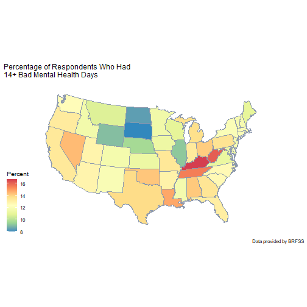
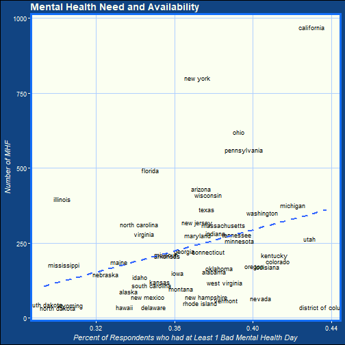

Final Presentation
========================================================
author: Keaton Markey
date: 3/25/2022
autosize: true 
width: 1920
height: 1080


Mental Health Today
==================================================================

  - 40% of U.S. adults reported struggling with mental health or substance use
  - Suicide is the second-leading cause of death among people aged 10-34
  - The average delay between onset of mental illness symptoms and treatment is 11 years
  
Only gotten worse since COVID-19

  - Are people getting the care, or able to get the care they need

My Data
==================================================================
Two datasets:
  - CDC's Behavioral Risk Factor Surveillance System (BRFSS)
  - Substance Abuse & Mental Health Data Archive's National Mental Health Services Survey (N-MHSS)
  
Goal: Use these two datasets together to: 
  - get an overview of the state of mental health across the country
  - and assess the availability of care and need

I explored these two separately and then together

Severity of Mental Health
==================================================================
Now thinking about your mental health, which includes stress, depression, and problems with emotions, for 
how many days during the past 30 days was your mental health not good? 

  - 0 days, 1-13 days, or 14+ days
  

```
<table>
 <thead>
  <tr>
   <th style="text-align:left;"> name </th>
   <th style="text-align:right;"> per </th>
   <th style="text-align:right;"> rank </th>
  </tr>
 </thead>
<tbody>
  <tr>
   <td style="text-align:left;"> kentucky </td>
   <td style="text-align:right;"> 0.1667291 </td>
   <td style="text-align:right;"> 1 </td>
  </tr>
  <tr>
   <td style="text-align:left;"> west virginia </td>
   <td style="text-align:right;"> 0.1612667 </td>
   <td style="text-align:right;"> 1 </td>
  </tr>
  <tr>
   <td style="text-align:left;"> tennessee </td>
   <td style="text-align:right;"> 0.1551849 </td>
   <td style="text-align:right;"> 1 </td>
  </tr>
  <tr>
   <td style="text-align:left;"> louisiana </td>
   <td style="text-align:right;"> 0.1477335 </td>
   <td style="text-align:right;"> 1 </td>
  </tr>
  <tr>
   <td style="text-align:left;"> nevada </td>
   <td style="text-align:right;"> 0.1442495 </td>
   <td style="text-align:right;"> 1 </td>
  </tr>
  <tr>
   <td style="text-align:left;"> oklahoma </td>
   <td style="text-align:right;"> 0.1422485 </td>
   <td style="text-align:right;"> 1 </td>
  </tr>
  <tr>
   <td style="text-align:left;"> alabama </td>
   <td style="text-align:right;"> 0.1417468 </td>
   <td style="text-align:right;"> 1 </td>
  </tr>
  <tr>
   <td style="text-align:left;"> ohio </td>
   <td style="text-align:right;"> 0.1410120 </td>
   <td style="text-align:right;"> 1 </td>
  </tr>
  <tr>
   <td style="text-align:left;"> texas </td>
   <td style="text-align:right;"> 0.1381682 </td>
   <td style="text-align:right;"> 1 </td>
  </tr>
  <tr>
   <td style="text-align:left;"> michigan </td>
   <td style="text-align:right;"> 0.1373796 </td>
   <td style="text-align:right;"> 1 </td>
  </tr>
</tbody>
</table>
```

Severity of Mental Health
==================================================================



Are there any facilities in Kentucky?
==================================================================


Mental Health Facilities
===================================================================


Is this relationship significant?
==========================================================




```r
mod1 <- lm(TOT ~ per, data = data)
summary(mod1)
```

```

Call:
lm(formula = TOT ~ per, data = data)

Residuals:
    Min      1Q  Median      3Q     Max 
-325.02 -112.43  -32.73   52.20  622.96 

Coefficients:
            Estimate Std. Error t value Pr(>|t|)  
(Intercept)   -412.7      279.5  -1.476   0.1462  
per           1767.4      754.6   2.342   0.0233 *
---
Signif. codes:  0 '***' 0.001 '**' 0.01 '*' 0.05 '.' 0.1 ' ' 1

Residual standard error: 185.4 on 49 degrees of freedom
Multiple R-squared:  0.1007,	Adjusted R-squared:  0.08232 
F-statistic: 5.485 on 1 and 49 DF,  p-value: 0.02329
```


What predicts bad mental health?
=========================================================

No idea.


```
      pred
actual      0      1
     0 187578  29536
     1  75751  51272
```

```
[1] 0.694055
```

```
      pred
actual      0      1
     0 188795  28319
     1  80280  46743
```

```
[1] 0.6844309
```


Reflection
=========================================================
I think I took on too much at the beginning

I had to restructure my approach a couple of times

Future Directions:
  - What influences where facilities are built?
  - How can we increase mental health availability

