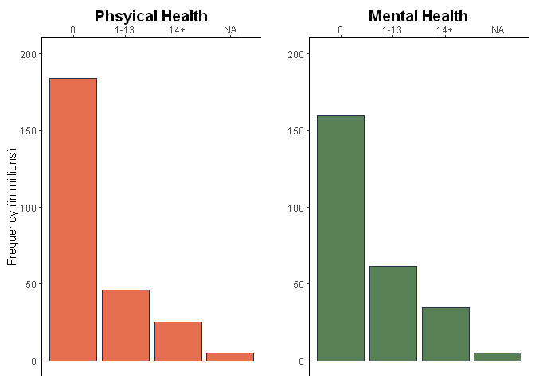
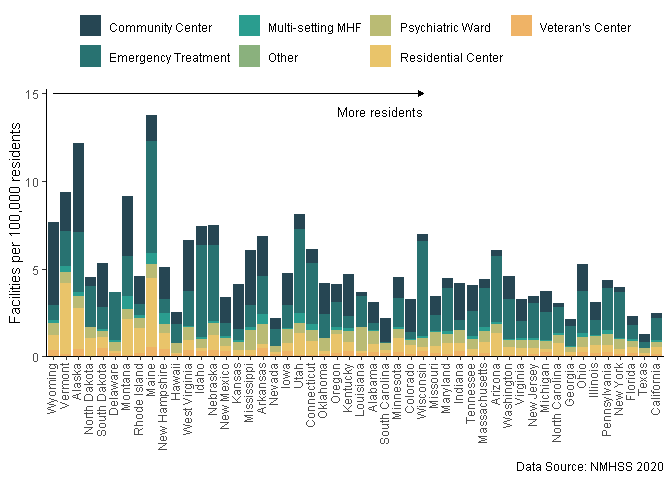
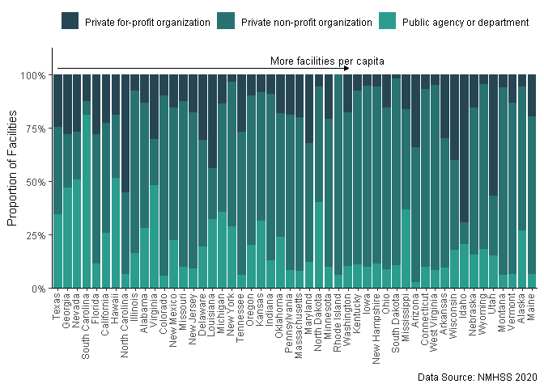
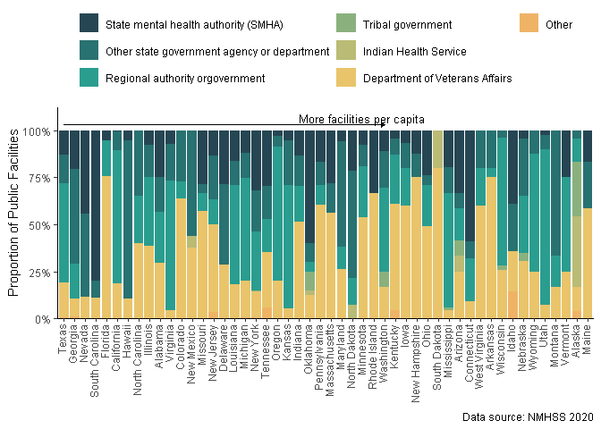

The State of Mental Illness
================
Keaton Markey
2023-05-23

# Introduction

In the past couple of years, during a global period of isolation,
suffering, and uncertainty, mental health has increasingly become a
concern for everyone. Poor mental health represents a host of massive
issues in the United States:

- Suicide, the most severe outcome of mental health challenges, is the
  second-leading cause of death among people aged 10-34. The importance
  of mental health cannot be overstated when it comes to saving lives.

- It is extremely difficult to be treated for mental health challenges.
  The average delay between onset of mental illness symptoms and
  treatment is 11 years.

- In the US, more adults reported struggling with mental health or
  substance abuse than physical health – around 40% in 2020. There is a
  tremendous need for mental health care, and to solve this crisis we
  must learn about, advocate for, and fund treatment.

This project was started for a data science course I took in 2022. Using
two national surveys, I contrast the reported rates of poor mental
health in each state with the accessibility of general facility-based
mental health care. Further, based on local indicators of poor mental
health and substance abuse, I rank each state for its ability to serve
the specific mental health needs of it’s population.

# BRFSS

## Physical and Mental Health

**The Behavioral Risk Factor Surveillance System (BRFSS)** is a survey
conducted yearly by the CDC which contacts hundreds of thousands of
residents across the U.S. for basic information on health-related
behavior. The survey is weighted by demographic as to account for any
sampling bias. Upwards of 200 data points are collected from each
participant and a few are related to mental health and its
co-morbidities, including substance abuse.

Each participant was asked to report the number of days they had a “bad
day” with respect to their physical and mental health:

> “Now thinking about your physical health, which includes physical
> illness and injury, for how many days during the past 30 days was your
> physical health not good?”

> “Now thinking about your mental health, which includes stress,
> depression, and problems with emotions, for how many days during the
> past 30 days was your mental health not good?”

Let’s look at he number of days per month that respondents had bad
physical or mental health days.

``` r
p <- drillb(phys14d) %>%
  group_by(phys14d) %>%
  reframe(phys14d, tot = sum(count)) %>%
  unique() %>%
  ggplot() +
  geom_bar(aes(x = phys14d, y = tot/1000000), stat = "identity", fill = "#e76f51", color = "#2B2D42") +
  scale_y_continuous(limits = c(0, 200), labels = comma) +
  scale_x_discrete(position = "top") +
  labs(x = "Phsyical Health", y = "Frequency (in millions)") +
  theme_classic() +
  theme(axis.title.x = element_text(size = 14, face = "bold")) +
  guides(fill = "none")

m <- drillb(ment14d) %>%
  group_by(ment14d) %>%
  reframe(ment14d, tot = sum(count)) %>%
  unique() %>%
  ggplot() +
  geom_bar(aes(x = ment14d, y = tot/1000000), stat = "identity", fill = "#588157", color = "#2B2D42") +
  scale_y_continuous(limits = c(0, 200), labels = comma) +
  scale_x_discrete(position = "top") +
  labs(x = "Mental Health") +
  theme_classic() +
  theme(axis.title.y = element_blank(),
        axis.title.x = element_text(size = 14, face = "bold")) +
  guides(fill = "none")


plot_grid(p, m, align = "vh", nrow = 1)
```

<!-- -->

In total, more respondents had bad mental health days than bad physical
health days.

The responses to this question are highly subjective to the respondent’s
own idea of what constitutes a “bad health day”. the population with
“bad mental health” is defined as all respondents who had at least 14
(14+) bad mental health day per month.

## Drug Use

Drug use, and particularly drug use disorders, are highly associated
with mental illness.
[source](https://nida.nih.gov/publications/research-reports/common-comorbidities-substance-use-disorders/part-1-connection-between-substance-use-disorders-mental-illness).
The survey asks a couple questions regarding drug use.

### Binge Drinking

Participants were asked questions about alcohol consumption.

> “Considering all types of alcoholic beverages, how many times during
> the past 30 days did you have 5 or more drinks for men or 4 or more
> drinks for women on an occasion?”

Those with at least one occurrence are considered to have participated
in binge drinking in the past month.

``` r
  # helper fun
# range01 <- function(x){(x-min(x))/(max(x)-min(x))}
# 
#   # creating scale breaks and color palette
# all_scaled_breaks <- range01(c(min(data[['per']], na.rm = TRUE), c(0.12, 0.14, 0.16, 0.18, 0.20), max(data[['per']], na.rm = TRUE)))
# 
# z_colors <- brewer.pal(length(all_scaled_breaks) - 1, "Oranges")
# 
#   # list of z breaks
#   z_list <- embed(all_scaled_breaks, 2)[, 2:1] |>
#     as.vector() |>
#     sort() %>%
#     data.frame(z = .)
# 
#   # final color scale df
#   colorScale <- bind_cols(z_list, cols = rep(z_colors, each = 2))
# 
```

``` r
us_states <- us_map(regions = "state")

data <- drillb(X_RFBING5) %>%
  
  group_by(state) %>%
  
  reframe(per = `count`/sum(`count`), X_RFBING5, n = sum(`count`)) %>%
  
  dplyr::filter(X_RFBING5 == "2") %>%
  
  right_join(us_states, by = c("state" = "full"))

plotly_chloropleth(data = data, 
                   z = "per", 
                   colors = "Oranges", 
                   tick_breaks = c(0.12, 0.14, 0.16, 0.18, 0.20), 
                   symbol = "%") %>%
  
    plotly_anno(text = "Data source: BRFSS 2020")
```

<div class="plotly html-widget html-fill-item" id="htmlwidget-d3f4f3e27b5a6b5a9cda" style="width:672px;height:480px;"></div>
<script type="application/json" data-for="htmlwidget-d3f4f3e27b5a6b5a9cda">{"x":{"visdat":{"107c4ea6983":["function () ","plotlyVisDat"]},"cur_data":"107c4ea6983","attrs":{"107c4ea6983":{"locationmode":"USA-states","colorscale":[{"z":0,"cols":"#FEEDDE"},{"z":0.16797621064127299,"cols":"#FEEDDE"},{"z":0.16797621064127299,"cols":"#FDD0A2"},{"z":0.34850874695188699,"cols":"#FDD0A2"},{"z":0.34850874695188699,"cols":"#FDAE6B"},{"z":0.52904128326250077,"cols":"#FDAE6B"},{"z":0.52904128326250077,"cols":"#FD8D3C"},{"z":0.70957381957311449,"cols":"#FD8D3C"},{"z":0.70957381957311449,"cols":"#E6550D"},{"z":0.89010635588372855,"cols":"#E6550D"},{"z":0.89010635588372855,"cols":"#A63603"},{"z":1,"cols":"#A63603"}],"hovertemplate":["12.3%<br>Alabama<extra><\/extra>","16.1%<br>Alaska<extra><\/extra>","12.8%<br>Arizona<extra><\/extra>","13.1%<br>Arkansas<extra><\/extra>","14.5%<br>California<extra><\/extra>","16.4%<br>Colorado<extra><\/extra>","13.0%<br>Connecticut<extra><\/extra>","12.9%<br>Delaware<extra><\/extra>","12.1%<br>Florida<extra><\/extra>","12.3%<br>Georgia<extra><\/extra>","14.8%<br>Hawaii<extra><\/extra>","13.4%<br>Idaho<extra><\/extra>","11.8%<br>Illinois<extra><\/extra>","14.2%<br>Indiana<extra><\/extra>","20.1%<br>Iowa<extra><\/extra>","16.1%<br>Kansas<extra><\/extra>","13.5%<br>Kentucky<extra><\/extra>","16.6%<br>Louisiana<extra><\/extra>","13.3%<br>Maine<extra><\/extra>","10.6%<br>Maryland<extra><\/extra>","14.3%<br>Massachusetts<extra><\/extra>","16.6%<br>Michigan<extra><\/extra>","16.9%<br>Minnesota<extra><\/extra>","12.5%<br>Mississippi<extra><\/extra>","15.8%<br>Missouri<extra><\/extra>","18.7%<br>Montana<extra><\/extra>","19.2%<br>Nebraska<extra><\/extra>","16.0%<br>Nevada<extra><\/extra>","14.3%<br>New Hampshire<extra><\/extra>","13.1%<br>New Jersey<extra><\/extra>","13.4%<br>New Mexico<extra><\/extra>","13.0%<br>New York<extra><\/extra>","12.9%<br>North Carolina<extra><\/extra>","19.7%<br>North Dakota<extra><\/extra>","14.7%<br>Ohio<extra><\/extra>","10.1%<br>Oklahoma<extra><\/extra>","14.9%<br>Oregon<extra><\/extra>","14.8%<br>Pennsylvania<extra><\/extra>","13.5%<br>Rhode Island<extra><\/extra>","14.6%<br>South Carolina<extra><\/extra>","16.7%<br>South Dakota<extra><\/extra>","12.6%<br>Tennessee<extra><\/extra>","14.7%<br>Texas<extra><\/extra>","10.7%<br>Utah<extra><\/extra>","16.3%<br>Vermont<extra><\/extra>","13.6%<br>Virginia<extra><\/extra>","13.8%<br>Washington<extra><\/extra>","10.8%<br>West Virginia<extra><\/extra>","21.2%<br>Wisconsin<extra><\/extra>","15.3%<br>Wyoming<extra><\/extra>","  NA%<br>District of Columbia<extra><\/extra>"],"alpha_stroke":1,"sizes":[10,100],"spans":[1,20],"z":{},"text":{},"locations":{},"color":{},"colorbar":{"ypad":1,"tickmode":"array","ticktext":["12.0%","14.0%","16.0%","18.0%","20.0%"],"tickvals":[0.12,0.14000000000000001,0.16,0.17999999999999999,0.20000000000000001]},"inherit":true}},"layout":{"margin":{"b":40,"l":60,"t":25,"r":10},"mapType":"geo","scene":{"zaxis":{"title":".data[[z]]"}},"geo":{"domain":{"x":[0,1],"y":[0,1]},"scope":"usa","projection":{"type":"albers usa"},"showlakes":false},"hovermode":"closest","showlegend":false,"legend":{"yanchor":"top","y":0.5},"title":{"text":"","y":0.90000000000000002},"annotations":[{"x":1,"y":0,"text":"Data source: BRFSS 2020","showarrow":false,"xref":"paper","yref":"paper","xanchor":"right","yanchor":"bottom","xshift":0,"yshift":0,"font":{"size":10}}]},"source":"A","config":{"modeBarButtonsToAdd":["hoverclosest","hovercompare"],"showSendToCloud":false},"data":[{"colorbar":{"title":"","ticklen":2,"ypad":1,"tickmode":"array","ticktext":["12.0%","14.0%","16.0%","18.0%","20.0%"],"tickvals":[0.12,0.14000000000000001,0.16,0.17999999999999999,0.20000000000000001],"len":0.5,"lenmode":"fraction","y":1,"yanchor":"top"},"colorscale":[[0,"#FEEDDE"],[0.16797621064127299,"#FEEDDE"],[0.16797621064127299,"#FDD0A2"],[0.34850874695188699,"#FDD0A2"],[0.34850874695188699,"#FDAE6B"],[0.52904128326250077,"#FDAE6B"],[0.52904128326250077,"#FD8D3C"],[0.70957381957311449,"#FD8D3C"],[0.70957381957311449,"#E6550D"],[0.89010635588372855,"#E6550D"],[0.89010635588372855,"#A63603"],[1,"#A63603"]],"showscale":true,"locationmode":"USA-states","hovertemplate":["12.3%<br>Alabama<extra><\/extra>","16.1%<br>Alaska<extra><\/extra>","12.8%<br>Arizona<extra><\/extra>","13.1%<br>Arkansas<extra><\/extra>","14.5%<br>California<extra><\/extra>","16.4%<br>Colorado<extra><\/extra>","13.0%<br>Connecticut<extra><\/extra>","12.9%<br>Delaware<extra><\/extra>","12.1%<br>Florida<extra><\/extra>","12.3%<br>Georgia<extra><\/extra>","14.8%<br>Hawaii<extra><\/extra>","13.4%<br>Idaho<extra><\/extra>","11.8%<br>Illinois<extra><\/extra>","14.2%<br>Indiana<extra><\/extra>","20.1%<br>Iowa<extra><\/extra>","16.1%<br>Kansas<extra><\/extra>","13.5%<br>Kentucky<extra><\/extra>","16.6%<br>Louisiana<extra><\/extra>","13.3%<br>Maine<extra><\/extra>","10.6%<br>Maryland<extra><\/extra>","14.3%<br>Massachusetts<extra><\/extra>","16.6%<br>Michigan<extra><\/extra>","16.9%<br>Minnesota<extra><\/extra>","12.5%<br>Mississippi<extra><\/extra>","15.8%<br>Missouri<extra><\/extra>","18.7%<br>Montana<extra><\/extra>","19.2%<br>Nebraska<extra><\/extra>","16.0%<br>Nevada<extra><\/extra>","14.3%<br>New Hampshire<extra><\/extra>","13.1%<br>New Jersey<extra><\/extra>","13.4%<br>New Mexico<extra><\/extra>","13.0%<br>New York<extra><\/extra>","12.9%<br>North Carolina<extra><\/extra>","19.7%<br>North Dakota<extra><\/extra>","14.7%<br>Ohio<extra><\/extra>","10.1%<br>Oklahoma<extra><\/extra>","14.9%<br>Oregon<extra><\/extra>","14.8%<br>Pennsylvania<extra><\/extra>","13.5%<br>Rhode Island<extra><\/extra>","14.6%<br>South Carolina<extra><\/extra>","16.7%<br>South Dakota<extra><\/extra>","12.6%<br>Tennessee<extra><\/extra>","14.7%<br>Texas<extra><\/extra>","10.7%<br>Utah<extra><\/extra>","16.3%<br>Vermont<extra><\/extra>","13.6%<br>Virginia<extra><\/extra>","13.8%<br>Washington<extra><\/extra>","10.8%<br>West Virginia<extra><\/extra>","21.2%<br>Wisconsin<extra><\/extra>","15.3%<br>Wyoming<extra><\/extra>"],"z":[0.12349713930977821,0.16109742733850113,0.12848820454942697,0.13147179366285228,0.14484238171682212,0.16423614812421372,0.13017447065373949,0.12917798551115117,0.12085377110631609,0.12308072170872124,0.14845464870899897,0.13448830554174368,0.11788941723067911,0.14229078899573047,0.20055901861881018,0.16110704432369199,0.13473989729983227,0.16577179283609944,0.13332681764658544,0.10570149140177822,0.14301304529148812,0.1663363992294736,0.16870124349924256,0.1252450221518904,0.15820938983439889,0.18670506842777901,0.19151386119642214,0.16005827606566439,0.14278951930456937,0.13147678218492126,0.13397313481119949,0.13011527332008535,0.1290094842810306,0.19650260733992495,0.14667476038071672,0.10139103188000828,0.14904177074487682,0.1481202877641577,0.13468979972343881,0.14642900789270324,0.16728829464912645,0.1260667463162414,0.14703167556689067,0.10695161630743347,0.16278472288383128,0.13613414344254379,0.13834684411073975,0.10788433059976554,0.21217438655237136,0.15312910429937618],"text":["Alabama","Alaska","Arizona","Arkansas","California","Colorado","Connecticut","Delaware","Florida","Georgia","Hawaii","Idaho","Illinois","Indiana","Iowa","Kansas","Kentucky","Louisiana","Maine","Maryland","Massachusetts","Michigan","Minnesota","Mississippi","Missouri","Montana","Nebraska","Nevada","New Hampshire","New Jersey","New Mexico","New York","North Carolina","North Dakota","Ohio","Oklahoma","Oregon","Pennsylvania","Rhode Island","South Carolina","South Dakota","Tennessee","Texas","Utah","Vermont","Virginia","Washington","West Virginia","Wisconsin","Wyoming"],"locations":["AL","AK","AZ","AR","CA","CO","CT","DE","FL","GA","HI","ID","IL","IN","IA","KS","KY","LA","ME","MD","MA","MI","MN","MS","MO","MT","NE","NV","NH","NJ","NM","NY","NC","ND","OH","OK","OR","PA","RI","SC","SD","TN","TX","UT","VT","VA","WA","WV","WI","WY"],"type":"choropleth","marker":{"line":{"colorbar":{"title":"","ticklen":2},"cmin":0.10139103188000828,"cmax":0.21217438655237136,"colorscale":[["0","rgba(68,1,84,1)"],["0.0416666666666667","rgba(70,19,97,1)"],["0.0833333333333333","rgba(72,32,111,1)"],["0.125","rgba(71,45,122,1)"],["0.166666666666667","rgba(68,58,128,1)"],["0.208333333333333","rgba(64,70,135,1)"],["0.25","rgba(60,82,138,1)"],["0.291666666666667","rgba(56,93,140,1)"],["0.333333333333333","rgba(49,104,142,1)"],["0.375","rgba(46,114,142,1)"],["0.416666666666667","rgba(42,123,142,1)"],["0.458333333333333","rgba(38,133,141,1)"],["0.5","rgba(37,144,140,1)"],["0.541666666666667","rgba(33,154,138,1)"],["0.583333333333333","rgba(39,164,133,1)"],["0.625","rgba(47,174,127,1)"],["0.666666666666667","rgba(53,183,121,1)"],["0.708333333333333","rgba(79,191,110,1)"],["0.75","rgba(98,199,98,1)"],["0.791666666666667","rgba(119,207,85,1)"],["0.833333333333333","rgba(147,214,70,1)"],["0.875","rgba(172,220,52,1)"],["0.916666666666667","rgba(199,225,42,1)"],["0.958333333333333","rgba(226,228,40,1)"],["1","rgba(253,231,37,1)"]],"showscale":false,"color":[0.12349713930977821,0.16109742733850113,0.12848820454942697,0.13147179366285228,0.14484238171682212,0.16423614812421372,0.13017447065373949,0.12917798551115117,0.12085377110631609,0.12308072170872124,0.14845464870899897,0.13448830554174368,0.11788941723067911,0.14229078899573047,0.20055901861881018,0.16110704432369199,0.13473989729983227,0.16577179283609944,0.13332681764658544,0.10570149140177822,0.14301304529148812,0.1663363992294736,0.16870124349924256,0.1252450221518904,0.15820938983439889,0.18670506842777901,0.19151386119642214,0.16005827606566439,0.14278951930456937,0.13147678218492126,0.13397313481119949,0.13011527332008535,0.1290094842810306,0.19650260733992495,0.14667476038071672,0.10139103188000828,0.14904177074487682,0.1481202877641577,0.13468979972343881,0.14642900789270324,0.16728829464912645,0.1260667463162414,0.14703167556689067,0.10695161630743347,0.16278472288383128,0.13613414344254379,0.13834684411073975,0.10788433059976554,0.21217438655237136,0.15312910429937618]}},"geo":"geo","frame":null}],"highlight":{"on":"plotly_click","persistent":false,"dynamic":false,"selectize":false,"opacityDim":0.20000000000000001,"selected":{"opacity":1},"debounce":0},"shinyEvents":["plotly_hover","plotly_click","plotly_selected","plotly_relayout","plotly_brushed","plotly_brushing","plotly_clickannotation","plotly_doubleclick","plotly_deselect","plotly_afterplot","plotly_sunburstclick"],"base_url":"https://plot.ly"},"evals":[],"jsHooks":[]}</script>

Of those that drink, this map shows the average number of drinks per
month, compiled from the average number of drinks per occasion:

> “During the past 30 days, on the days when you drank, about how many
> drinks did you drink on the average?”

``` r
# avg number of drinks per person
data <- drillb(AVEDRNK3) %>%
  
  dplyr::filter(AVEDRNK3 <= 76) %>%
  
  group_by(state) %>%
  
  reframe(total = `count` * AVEDRNK3, avg = sum(total) / statecount) %>%
  
  dplyr::select(-total) %>%
  
  distinct() %>%
  
  right_join(us_states, by = c("state" = "full"))

plotly_chloropleth(data = data, 
                   z = "avg", 
                   colors = "Oranges", 
                   tick_breaks = c(0.80, 1.00, 1.20, 1.40)) %>%
    plotly_anno(text = "Data source: BRFSS 2020")
```

<div class="plotly html-widget html-fill-item" id="htmlwidget-8e997b060bd98c4a3013" style="width:672px;height:480px;"></div>
<script type="application/json" data-for="htmlwidget-8e997b060bd98c4a3013">{"x":{"visdat":{"107c596e476d":["function () ","plotlyVisDat"]},"cur_data":"107c596e476d","attrs":{"107c596e476d":{"locationmode":"USA-states","colorscale":[{"z":0,"cols":"#FEEDDE"},{"z":0.018733624603509837,"cols":"#FEEDDE"},{"z":0.018733624603509837,"cols":"#FDBE85"},{"z":0.27446223627745503,"cols":"#FDBE85"},{"z":0.27446223627745503,"cols":"#FD8D3C"},{"z":0.53019084795140026,"cols":"#FD8D3C"},{"z":0.53019084795140026,"cols":"#E6550D"},{"z":0.78591945962534548,"cols":"#E6550D"},{"z":0.78591945962534548,"cols":"#A63603"},{"z":1,"cols":"#A63603"}],"hovertemplate":[" 1<br>Alabama<extra><\/extra>"," 1<br>Alaska<extra><\/extra>"," 1<br>Arizona<extra><\/extra>"," 1<br>Arkansas<extra><\/extra>"," 1<br>California<extra><\/extra>"," 1<br>Colorado<extra><\/extra>"," 1<br>Connecticut<extra><\/extra>"," 1<br>Delaware<extra><\/extra>"," 1<br>Florida<extra><\/extra>"," 1<br>Georgia<extra><\/extra>"," 1<br>Hawaii<extra><\/extra>"," 1<br>Idaho<extra><\/extra>"," 1<br>Illinois<extra><\/extra>"," 1<br>Indiana<extra><\/extra>"," 1<br>Iowa<extra><\/extra>"," 1<br>Kansas<extra><\/extra>"," 1<br>Kentucky<extra><\/extra>"," 1<br>Louisiana<extra><\/extra>"," 1<br>Maine<extra><\/extra>"," 1<br>Maryland<extra><\/extra>"," 1<br>Massachusetts<extra><\/extra>"," 1<br>Michigan<extra><\/extra>"," 1<br>Minnesota<extra><\/extra>"," 1<br>Mississippi<extra><\/extra>"," 1<br>Missouri<extra><\/extra>"," 1<br>Montana<extra><\/extra>"," 1<br>Nebraska<extra><\/extra>"," 1<br>Nevada<extra><\/extra>"," 1<br>New Hampshire<extra><\/extra>"," 1<br>New Jersey<extra><\/extra>"," 1<br>New Mexico<extra><\/extra>"," 1<br>New York<extra><\/extra>"," 1<br>North Carolina<extra><\/extra>"," 1<br>North Dakota<extra><\/extra>"," 1<br>Ohio<extra><\/extra>"," 1<br>Oklahoma<extra><\/extra>"," 1<br>Oregon<extra><\/extra>"," 1<br>Pennsylvania<extra><\/extra>"," 1<br>Rhode Island<extra><\/extra>"," 1<br>South Carolina<extra><\/extra>"," 1<br>South Dakota<extra><\/extra>"," 1<br>Tennessee<extra><\/extra>"," 1<br>Texas<extra><\/extra>"," 1<br>Utah<extra><\/extra>"," 1<br>Vermont<extra><\/extra>"," 1<br>Virginia<extra><\/extra>"," 1<br>Washington<extra><\/extra>"," 1<br>West Virginia<extra><\/extra>"," 2<br>Wisconsin<extra><\/extra>"," 1<br>Wyoming<extra><\/extra>","NA<br>District of Columbia<extra><\/extra>"],"alpha_stroke":1,"sizes":[10,100],"spans":[1,20],"z":{},"text":{},"locations":{},"color":{},"colorbar":{"ypad":1,"tickmode":"array","ticktext":["1","1","1","1"],"tickvals":[0.80000000000000004,1,1.2,1.3999999999999999]},"inherit":true}},"layout":{"margin":{"b":40,"l":60,"t":25,"r":10},"mapType":"geo","scene":{"zaxis":{"title":".data[[z]]"}},"geo":{"domain":{"x":[0,1],"y":[0,1]},"scope":"usa","projection":{"type":"albers usa"},"showlakes":false},"hovermode":"closest","showlegend":false,"legend":{"yanchor":"top","y":0.5},"title":{"text":"","y":0.90000000000000002},"annotations":[{"x":1,"y":0,"text":"Data source: BRFSS 2020","showarrow":false,"xref":"paper","yref":"paper","xanchor":"right","yanchor":"bottom","xshift":0,"yshift":0,"font":{"size":10}}]},"source":"A","config":{"modeBarButtonsToAdd":["hoverclosest","hovercompare"],"showSendToCloud":false},"data":[{"colorbar":{"title":"","ticklen":2,"ypad":1,"tickmode":"array","ticktext":["1","1","1","1"],"tickvals":[0.80000000000000004,1,1.2,1.3999999999999999],"len":0.5,"lenmode":"fraction","y":1,"yanchor":"top"},"colorscale":[[0,"#FEEDDE"],[0.018733624603509837,"#FEEDDE"],[0.018733624603509837,"#FDBE85"],[0.27446223627745503,"#FDBE85"],[0.27446223627745503,"#FD8D3C"],[0.53019084795140026,"#FD8D3C"],[0.53019084795140026,"#E6550D"],[0.78591945962534548,"#E6550D"],[0.78591945962534548,"#A63603"],[1,"#A63603"]],"showscale":true,"locationmode":"USA-states","hovertemplate":[" 1<br>Alabama<extra><\/extra>"," 1<br>Alaska<extra><\/extra>"," 1<br>Arizona<extra><\/extra>"," 1<br>Arkansas<extra><\/extra>"," 1<br>California<extra><\/extra>"," 1<br>Colorado<extra><\/extra>"," 1<br>Connecticut<extra><\/extra>"," 1<br>Delaware<extra><\/extra>"," 1<br>Florida<extra><\/extra>"," 1<br>Georgia<extra><\/extra>"," 1<br>Hawaii<extra><\/extra>"," 1<br>Idaho<extra><\/extra>"," 1<br>Illinois<extra><\/extra>"," 1<br>Indiana<extra><\/extra>"," 1<br>Iowa<extra><\/extra>"," 1<br>Kansas<extra><\/extra>"," 1<br>Kentucky<extra><\/extra>"," 1<br>Louisiana<extra><\/extra>"," 1<br>Maine<extra><\/extra>"," 1<br>Maryland<extra><\/extra>"," 1<br>Massachusetts<extra><\/extra>"," 1<br>Michigan<extra><\/extra>"," 1<br>Minnesota<extra><\/extra>"," 1<br>Mississippi<extra><\/extra>"," 1<br>Missouri<extra><\/extra>"," 1<br>Montana<extra><\/extra>"," 1<br>Nebraska<extra><\/extra>"," 1<br>Nevada<extra><\/extra>"," 1<br>New Hampshire<extra><\/extra>"," 1<br>New Jersey<extra><\/extra>"," 1<br>New Mexico<extra><\/extra>"," 1<br>New York<extra><\/extra>"," 1<br>North Carolina<extra><\/extra>"," 1<br>North Dakota<extra><\/extra>"," 1<br>Ohio<extra><\/extra>"," 1<br>Oklahoma<extra><\/extra>"," 1<br>Oregon<extra><\/extra>"," 1<br>Pennsylvania<extra><\/extra>"," 1<br>Rhode Island<extra><\/extra>"," 1<br>South Carolina<extra><\/extra>"," 1<br>South Dakota<extra><\/extra>"," 1<br>Tennessee<extra><\/extra>"," 1<br>Texas<extra><\/extra>"," 1<br>Utah<extra><\/extra>"," 1<br>Vermont<extra><\/extra>"," 1<br>Virginia<extra><\/extra>"," 1<br>Washington<extra><\/extra>"," 1<br>West Virginia<extra><\/extra>"," 2<br>Wisconsin<extra><\/extra>"," 1<br>Wyoming<extra><\/extra>"],"z":[1.0414111816308764,1.2006107210431709,1.0806025810748225,1.0650601504220583,1.1508904107398892,1.1969678471161582,1.1189995430965716,1.1448642708712136,1.1111309648504335,1.0418512325906106,1.2782080328082455,1.0689435705504928,1.0304555267288389,1.0859971740092118,1.4038487423730803,1.2074480449263387,1.0463297506851772,1.1975143365511445,1.1808644150839489,0.93712713376319845,1.1784400355461793,1.23383998572196,1.2860320091076205,0.98907303157440274,1.2202089661629409,1.3445073940372338,1.3437758235998039,1.1410575728874761,1.2140867389360628,1.0915704942866915,1.1802185721222656,1.0900470234390967,1.0253668528513828,1.4816805358211711,1.153613906696759,0.82549129073828731,1.1241881677434133,1.1425180017598227,1.1060281992889847,1.1474013021088025,1.217217860059278,1.0500084363235709,1.1791585317463895,0.78534882391072047,1.2181404706326397,1.0671236928807741,1.0663236213440037,0.93309101318949539,1.5674279142825112,1.1930103713725402],"text":["Alabama","Alaska","Arizona","Arkansas","California","Colorado","Connecticut","Delaware","Florida","Georgia","Hawaii","Idaho","Illinois","Indiana","Iowa","Kansas","Kentucky","Louisiana","Maine","Maryland","Massachusetts","Michigan","Minnesota","Mississippi","Missouri","Montana","Nebraska","Nevada","New Hampshire","New Jersey","New Mexico","New York","North Carolina","North Dakota","Ohio","Oklahoma","Oregon","Pennsylvania","Rhode Island","South Carolina","South Dakota","Tennessee","Texas","Utah","Vermont","Virginia","Washington","West Virginia","Wisconsin","Wyoming"],"locations":["AL","AK","AZ","AR","CA","CO","CT","DE","FL","GA","HI","ID","IL","IN","IA","KS","KY","LA","ME","MD","MA","MI","MN","MS","MO","MT","NE","NV","NH","NJ","NM","NY","NC","ND","OH","OK","OR","PA","RI","SC","SD","TN","TX","UT","VT","VA","WA","WV","WI","WY"],"type":"choropleth","marker":{"line":{"colorbar":{"title":"","ticklen":2},"cmin":0.78534882391072047,"cmax":1.5674279142825112,"colorscale":[["0","rgba(68,1,84,1)"],["0.0416666666666666","rgba(70,19,97,1)"],["0.0833333333333334","rgba(72,32,111,1)"],["0.125","rgba(71,45,122,1)"],["0.166666666666667","rgba(68,58,128,1)"],["0.208333333333333","rgba(64,70,135,1)"],["0.25","rgba(60,82,138,1)"],["0.291666666666667","rgba(56,93,140,1)"],["0.333333333333333","rgba(49,104,142,1)"],["0.375","rgba(46,114,142,1)"],["0.416666666666667","rgba(42,123,142,1)"],["0.458333333333334","rgba(38,133,141,1)"],["0.5","rgba(37,144,140,1)"],["0.541666666666667","rgba(33,154,138,1)"],["0.583333333333333","rgba(39,164,133,1)"],["0.625","rgba(47,174,127,1)"],["0.666666666666667","rgba(53,183,121,1)"],["0.708333333333333","rgba(79,191,110,1)"],["0.75","rgba(98,199,98,1)"],["0.791666666666667","rgba(119,207,85,1)"],["0.833333333333333","rgba(147,214,70,1)"],["0.875","rgba(172,220,52,1)"],["0.916666666666667","rgba(199,225,42,1)"],["0.958333333333333","rgba(226,228,40,1)"],["1","rgba(253,231,37,1)"]],"showscale":false,"color":[1.0414111816308764,1.2006107210431709,1.0806025810748225,1.0650601504220583,1.1508904107398892,1.1969678471161582,1.1189995430965716,1.1448642708712136,1.1111309648504335,1.0418512325906106,1.2782080328082455,1.0689435705504928,1.0304555267288389,1.0859971740092118,1.4038487423730803,1.2074480449263387,1.0463297506851772,1.1975143365511445,1.1808644150839489,0.93712713376319845,1.1784400355461793,1.23383998572196,1.2860320091076205,0.98907303157440274,1.2202089661629409,1.3445073940372338,1.3437758235998039,1.1410575728874761,1.2140867389360628,1.0915704942866915,1.1802185721222656,1.0900470234390967,1.0253668528513828,1.4816805358211711,1.153613906696759,0.82549129073828731,1.1241881677434133,1.1425180017598227,1.1060281992889847,1.1474013021088025,1.217217860059278,1.0500084363235709,1.1791585317463895,0.78534882391072047,1.2181404706326397,1.0671236928807741,1.0663236213440037,0.93309101318949539,1.5674279142825112,1.1930103713725402]}},"geo":"geo","frame":null}],"highlight":{"on":"plotly_click","persistent":false,"dynamic":false,"selectize":false,"opacityDim":0.20000000000000001,"selected":{"opacity":1},"debounce":0},"shinyEvents":["plotly_hover","plotly_click","plotly_selected","plotly_relayout","plotly_brushed","plotly_brushing","plotly_clickannotation","plotly_doubleclick","plotly_deselect","plotly_afterplot","plotly_sunburstclick"],"base_url":"https://plot.ly"},"evals":[],"jsHooks":[]}</script>

Many of the central northern states lead this category.

### Smoking

> “Do you now smoke cigarettes every day, some days, or not at all?

The following plot shows the percentage of people that smoke.

``` r
data <- drillb(SMOKDAY2) %>%
  dplyr::filter(SMOKDAY2 == 1 | SMOKDAY2 == 2) %>%
  group_by(state) %>%
  dplyr::summarise(per = sum(count) / max(statecount), statecount = max(statecount)) %>%
  right_join(us_states, by = c("state" = "full"))

plotly_chloropleth(data = data, z = "per", title = "", colors = "Oranges", tick_breaks = c(0.10, 0.14, 0.18), symbol = "%") %>%
    plotly_anno(text = "Data source: BRFSS 2020")
```

<div class="plotly html-widget html-fill-item" id="htmlwidget-300a96ef3ae3a6a9bb85" style="width:672px;height:480px;"></div>
<script type="application/json" data-for="htmlwidget-300a96ef3ae3a6a9bb85">{"x":{"visdat":{"107c12ff340a":["function () ","plotlyVisDat"]},"cur_data":"107c12ff340a","attrs":{"107c12ff340a":{"locationmode":"USA-states","colorscale":[{"z":0,"cols":"#FEEDDE"},{"z":0.1538988760290638,"cols":"#FEEDDE"},{"z":0.1538988760290638,"cols":"#FDBE85"},{"z":0.43629640284480009,"cols":"#FDBE85"},{"z":0.43629640284480009,"cols":"#FD8D3C"},{"z":0.71869392966053625,"cols":"#FD8D3C"},{"z":0.71869392966053625,"cols":"#D94701"},{"z":1,"cols":"#D94701"}],"hovertemplate":["17.6%<br>Alabama<extra><\/extra>","16.8%<br>Alaska<extra><\/extra>","12.2%<br>Arizona<extra><\/extra>","19.2%<br>Arkansas<extra><\/extra>"," 8.1%<br>California<extra><\/extra>","11.6%<br>Colorado<extra><\/extra>","11.2%<br>Connecticut<extra><\/extra>","14.0%<br>Delaware<extra><\/extra>","13.6%<br>Florida<extra><\/extra>","14.5%<br>Georgia<extra><\/extra>","11.1%<br>Hawaii<extra><\/extra>","13.2%<br>Idaho<extra><\/extra>","12.1%<br>Illinois<extra><\/extra>","18.2%<br>Indiana<extra><\/extra>","15.0%<br>Iowa<extra><\/extra>","15.6%<br>Kansas<extra><\/extra>","20.5%<br>Kentucky<extra><\/extra>","17.0%<br>Louisiana<extra><\/extra>","15.8%<br>Maine<extra><\/extra>","10.1%<br>Maryland<extra><\/extra>","10.4%<br>Massachusetts<extra><\/extra>","17.7%<br>Michigan<extra><\/extra>","13.1%<br>Minnesota<extra><\/extra>","19.6%<br>Mississippi<extra><\/extra>","17.2%<br>Missouri<extra><\/extra>","15.8%<br>Montana<extra><\/extra>","13.4%<br>Nebraska<extra><\/extra>","13.7%<br>Nevada<extra><\/extra>","12.7%<br>New Hampshire<extra><\/extra>"," 9.9%<br>New Jersey<extra><\/extra>","15.4%<br>New Mexico<extra><\/extra>","11.1%<br>New York<extra><\/extra>","15.7%<br>North Carolina<extra><\/extra>","16.7%<br>North Dakota<extra><\/extra>","18.0%<br>Ohio<extra><\/extra>","17.7%<br>Oklahoma<extra><\/extra>","12.7%<br>Oregon<extra><\/extra>","15.0%<br>Pennsylvania<extra><\/extra>","12.5%<br>Rhode Island<extra><\/extra>","17.3%<br>South Carolina<extra><\/extra>","17.1%<br>South Dakota<extra><\/extra>","18.1%<br>Tennessee<extra><\/extra>","12.3%<br>Texas<extra><\/extra>"," 7.8%<br>Utah<extra><\/extra>","12.6%<br>Vermont<extra><\/extra>","12.8%<br>Virginia<extra><\/extra>","10.6%<br>Washington<extra><\/extra>","22.0%<br>West Virginia<extra><\/extra>","14.7%<br>Wisconsin<extra><\/extra>","17.7%<br>Wyoming<extra><\/extra>","  NA%<br>District of Columbia<extra><\/extra>"],"alpha_stroke":1,"sizes":[10,100],"spans":[1,20],"z":{},"text":{},"locations":{},"color":{},"colorbar":{"ypad":1,"tickmode":"array","ticktext":["10.0%","14.0%","18.0%"],"tickvals":[0.10000000000000001,0.14000000000000001,0.17999999999999999]},"inherit":true}},"layout":{"margin":{"b":40,"l":60,"t":25,"r":10},"mapType":"geo","scene":{"zaxis":{"title":".data[[z]]"}},"geo":{"domain":{"x":[0,1],"y":[0,1]},"scope":"usa","projection":{"type":"albers usa"},"showlakes":false},"hovermode":"closest","showlegend":false,"legend":{"yanchor":"top","y":0.5},"title":{"text":"","y":0.90000000000000002},"annotations":[{"x":1,"y":0,"text":"Data source: BRFSS 2020","showarrow":false,"xref":"paper","yref":"paper","xanchor":"right","yanchor":"bottom","xshift":0,"yshift":0,"font":{"size":10}}]},"source":"A","config":{"modeBarButtonsToAdd":["hoverclosest","hovercompare"],"showSendToCloud":false},"data":[{"colorbar":{"title":"","ticklen":2,"ypad":1,"tickmode":"array","ticktext":["10.0%","14.0%","18.0%"],"tickvals":[0.10000000000000001,0.14000000000000001,0.17999999999999999],"len":0.5,"lenmode":"fraction","y":1,"yanchor":"top"},"colorscale":[[0,"#FEEDDE"],[0.1538988760290638,"#FEEDDE"],[0.1538988760290638,"#FDBE85"],[0.43629640284480009,"#FDBE85"],[0.43629640284480009,"#FD8D3C"],[0.71869392966053625,"#FD8D3C"],[0.71869392966053625,"#D94701"],[1,"#D94701"]],"showscale":true,"locationmode":"USA-states","hovertemplate":["17.6%<br>Alabama<extra><\/extra>","16.8%<br>Alaska<extra><\/extra>","12.2%<br>Arizona<extra><\/extra>","19.2%<br>Arkansas<extra><\/extra>"," 8.1%<br>California<extra><\/extra>","11.6%<br>Colorado<extra><\/extra>","11.2%<br>Connecticut<extra><\/extra>","14.0%<br>Delaware<extra><\/extra>","13.6%<br>Florida<extra><\/extra>","14.5%<br>Georgia<extra><\/extra>","11.1%<br>Hawaii<extra><\/extra>","13.2%<br>Idaho<extra><\/extra>","12.1%<br>Illinois<extra><\/extra>","18.2%<br>Indiana<extra><\/extra>","15.0%<br>Iowa<extra><\/extra>","15.6%<br>Kansas<extra><\/extra>","20.5%<br>Kentucky<extra><\/extra>","17.0%<br>Louisiana<extra><\/extra>","15.8%<br>Maine<extra><\/extra>","10.1%<br>Maryland<extra><\/extra>","10.4%<br>Massachusetts<extra><\/extra>","17.7%<br>Michigan<extra><\/extra>","13.1%<br>Minnesota<extra><\/extra>","19.6%<br>Mississippi<extra><\/extra>","17.2%<br>Missouri<extra><\/extra>","15.8%<br>Montana<extra><\/extra>","13.4%<br>Nebraska<extra><\/extra>","13.7%<br>Nevada<extra><\/extra>","12.7%<br>New Hampshire<extra><\/extra>"," 9.9%<br>New Jersey<extra><\/extra>","15.4%<br>New Mexico<extra><\/extra>","11.1%<br>New York<extra><\/extra>","15.7%<br>North Carolina<extra><\/extra>","16.7%<br>North Dakota<extra><\/extra>","18.0%<br>Ohio<extra><\/extra>","17.7%<br>Oklahoma<extra><\/extra>","12.7%<br>Oregon<extra><\/extra>","15.0%<br>Pennsylvania<extra><\/extra>","12.5%<br>Rhode Island<extra><\/extra>","17.3%<br>South Carolina<extra><\/extra>","17.1%<br>South Dakota<extra><\/extra>","18.1%<br>Tennessee<extra><\/extra>","12.3%<br>Texas<extra><\/extra>"," 7.8%<br>Utah<extra><\/extra>","12.6%<br>Vermont<extra><\/extra>","12.8%<br>Virginia<extra><\/extra>","10.6%<br>Washington<extra><\/extra>","22.0%<br>West Virginia<extra><\/extra>","14.7%<br>Wisconsin<extra><\/extra>","17.7%<br>Wyoming<extra><\/extra>"],"z":[0.17632518060138064,0.16843224841855803,0.12184101071659047,0.19241776126173574,0.081403042475671969,0.11580423034791985,0.11163838917247178,0.13960747585637395,0.13608349920971372,0.1454752529541358,0.11144288024545376,0.13155994680564528,0.12072469493183953,0.18173498334418473,0.15019620056047317,0.15642460477633158,0.20472983657064781,0.1700047297224376,0.15828504996048795,0.10066905951937261,0.10377928894810727,0.17727084873782423,0.13127309634094819,0.19593182769813686,0.17152297230991365,0.15806139600504432,0.13367148450378322,0.13676572782118651,0.12708954723938673,0.09852827077416948,0.1539596853681188,0.11051923586543201,0.15705072154046687,0.16697503479999307,0.18019369114906747,0.17702608974195555,0.12673485517890198,0.14978990136232134,0.1245474639313873,0.17326127711205547,0.17072869844786742,0.18073703507607494,0.12333886846262251,0.078201101438188952,0.12577554365442423,0.12817786713045748,0.10594925489452825,0.21984540141146708,0.14724239937420167,0.17672551995986061],"text":["Alabama","Alaska","Arizona","Arkansas","California","Colorado","Connecticut","Delaware","Florida","Georgia","Hawaii","Idaho","Illinois","Indiana","Iowa","Kansas","Kentucky","Louisiana","Maine","Maryland","Massachusetts","Michigan","Minnesota","Mississippi","Missouri","Montana","Nebraska","Nevada","New Hampshire","New Jersey","New Mexico","New York","North Carolina","North Dakota","Ohio","Oklahoma","Oregon","Pennsylvania","Rhode Island","South Carolina","South Dakota","Tennessee","Texas","Utah","Vermont","Virginia","Washington","West Virginia","Wisconsin","Wyoming"],"locations":["AL","AK","AZ","AR","CA","CO","CT","DE","FL","GA","HI","ID","IL","IN","IA","KS","KY","LA","ME","MD","MA","MI","MN","MS","MO","MT","NE","NV","NH","NJ","NM","NY","NC","ND","OH","OK","OR","PA","RI","SC","SD","TN","TX","UT","VT","VA","WA","WV","WI","WY"],"type":"choropleth","marker":{"line":{"colorbar":{"title":"","ticklen":2},"cmin":0.078201101438188952,"cmax":0.21984540141146708,"colorscale":[["0","rgba(68,1,84,1)"],["0.0416666666666667","rgba(70,19,97,1)"],["0.0833333333333333","rgba(72,32,111,1)"],["0.125","rgba(71,45,122,1)"],["0.166666666666667","rgba(68,58,128,1)"],["0.208333333333333","rgba(64,70,135,1)"],["0.25","rgba(60,82,138,1)"],["0.291666666666667","rgba(56,93,140,1)"],["0.333333333333333","rgba(49,104,142,1)"],["0.375","rgba(46,114,142,1)"],["0.416666666666667","rgba(42,123,142,1)"],["0.458333333333333","rgba(38,133,141,1)"],["0.5","rgba(37,144,140,1)"],["0.541666666666667","rgba(33,154,138,1)"],["0.583333333333333","rgba(39,164,133,1)"],["0.625","rgba(47,174,127,1)"],["0.666666666666667","rgba(53,183,121,1)"],["0.708333333333333","rgba(79,191,110,1)"],["0.75","rgba(98,199,98,1)"],["0.791666666666667","rgba(119,207,85,1)"],["0.833333333333333","rgba(147,214,70,1)"],["0.875","rgba(172,220,52,1)"],["0.916666666666667","rgba(199,225,42,1)"],["0.958333333333333","rgba(226,228,40,1)"],["1","rgba(253,231,37,1)"]],"showscale":false,"color":[0.17632518060138064,0.16843224841855803,0.12184101071659047,0.19241776126173574,0.081403042475671969,0.11580423034791985,0.11163838917247178,0.13960747585637395,0.13608349920971372,0.1454752529541358,0.11144288024545376,0.13155994680564528,0.12072469493183953,0.18173498334418473,0.15019620056047317,0.15642460477633158,0.20472983657064781,0.1700047297224376,0.15828504996048795,0.10066905951937261,0.10377928894810727,0.17727084873782423,0.13127309634094819,0.19593182769813686,0.17152297230991365,0.15806139600504432,0.13367148450378322,0.13676572782118651,0.12708954723938673,0.09852827077416948,0.1539596853681188,0.11051923586543201,0.15705072154046687,0.16697503479999307,0.18019369114906747,0.17702608974195555,0.12673485517890198,0.14978990136232134,0.1245474639313873,0.17326127711205547,0.17072869844786742,0.18073703507607494,0.12333886846262251,0.078201101438188952,0.12577554365442423,0.12817786713045748,0.10594925489452825,0.21984540141146708,0.14724239937420167,0.17672551995986061]}},"geo":"geo","frame":null}],"highlight":{"on":"plotly_click","persistent":false,"dynamic":false,"selectize":false,"opacityDim":0.20000000000000001,"selected":{"opacity":1},"debounce":0},"shinyEvents":["plotly_hover","plotly_click","plotly_selected","plotly_relayout","plotly_brushed","plotly_brushing","plotly_clickannotation","plotly_doubleclick","plotly_deselect","plotly_afterplot","plotly_sunburstclick"],"base_url":"https://plot.ly"},"evals":[],"jsHooks":[]}</script>

The information available about drug use only fills in part of the
picture of substance abuse that would be treated at Mental Health
Facilities (MHFs).

However, looking at these substances benefits us in two ways:

- First, we don’t have to worry about any interference between the
  observed rates of drug use and the prescription of these drugs by
  MHFs. MHFs are not known to prescribe alcohol, tobacco, but do
  prescribe benzodiazepenes (Xanax, Vicodin) and amphetamines (Adderall)
  that result in higher rates of substance abuse.

- Second, when the government collects data about any kind of illegal
  activity, it introduces response bias that may not yield accurate
  measures how many people participate in the illegal activity. The
  survey skirts around this by asking some questions about people the
  respondents live with **(See Figure Appendix)**

## Healthcare

The cost of treatment is a huge barrier to many people seeking care. For
all health-related visits, participants were asked:

> “Was there a time in the past 12 months when you needed to see a
> doctor but could not because of cost?”

``` r
data <- drillb(medcost) %>%
  filter(medcost == "yes") %>%
  group_by(state) %>%
  dplyr::mutate(per = sum(count) / statecount) %>%
  right_join(us_states, by = c("state" = "full"))

plotly_chloropleth(data = data, z = "per", title = "", colors = "Oranges", tick_breaks = c(0.08, 0.10, 0.12, 0.14), symbol = "%") %>%
    plotly_anno(text = "Data source: BRFSS 2020")
```

<div class="plotly html-widget html-fill-item" id="htmlwidget-7a13e5e4b4805e9646f4" style="width:672px;height:480px;"></div>
<script type="application/json" data-for="htmlwidget-7a13e5e4b4805e9646f4">{"x":{"visdat":{"107c7932af9":["function () ","plotlyVisDat"]},"cur_data":"107c7932af9","attrs":{"107c7932af9":{"locationmode":"USA-states","colorscale":[{"z":0,"cols":"#FEEDDE"},{"z":0.22158016578391493,"cols":"#FEEDDE"},{"z":0.22158016578391493,"cols":"#FDBE85"},{"z":0.44088314858530031,"cols":"#FDBE85"},{"z":0.44088314858530031,"cols":"#FD8D3C"},{"z":0.66018613138668558,"cols":"#FD8D3C"},{"z":0.66018613138668558,"cols":"#E6550D"},{"z":0.87948911418807107,"cols":"#E6550D"},{"z":0.87948911418807107,"cols":"#A63603"},{"z":1,"cols":"#A63603"}],"hovertemplate":["13.0%<br>Alabama<extra><\/extra>","10.5%<br>Alaska<extra><\/extra>","11.6%<br>Arizona<extra><\/extra>","12.9%<br>Arkansas<extra><\/extra>"," 8.6%<br>California<extra><\/extra>","10.5%<br>Colorado<extra><\/extra>"," 7.6%<br>Connecticut<extra><\/extra>"," 9.3%<br>Delaware<extra><\/extra>","14.0%<br>Florida<extra><\/extra>","15.0%<br>Georgia<extra><\/extra>"," 6.0%<br>Hawaii<extra><\/extra>","10.5%<br>Idaho<extra><\/extra>","10.3%<br>Illinois<extra><\/extra>","10.3%<br>Indiana<extra><\/extra>"," 7.3%<br>Iowa<extra><\/extra>","10.3%<br>Kansas<extra><\/extra>"," 9.7%<br>Kentucky<extra><\/extra>","11.6%<br>Louisiana<extra><\/extra>"," 9.3%<br>Maine<extra><\/extra>"," 8.7%<br>Maryland<extra><\/extra>"," 8.2%<br>Massachusetts<extra><\/extra>"," 7.9%<br>Michigan<extra><\/extra>"," 7.9%<br>Minnesota<extra><\/extra>","13.9%<br>Mississippi<extra><\/extra>","12.2%<br>Missouri<extra><\/extra>"," 9.0%<br>Montana<extra><\/extra>"," 9.3%<br>Nebraska<extra><\/extra>","11.1%<br>Nevada<extra><\/extra>"," 8.9%<br>New Hampshire<extra><\/extra>","10.5%<br>New Jersey<extra><\/extra>"," 9.6%<br>New Mexico<extra><\/extra>"," 8.7%<br>New York<extra><\/extra>","11.4%<br>North Carolina<extra><\/extra>"," 7.4%<br>North Dakota<extra><\/extra>"," 9.0%<br>Ohio<extra><\/extra>","14.5%<br>Oklahoma<extra><\/extra>"," 9.8%<br>Oregon<extra><\/extra>"," 7.8%<br>Pennsylvania<extra><\/extra>"," 8.2%<br>Rhode Island<extra><\/extra>","12.6%<br>South Carolina<extra><\/extra>"," 8.2%<br>South Dakota<extra><\/extra>","11.7%<br>Tennessee<extra><\/extra>","15.1%<br>Texas<extra><\/extra>","10.4%<br>Utah<extra><\/extra>"," 7.7%<br>Vermont<extra><\/extra>","10.4%<br>Virginia<extra><\/extra>"," 8.8%<br>Washington<extra><\/extra>","11.0%<br>West Virginia<extra><\/extra>"," 8.3%<br>Wisconsin<extra><\/extra>","11.0%<br>Wyoming<extra><\/extra>","  NA%<br>District of Columbia<extra><\/extra>"],"alpha_stroke":1,"sizes":[10,100],"spans":[1,20],"z":{},"text":{},"locations":{},"color":{},"colorbar":{"ypad":1,"tickmode":"array","ticktext":[" 8.0%","10.0%","12.0%","14.0%"],"tickvals":[0.080000000000000002,0.10000000000000001,0.12,0.14000000000000001]},"inherit":true}},"layout":{"margin":{"b":40,"l":60,"t":25,"r":10},"mapType":"geo","scene":{"zaxis":{"title":".data[[z]]"}},"geo":{"domain":{"x":[0,1],"y":[0,1]},"scope":"usa","projection":{"type":"albers usa"},"showlakes":false},"hovermode":"closest","showlegend":false,"legend":{"yanchor":"top","y":0.5},"title":{"text":"","y":0.90000000000000002},"annotations":[{"x":1,"y":0,"text":"Data source: BRFSS 2020","showarrow":false,"xref":"paper","yref":"paper","xanchor":"right","yanchor":"bottom","xshift":0,"yshift":0,"font":{"size":10}}]},"source":"A","config":{"modeBarButtonsToAdd":["hoverclosest","hovercompare"],"showSendToCloud":false},"data":[{"colorbar":{"title":"","ticklen":2,"ypad":1,"tickmode":"array","ticktext":[" 8.0%","10.0%","12.0%","14.0%"],"tickvals":[0.080000000000000002,0.10000000000000001,0.12,0.14000000000000001],"len":0.5,"lenmode":"fraction","y":1,"yanchor":"top"},"colorscale":[[0,"#FEEDDE"],[0.22158016578391493,"#FEEDDE"],[0.22158016578391493,"#FDBE85"],[0.44088314858530031,"#FDBE85"],[0.44088314858530031,"#FD8D3C"],[0.66018613138668558,"#FD8D3C"],[0.66018613138668558,"#E6550D"],[0.87948911418807107,"#E6550D"],[0.87948911418807107,"#A63603"],[1,"#A63603"]],"showscale":true,"locationmode":"USA-states","hovertemplate":["13.0%<br>Alabama<extra><\/extra>","10.5%<br>Alaska<extra><\/extra>","11.6%<br>Arizona<extra><\/extra>","12.9%<br>Arkansas<extra><\/extra>"," 8.6%<br>California<extra><\/extra>","10.5%<br>Colorado<extra><\/extra>"," 7.6%<br>Connecticut<extra><\/extra>"," 9.3%<br>Delaware<extra><\/extra>","14.0%<br>Florida<extra><\/extra>","15.0%<br>Georgia<extra><\/extra>"," 6.0%<br>Hawaii<extra><\/extra>","10.5%<br>Idaho<extra><\/extra>","10.3%<br>Illinois<extra><\/extra>","10.3%<br>Indiana<extra><\/extra>"," 7.3%<br>Iowa<extra><\/extra>","10.3%<br>Kansas<extra><\/extra>"," 9.7%<br>Kentucky<extra><\/extra>","11.6%<br>Louisiana<extra><\/extra>"," 9.3%<br>Maine<extra><\/extra>"," 8.7%<br>Maryland<extra><\/extra>"," 8.2%<br>Massachusetts<extra><\/extra>"," 7.9%<br>Michigan<extra><\/extra>"," 7.9%<br>Minnesota<extra><\/extra>","13.9%<br>Mississippi<extra><\/extra>","12.2%<br>Missouri<extra><\/extra>"," 9.0%<br>Montana<extra><\/extra>"," 9.3%<br>Nebraska<extra><\/extra>","11.1%<br>Nevada<extra><\/extra>"," 8.9%<br>New Hampshire<extra><\/extra>","10.5%<br>New Jersey<extra><\/extra>"," 9.6%<br>New Mexico<extra><\/extra>"," 8.7%<br>New York<extra><\/extra>","11.4%<br>North Carolina<extra><\/extra>"," 7.4%<br>North Dakota<extra><\/extra>"," 9.0%<br>Ohio<extra><\/extra>","14.5%<br>Oklahoma<extra><\/extra>"," 9.8%<br>Oregon<extra><\/extra>"," 7.8%<br>Pennsylvania<extra><\/extra>"," 8.2%<br>Rhode Island<extra><\/extra>","12.6%<br>South Carolina<extra><\/extra>"," 8.2%<br>South Dakota<extra><\/extra>","11.7%<br>Tennessee<extra><\/extra>","15.1%<br>Texas<extra><\/extra>","10.4%<br>Utah<extra><\/extra>"," 7.7%<br>Vermont<extra><\/extra>","10.4%<br>Virginia<extra><\/extra>"," 8.8%<br>Washington<extra><\/extra>","11.0%<br>West Virginia<extra><\/extra>"," 8.3%<br>Wisconsin<extra><\/extra>","11.0%<br>Wyoming<extra><\/extra>"],"z":[0.13026071722487931,0.10470300670198047,0.11634333354519485,0.12922187311368294,0.086051739738672278,0.105311420048624,0.075760481263198107,0.092542004829353847,0.13965189823354071,0.15036704882470445,0.05979232539809165,0.10516690308268649,0.10329587938798199,0.10342776280757256,0.073248034326513042,0.10332092559622909,0.097077595761759131,0.11570704904787794,0.093381176616718256,0.086980619852534594,0.082464505109780331,0.07930460589624741,0.079394129568848323,0.13869652913161654,0.12207383730442689,0.089929942617100994,0.093081651922291495,0.11059121321603614,0.089493839278667761,0.10488027915702013,0.096277153958516812,0.087419911213394375,0.11406224469282603,0.074091213408297663,0.089847839310490535,0.14513884854885092,0.097694071758891388,0.077972103630070733,0.082299958879361715,0.12619416042388887,0.082284013546656959,0.11745227200569361,0.15099035537706948,0.10377536847756336,0.076709040433437251,0.10420157664724472,0.088223162839657449,0.11018743888428535,0.082842891791801626,0.11049756856895339],"text":["Alabama","Alaska","Arizona","Arkansas","California","Colorado","Connecticut","Delaware","Florida","Georgia","Hawaii","Idaho","Illinois","Indiana","Iowa","Kansas","Kentucky","Louisiana","Maine","Maryland","Massachusetts","Michigan","Minnesota","Mississippi","Missouri","Montana","Nebraska","Nevada","New Hampshire","New Jersey","New Mexico","New York","North Carolina","North Dakota","Ohio","Oklahoma","Oregon","Pennsylvania","Rhode Island","South Carolina","South Dakota","Tennessee","Texas","Utah","Vermont","Virginia","Washington","West Virginia","Wisconsin","Wyoming"],"locations":["AL","AK","AZ","AR","CA","CO","CT","DE","FL","GA","HI","ID","IL","IN","IA","KS","KY","LA","ME","MD","MA","MI","MN","MS","MO","MT","NE","NV","NH","NJ","NM","NY","NC","ND","OH","OK","OR","PA","RI","SC","SD","TN","TX","UT","VT","VA","WA","WV","WI","WY"],"type":"choropleth","marker":{"line":{"colorbar":{"title":"","ticklen":2},"cmin":0.05979232539809165,"cmax":0.15099035537706948,"colorscale":[["0","rgba(68,1,84,1)"],["0.0416666666666667","rgba(70,19,97,1)"],["0.0833333333333333","rgba(72,32,111,1)"],["0.125","rgba(71,45,122,1)"],["0.166666666666667","rgba(68,58,128,1)"],["0.208333333333333","rgba(64,70,135,1)"],["0.25","rgba(60,82,138,1)"],["0.291666666666667","rgba(56,93,140,1)"],["0.333333333333333","rgba(49,104,142,1)"],["0.375","rgba(46,114,142,1)"],["0.416666666666667","rgba(42,123,142,1)"],["0.458333333333333","rgba(38,133,141,1)"],["0.5","rgba(37,144,140,1)"],["0.541666666666667","rgba(33,154,138,1)"],["0.583333333333333","rgba(39,164,133,1)"],["0.625","rgba(47,174,127,1)"],["0.666666666666667","rgba(53,183,121,1)"],["0.708333333333333","rgba(79,191,110,1)"],["0.75","rgba(98,199,98,1)"],["0.791666666666667","rgba(119,207,85,1)"],["0.833333333333333","rgba(147,214,70,1)"],["0.875","rgba(172,220,52,1)"],["0.916666666666667","rgba(199,225,42,1)"],["0.958333333333333","rgba(226,228,40,1)"],["1","rgba(253,231,37,1)"]],"showscale":false,"color":[0.13026071722487931,0.10470300670198047,0.11634333354519485,0.12922187311368294,0.086051739738672278,0.105311420048624,0.075760481263198107,0.092542004829353847,0.13965189823354071,0.15036704882470445,0.05979232539809165,0.10516690308268649,0.10329587938798199,0.10342776280757256,0.073248034326513042,0.10332092559622909,0.097077595761759131,0.11570704904787794,0.093381176616718256,0.086980619852534594,0.082464505109780331,0.07930460589624741,0.079394129568848323,0.13869652913161654,0.12207383730442689,0.089929942617100994,0.093081651922291495,0.11059121321603614,0.089493839278667761,0.10488027915702013,0.096277153958516812,0.087419911213394375,0.11406224469282603,0.074091213408297663,0.089847839310490535,0.14513884854885092,0.097694071758891388,0.077972103630070733,0.082299958879361715,0.12619416042388887,0.082284013546656959,0.11745227200569361,0.15099035537706948,0.10377536847756336,0.076709040433437251,0.10420157664724472,0.088223162839657449,0.11018743888428535,0.082842891791801626,0.11049756856895339]}},"geo":"geo","frame":null}],"highlight":{"on":"plotly_click","persistent":false,"dynamic":false,"selectize":false,"opacityDim":0.20000000000000001,"selected":{"opacity":1},"debounce":0},"shinyEvents":["plotly_hover","plotly_click","plotly_selected","plotly_relayout","plotly_brushed","plotly_brushing","plotly_clickannotation","plotly_doubleclick","plotly_deselect","plotly_afterplot","plotly_sunburstclick"],"base_url":"https://plot.ly"},"evals":[],"jsHooks":[]}</script>

Treatment is especially difficult to afford if a patient doesn’t have
any kind of healthcare.

> “Do you have any kind of health care coverage, including health
> insurance, prepaid plans such as HMOs, or government plans such as
> Medicare, or Indian Health Service?”

``` r
data <- drillb(hlthplan)  %>%
  filter(hlthplan == "no") %>%
  group_by(state) %>%
  dplyr::mutate(per = sum(count) / statecount) %>%
  right_join(us_states, by = c("state" = "full")) 

plotly_chloropleth(data = data, z = "per", title = "Without any health care coverage", colors = "Oranges", tick_breaks = c(0.08, 0.12, 0.16, 0.20), symbol = "%") %>%
    plotly_anno(text = "Data source: BRFSS 2020")
```

<div class="plotly html-widget html-fill-item" id="htmlwidget-2410fdaa839e2cefb19c" style="width:672px;height:480px;"></div>
<script type="application/json" data-for="htmlwidget-2410fdaa839e2cefb19c">{"x":{"visdat":{"107c4f075073":["function () ","plotlyVisDat"]},"cur_data":"107c4f075073","attrs":{"107c4f075073":{"locationmode":"USA-states","colorscale":[{"z":0,"cols":"#FEEDDE"},{"z":0.1549163664172459,"cols":"#FEEDDE"},{"z":0.1549163664172459,"cols":"#FDBE85"},{"z":0.36221860248152055,"cols":"#FDBE85"},{"z":0.36221860248152055,"cols":"#FD8D3C"},{"z":0.56952083854579527,"cols":"#FD8D3C"},{"z":0.56952083854579527,"cols":"#E6550D"},{"z":0.77682307461007005,"cols":"#E6550D"},{"z":0.77682307461007005,"cols":"#A63603"},{"z":1,"cols":"#A63603"}],"hovertemplate":["13.7%<br>Alabama<extra><\/extra>","11.0%<br>Alaska<extra><\/extra>","14.5%<br>Arizona<extra><\/extra>","11.9%<br>Arkansas<extra><\/extra>","10.7%<br>California<extra><\/extra>","11.8%<br>Colorado<extra><\/extra>"," 8.4%<br>Connecticut<extra><\/extra>","10.0%<br>Delaware<extra><\/extra>","17.1%<br>Florida<extra><\/extra>","18.1%<br>Georgia<extra><\/extra>"," 6.6%<br>Hawaii<extra><\/extra>","13.8%<br>Idaho<extra><\/extra>"," 9.2%<br>Illinois<extra><\/extra>","11.1%<br>Indiana<extra><\/extra>"," 7.6%<br>Iowa<extra><\/extra>","11.8%<br>Kansas<extra><\/extra>"," 8.1%<br>Kentucky<extra><\/extra>","11.3%<br>Louisiana<extra><\/extra>"," 8.7%<br>Maine<extra><\/extra>"," 9.0%<br>Maryland<extra><\/extra>"," 5.0%<br>Massachusetts<extra><\/extra>"," 6.8%<br>Michigan<extra><\/extra>"," 8.2%<br>Minnesota<extra><\/extra>","17.3%<br>Mississippi<extra><\/extra>","12.5%<br>Missouri<extra><\/extra>"," 9.0%<br>Montana<extra><\/extra>","12.1%<br>Nebraska<extra><\/extra>","15.2%<br>Nevada<extra><\/extra>"," 7.6%<br>New Hampshire<extra><\/extra>","11.5%<br>New Jersey<extra><\/extra>","11.1%<br>New Mexico<extra><\/extra>","10.4%<br>New York<extra><\/extra>","14.6%<br>North Carolina<extra><\/extra>"," 8.5%<br>North Dakota<extra><\/extra>"," 9.2%<br>Ohio<extra><\/extra>","15.6%<br>Oklahoma<extra><\/extra>"," 8.9%<br>Oregon<extra><\/extra>"," 8.1%<br>Pennsylvania<extra><\/extra>"," 7.0%<br>Rhode Island<extra><\/extra>","14.0%<br>South Carolina<extra><\/extra>"," 9.8%<br>South Dakota<extra><\/extra>","13.0%<br>Tennessee<extra><\/extra>","24.3%<br>Texas<extra><\/extra>","11.7%<br>Utah<extra><\/extra>"," 6.5%<br>Vermont<extra><\/extra>","11.0%<br>Virginia<extra><\/extra>"," 9.4%<br>Washington<extra><\/extra>"," 8.0%<br>West Virginia<extra><\/extra>"," 7.5%<br>Wisconsin<extra><\/extra>","14.5%<br>Wyoming<extra><\/extra>","  NA%<br>District of Columbia<extra><\/extra>"],"alpha_stroke":1,"sizes":[10,100],"spans":[1,20],"z":{},"text":{},"locations":{},"color":{},"colorbar":{"ypad":1,"tickmode":"array","ticktext":[" 8.0%","12.0%","16.0%","20.0%"],"tickvals":[0.080000000000000002,0.12,0.16,0.20000000000000001]},"inherit":true}},"layout":{"margin":{"b":40,"l":60,"t":25,"r":10},"mapType":"geo","scene":{"zaxis":{"title":".data[[z]]"}},"geo":{"domain":{"x":[0,1],"y":[0,1]},"scope":"usa","projection":{"type":"albers usa"},"showlakes":false},"hovermode":"closest","showlegend":false,"legend":{"yanchor":"top","y":0.5},"title":{"text":"Without any health care coverage","y":0.90000000000000002},"annotations":[{"x":1,"y":0,"text":"Data source: BRFSS 2020","showarrow":false,"xref":"paper","yref":"paper","xanchor":"right","yanchor":"bottom","xshift":0,"yshift":0,"font":{"size":10}}]},"source":"A","config":{"modeBarButtonsToAdd":["hoverclosest","hovercompare"],"showSendToCloud":false},"data":[{"colorbar":{"title":"","ticklen":2,"ypad":1,"tickmode":"array","ticktext":[" 8.0%","12.0%","16.0%","20.0%"],"tickvals":[0.080000000000000002,0.12,0.16,0.20000000000000001],"len":0.5,"lenmode":"fraction","y":1,"yanchor":"top"},"colorscale":[[0,"#FEEDDE"],[0.1549163664172459,"#FEEDDE"],[0.1549163664172459,"#FDBE85"],[0.36221860248152055,"#FDBE85"],[0.36221860248152055,"#FD8D3C"],[0.56952083854579527,"#FD8D3C"],[0.56952083854579527,"#E6550D"],[0.77682307461007005,"#E6550D"],[0.77682307461007005,"#A63603"],[1,"#A63603"]],"showscale":true,"locationmode":"USA-states","hovertemplate":["13.7%<br>Alabama<extra><\/extra>","11.0%<br>Alaska<extra><\/extra>","14.5%<br>Arizona<extra><\/extra>","11.9%<br>Arkansas<extra><\/extra>","10.7%<br>California<extra><\/extra>","11.8%<br>Colorado<extra><\/extra>"," 8.4%<br>Connecticut<extra><\/extra>","10.0%<br>Delaware<extra><\/extra>","17.1%<br>Florida<extra><\/extra>","18.1%<br>Georgia<extra><\/extra>"," 6.6%<br>Hawaii<extra><\/extra>","13.8%<br>Idaho<extra><\/extra>"," 9.2%<br>Illinois<extra><\/extra>","11.1%<br>Indiana<extra><\/extra>"," 7.6%<br>Iowa<extra><\/extra>","11.8%<br>Kansas<extra><\/extra>"," 8.1%<br>Kentucky<extra><\/extra>","11.3%<br>Louisiana<extra><\/extra>"," 8.7%<br>Maine<extra><\/extra>"," 9.0%<br>Maryland<extra><\/extra>"," 5.0%<br>Massachusetts<extra><\/extra>"," 6.8%<br>Michigan<extra><\/extra>"," 8.2%<br>Minnesota<extra><\/extra>","17.3%<br>Mississippi<extra><\/extra>","12.5%<br>Missouri<extra><\/extra>"," 9.0%<br>Montana<extra><\/extra>","12.1%<br>Nebraska<extra><\/extra>","15.2%<br>Nevada<extra><\/extra>"," 7.6%<br>New Hampshire<extra><\/extra>","11.5%<br>New Jersey<extra><\/extra>","11.1%<br>New Mexico<extra><\/extra>","10.4%<br>New York<extra><\/extra>","14.6%<br>North Carolina<extra><\/extra>"," 8.5%<br>North Dakota<extra><\/extra>"," 9.2%<br>Ohio<extra><\/extra>","15.6%<br>Oklahoma<extra><\/extra>"," 8.9%<br>Oregon<extra><\/extra>"," 8.1%<br>Pennsylvania<extra><\/extra>"," 7.0%<br>Rhode Island<extra><\/extra>","14.0%<br>South Carolina<extra><\/extra>"," 9.8%<br>South Dakota<extra><\/extra>","13.0%<br>Tennessee<extra><\/extra>","24.3%<br>Texas<extra><\/extra>","11.7%<br>Utah<extra><\/extra>"," 6.5%<br>Vermont<extra><\/extra>","11.0%<br>Virginia<extra><\/extra>"," 9.4%<br>Washington<extra><\/extra>"," 8.0%<br>West Virginia<extra><\/extra>"," 7.5%<br>Wisconsin<extra><\/extra>","14.5%<br>Wyoming<extra><\/extra>"],"z":[0.13741259200307385,0.10968844350062527,0.14454698874152777,0.11875905860253159,0.10661214037644584,0.11779456683434754,0.084454052857258849,0.10047296313678811,0.17084825741083803,0.18085800249857381,0.066388506843927345,0.13815451364119125,0.091535024865446304,0.11080761835253672,0.076058450978878089,0.11780178655134835,0.081410877860127864,0.11294316049366296,0.087362987864744501,0.090417236668436624,0.05010811472979701,0.067990754420980154,0.08154976808723341,0.17255371883517809,0.12450534478832755,0.089650801220665696,0.12051754201870538,0.15184622015565996,0.076033938939376794,0.11502551994622609,0.11148861236298512,0.10442136230758384,0.14636501079344053,0.085185415002958675,0.092043545499129284,0.1561021086220015,0.089210765776517362,0.081130636841773629,0.069969588623820064,0.14010678815736718,0.098122997570387616,0.1301533697981706,0.24306310045217908,0.11734524208263715,0.06500732859821165,0.11006777759402063,0.09352197897655079,0.079856307055876194,0.075164010920530697,0.14463738379945607],"text":["Alabama","Alaska","Arizona","Arkansas","California","Colorado","Connecticut","Delaware","Florida","Georgia","Hawaii","Idaho","Illinois","Indiana","Iowa","Kansas","Kentucky","Louisiana","Maine","Maryland","Massachusetts","Michigan","Minnesota","Mississippi","Missouri","Montana","Nebraska","Nevada","New Hampshire","New Jersey","New Mexico","New York","North Carolina","North Dakota","Ohio","Oklahoma","Oregon","Pennsylvania","Rhode Island","South Carolina","South Dakota","Tennessee","Texas","Utah","Vermont","Virginia","Washington","West Virginia","Wisconsin","Wyoming"],"locations":["AL","AK","AZ","AR","CA","CO","CT","DE","FL","GA","HI","ID","IL","IN","IA","KS","KY","LA","ME","MD","MA","MI","MN","MS","MO","MT","NE","NV","NH","NJ","NM","NY","NC","ND","OH","OK","OR","PA","RI","SC","SD","TN","TX","UT","VT","VA","WA","WV","WI","WY"],"type":"choropleth","marker":{"line":{"colorbar":{"title":"","ticklen":2},"cmin":0.05010811472979701,"cmax":0.24306310045217908,"colorscale":[["0","rgba(68,1,84,1)"],["0.0416666666666667","rgba(70,19,97,1)"],["0.0833333333333333","rgba(72,32,111,1)"],["0.125","rgba(71,45,122,1)"],["0.166666666666667","rgba(68,58,128,1)"],["0.208333333333333","rgba(64,70,135,1)"],["0.25","rgba(60,82,138,1)"],["0.291666666666667","rgba(56,93,140,1)"],["0.333333333333333","rgba(49,104,142,1)"],["0.375","rgba(46,114,142,1)"],["0.416666666666667","rgba(42,123,142,1)"],["0.458333333333333","rgba(38,133,141,1)"],["0.5","rgba(37,144,140,1)"],["0.541666666666667","rgba(33,154,138,1)"],["0.583333333333333","rgba(39,164,133,1)"],["0.625","rgba(47,174,127,1)"],["0.666666666666667","rgba(53,183,121,1)"],["0.708333333333333","rgba(79,191,110,1)"],["0.75","rgba(98,199,98,1)"],["0.791666666666667","rgba(119,207,85,1)"],["0.833333333333333","rgba(147,214,70,1)"],["0.875","rgba(172,220,52,1)"],["0.916666666666667","rgba(199,225,42,1)"],["0.958333333333333","rgba(226,228,40,1)"],["1","rgba(253,231,37,1)"]],"showscale":false,"color":[0.13741259200307385,0.10968844350062527,0.14454698874152777,0.11875905860253159,0.10661214037644584,0.11779456683434754,0.084454052857258849,0.10047296313678811,0.17084825741083803,0.18085800249857381,0.066388506843927345,0.13815451364119125,0.091535024865446304,0.11080761835253672,0.076058450978878089,0.11780178655134835,0.081410877860127864,0.11294316049366296,0.087362987864744501,0.090417236668436624,0.05010811472979701,0.067990754420980154,0.08154976808723341,0.17255371883517809,0.12450534478832755,0.089650801220665696,0.12051754201870538,0.15184622015565996,0.076033938939376794,0.11502551994622609,0.11148861236298512,0.10442136230758384,0.14636501079344053,0.085185415002958675,0.092043545499129284,0.1561021086220015,0.089210765776517362,0.081130636841773629,0.069969588623820064,0.14010678815736718,0.098122997570387616,0.1301533697981706,0.24306310045217908,0.11734524208263715,0.06500732859821165,0.11006777759402063,0.09352197897655079,0.079856307055876194,0.075164010920530697,0.14463738379945607]}},"geo":"geo","frame":null}],"highlight":{"on":"plotly_click","persistent":false,"dynamic":false,"selectize":false,"opacityDim":0.20000000000000001,"selected":{"opacity":1},"debounce":0},"shinyEvents":["plotly_hover","plotly_click","plotly_selected","plotly_relayout","plotly_brushed","plotly_brushing","plotly_clickannotation","plotly_doubleclick","plotly_deselect","plotly_afterplot","plotly_sunburstclick"],"base_url":"https://plot.ly"},"evals":[],"jsHooks":[]}</script>

Texas and some other southern states stand out here.

# NMHSS

**The National Mental Health Services Survey (NMHSS)** is a survey of
12,197 Mental Health Facilities (MHFs) across the United States to
collect information about patient demographics, treatment options,
practices, and funding. This survey aims to be a complete list of all
operating mental health treatment facilities within the U.S, including
general hospitals with a specialized psychiatric unit, residential
treatment centers, and community behavioral health clinics. For a more
complete overview of this survey, consult the Data Section of the
[References](#references).

We will use this survey to get some information about:

- the kinds of facilities that exist in each state
- the types of treatment options they offer and thus, what kind of
  population they serve
- the affordability of those treatments
- and other aspects that might hinder access and affordability of care.

Lets begin by looking at where these facilities are located. While we
don’t have access to the precise location, we do know the state in which
the facility operates.

``` r
data <- drilln() %>%
  
  right_join(us_states, by = c("state" = "full"))
  
plotly_chloropleth(data = data, z = "count", colors = "Blues", tick_breaks = c(200, 400, 600, 800), symbol = "", digits = 0) %>%
    plotly_anno(text = "Data source: NMHSS 2020")
```

<div class="plotly html-widget html-fill-item" id="htmlwidget-4920589c26733ac62ae8" style="width:672px;height:480px;"></div>
<script type="application/json" data-for="htmlwidget-4920589c26733ac62ae8">{"x":{"visdat":{"107c29547223":["function () ","plotlyVisDat"]},"cur_data":"107c29547223","attrs":{"107c29547223":{"locationmode":"USA-states","colorscale":[{"z":0,"cols":"#EFF3FF"},{"z":0.17647058823529413,"cols":"#EFF3FF"},{"z":0.17647058823529413,"cols":"#BDD7E7"},{"z":0.39037433155080214,"cols":"#BDD7E7"},{"z":0.39037433155080214,"cols":"#6BAED6"},{"z":0.60427807486631013,"cols":"#6BAED6"},{"z":0.60427807486631013,"cols":"#3182BD"},{"z":0.81818181818181823,"cols":"#3182BD"},{"z":0.81818181818181823,"cols":"#08519C"},{"z":1,"cols":"#08519C"}],"hovertemplate":["156<br>Alabama<extra><\/extra>"," 89<br>Alaska<extra><\/extra>","433<br>Arizona<extra><\/extra>","207<br>Arkansas<extra><\/extra>","970<br>California<extra><\/extra>","189<br>Colorado<extra><\/extra>","221<br>Connecticut<extra><\/extra>"," 36<br>Delaware<extra><\/extra>","494<br>Florida<extra><\/extra>","225<br>Georgia<extra><\/extra>"," 37<br>Hawaii<extra><\/extra>","137<br>Idaho<extra><\/extra>","397<br>Illinois<extra><\/extra>","284<br>Indiana<extra><\/extra>","152<br>Iowa<extra><\/extra>","121<br>Kansas<extra><\/extra>","210<br>Kentucky<extra><\/extra>","171<br>Louisiana<extra><\/extra>","187<br>Maine<extra><\/extra>","276<br>Maryland<extra><\/extra>","310<br>Massachusetts<extra><\/extra>","377<br>Michigan<extra><\/extra>","259<br>Minnesota<extra><\/extra>","179<br>Mississippi<extra><\/extra>","212<br>Missouri<extra><\/extra>"," 99<br>Montana<extra><\/extra>","147<br>Nebraska<extra><\/extra>"," 67<br>Nevada<extra><\/extra>"," 70<br>New Hampshire<extra><\/extra>","320<br>New Jersey<extra><\/extra>"," 71<br>New Mexico<extra><\/extra>","802<br>New York<extra><\/extra>","314<br>North Carolina<extra><\/extra>"," 35<br>North Dakota<extra><\/extra>","621<br>Ohio<extra><\/extra>","166<br>Oklahoma<extra><\/extra>","174<br>Oregon<extra><\/extra>","563<br>Pennsylvania<extra><\/extra>"," 50<br>Rhode Island<extra><\/extra>","111<br>South Carolina<extra><\/extra>"," 47<br>South Dakota<extra><\/extra>","280<br>Tennessee<extra><\/extra>","363<br>Texas<extra><\/extra>","265<br>Utah<extra><\/extra>"," 60<br>Vermont<extra><\/extra>","281<br>Virginia<extra><\/extra>","352<br>Washington<extra><\/extra>","119<br>West Virginia<extra><\/extra>","411<br>Wisconsin<extra><\/extra>"," 44<br>Wyoming<extra><\/extra>"," NA<br>District of Columbia<extra><\/extra>"],"alpha_stroke":1,"sizes":[10,100],"spans":[1,20],"z":{},"text":{},"locations":{},"color":{},"colorbar":{"ypad":1,"tickmode":"array","ticktext":["200","400","600","800"],"tickvals":[200,400,600,800]},"inherit":true}},"layout":{"margin":{"b":40,"l":60,"t":25,"r":10},"mapType":"geo","scene":{"zaxis":{"title":".data[[z]]"}},"geo":{"domain":{"x":[0,1],"y":[0,1]},"scope":"usa","projection":{"type":"albers usa"},"showlakes":false},"hovermode":"closest","showlegend":false,"legend":{"yanchor":"top","y":0.5},"title":{"text":"","y":0.90000000000000002},"annotations":[{"x":1,"y":0,"text":"Data source: NMHSS 2020","showarrow":false,"xref":"paper","yref":"paper","xanchor":"right","yanchor":"bottom","xshift":0,"yshift":0,"font":{"size":10}}]},"source":"A","config":{"modeBarButtonsToAdd":["hoverclosest","hovercompare"],"showSendToCloud":false},"data":[{"colorbar":{"title":"","ticklen":2,"ypad":1,"tickmode":"array","ticktext":["200","400","600","800"],"tickvals":[200,400,600,800],"len":0.5,"lenmode":"fraction","y":1,"yanchor":"top"},"colorscale":[[0,"#EFF3FF"],[0.17647058823529413,"#EFF3FF"],[0.17647058823529413,"#BDD7E7"],[0.39037433155080214,"#BDD7E7"],[0.39037433155080214,"#6BAED6"],[0.60427807486631013,"#6BAED6"],[0.60427807486631013,"#3182BD"],[0.81818181818181823,"#3182BD"],[0.81818181818181823,"#08519C"],[1,"#08519C"]],"showscale":true,"locationmode":"USA-states","hovertemplate":["156<br>Alabama<extra><\/extra>"," 89<br>Alaska<extra><\/extra>","433<br>Arizona<extra><\/extra>","207<br>Arkansas<extra><\/extra>","970<br>California<extra><\/extra>","189<br>Colorado<extra><\/extra>","221<br>Connecticut<extra><\/extra>"," 36<br>Delaware<extra><\/extra>","494<br>Florida<extra><\/extra>","225<br>Georgia<extra><\/extra>"," 37<br>Hawaii<extra><\/extra>","137<br>Idaho<extra><\/extra>","397<br>Illinois<extra><\/extra>","284<br>Indiana<extra><\/extra>","152<br>Iowa<extra><\/extra>","121<br>Kansas<extra><\/extra>","210<br>Kentucky<extra><\/extra>","171<br>Louisiana<extra><\/extra>","187<br>Maine<extra><\/extra>","276<br>Maryland<extra><\/extra>","310<br>Massachusetts<extra><\/extra>","377<br>Michigan<extra><\/extra>","259<br>Minnesota<extra><\/extra>","179<br>Mississippi<extra><\/extra>","212<br>Missouri<extra><\/extra>"," 99<br>Montana<extra><\/extra>","147<br>Nebraska<extra><\/extra>"," 67<br>Nevada<extra><\/extra>"," 70<br>New Hampshire<extra><\/extra>","320<br>New Jersey<extra><\/extra>"," 71<br>New Mexico<extra><\/extra>","802<br>New York<extra><\/extra>","314<br>North Carolina<extra><\/extra>"," 35<br>North Dakota<extra><\/extra>","621<br>Ohio<extra><\/extra>","166<br>Oklahoma<extra><\/extra>","174<br>Oregon<extra><\/extra>","563<br>Pennsylvania<extra><\/extra>"," 50<br>Rhode Island<extra><\/extra>","111<br>South Carolina<extra><\/extra>"," 47<br>South Dakota<extra><\/extra>","280<br>Tennessee<extra><\/extra>","363<br>Texas<extra><\/extra>","265<br>Utah<extra><\/extra>"," 60<br>Vermont<extra><\/extra>","281<br>Virginia<extra><\/extra>","352<br>Washington<extra><\/extra>","119<br>West Virginia<extra><\/extra>","411<br>Wisconsin<extra><\/extra>"," 44<br>Wyoming<extra><\/extra>"],"z":[156,89,433,207,970,189,221,36,494,225,37,137,397,284,152,121,210,171,187,276,310,377,259,179,212,99,147,67,70,320,71,802,314,35,621,166,174,563,50,111,47,280,363,265,60,281,352,119,411,44],"text":["Alabama","Alaska","Arizona","Arkansas","California","Colorado","Connecticut","Delaware","Florida","Georgia","Hawaii","Idaho","Illinois","Indiana","Iowa","Kansas","Kentucky","Louisiana","Maine","Maryland","Massachusetts","Michigan","Minnesota","Mississippi","Missouri","Montana","Nebraska","Nevada","New Hampshire","New Jersey","New Mexico","New York","North Carolina","North Dakota","Ohio","Oklahoma","Oregon","Pennsylvania","Rhode Island","South Carolina","South Dakota","Tennessee","Texas","Utah","Vermont","Virginia","Washington","West Virginia","Wisconsin","Wyoming"],"locations":["AL","AK","AZ","AR","CA","CO","CT","DE","FL","GA","HI","ID","IL","IN","IA","KS","KY","LA","ME","MD","MA","MI","MN","MS","MO","MT","NE","NV","NH","NJ","NM","NY","NC","ND","OH","OK","OR","PA","RI","SC","SD","TN","TX","UT","VT","VA","WA","WV","WI","WY"],"type":"choropleth","marker":{"line":{"colorbar":{"title":"","ticklen":2},"cmin":35,"cmax":970,"colorscale":[["0","rgba(68,1,84,1)"],["0.0416666666666667","rgba(70,19,97,1)"],["0.0833333333333333","rgba(72,32,111,1)"],["0.125","rgba(71,45,122,1)"],["0.166666666666667","rgba(68,58,128,1)"],["0.208333333333333","rgba(64,70,135,1)"],["0.25","rgba(60,82,138,1)"],["0.291666666666667","rgba(56,93,140,1)"],["0.333333333333333","rgba(49,104,142,1)"],["0.375","rgba(46,114,142,1)"],["0.416666666666667","rgba(42,123,142,1)"],["0.458333333333333","rgba(38,133,141,1)"],["0.5","rgba(37,144,140,1)"],["0.541666666666667","rgba(33,154,138,1)"],["0.583333333333333","rgba(39,164,133,1)"],["0.625","rgba(47,174,127,1)"],["0.666666666666667","rgba(53,183,121,1)"],["0.708333333333333","rgba(79,191,110,1)"],["0.75","rgba(98,199,98,1)"],["0.791666666666667","rgba(119,207,85,1)"],["0.833333333333333","rgba(147,214,70,1)"],["0.875","rgba(172,220,52,1)"],["0.916666666666667","rgba(199,225,42,1)"],["0.958333333333333","rgba(226,228,40,1)"],["1","rgba(253,231,37,1)"]],"showscale":false,"color":[156,89,433,207,970,189,221,36,494,225,37,137,397,284,152,121,210,171,187,276,310,377,259,179,212,99,147,67,70,320,71,802,314,35,621,166,174,563,50,111,47,280,363,265,60,281,352,119,411,44]}},"geo":"geo","frame":null}],"highlight":{"on":"plotly_click","persistent":false,"dynamic":false,"selectize":false,"opacityDim":0.20000000000000001,"selected":{"opacity":1},"debounce":0},"shinyEvents":["plotly_hover","plotly_click","plotly_selected","plotly_relayout","plotly_brushed","plotly_brushing","plotly_clickannotation","plotly_doubleclick","plotly_deselect","plotly_afterplot","plotly_sunburstclick"],"base_url":"https://plot.ly"},"evals":[],"jsHooks":[]}</script>

As we should expect, California and New York have the most facilities by
a substantial margin.

If we calculate the number of facilities on a per-capita basis according
to the 2020 Census, the map looks different.

``` r
data <- drilln() %>%
  left_join(pop, by = c("state")) %>%
  dplyr::mutate(per = count / pop * 100000) %>%
  
  right_join(us_states, by = c("state" = "full"))

plotly_chloropleth(data = data, z = "per", colors = "Blues", tick_breaks = c(3, 6, 9, 12), symbol = "", digits = 0) %>%
    plotly_anno(text = "Data source: NMHSS 2020")
```

<div class="plotly html-widget html-fill-item" id="htmlwidget-ce1c64f11cc05d993a9b" style="width:672px;height:480px;"></div>
<script type="application/json" data-for="htmlwidget-ce1c64f11cc05d993a9b">{"x":{"visdat":{"107c41d864e2":["function () ","plotlyVisDat"]},"cur_data":"107c41d864e2","attrs":{"107c41d864e2":{"locationmode":"USA-states","colorscale":[{"z":0,"cols":"#EFF3FF"},{"z":0.14057886745161427,"cols":"#EFF3FF"},{"z":0.14057886745161427,"cols":"#BDD7E7"},{"z":0.38094969156068942,"cols":"#BDD7E7"},{"z":0.38094969156068942,"cols":"#6BAED6"},{"z":0.62132051566976454,"cols":"#6BAED6"},{"z":0.62132051566976454,"cols":"#3182BD"},{"z":0.86169133977883972,"cols":"#3182BD"},{"z":0.86169133977883972,"cols":"#08519C"},{"z":1,"cols":"#08519C"}],"hovertemplate":[" 3<br>Alabama<extra><\/extra>","12<br>Alaska<extra><\/extra>"," 6<br>Arizona<extra><\/extra>"," 7<br>Arkansas<extra><\/extra>"," 2<br>California<extra><\/extra>"," 3<br>Colorado<extra><\/extra>"," 6<br>Connecticut<extra><\/extra>"," 4<br>Delaware<extra><\/extra>"," 2<br>Florida<extra><\/extra>"," 2<br>Georgia<extra><\/extra>"," 3<br>Hawaii<extra><\/extra>"," 7<br>Idaho<extra><\/extra>"," 3<br>Illinois<extra><\/extra>"," 4<br>Indiana<extra><\/extra>"," 5<br>Iowa<extra><\/extra>"," 4<br>Kansas<extra><\/extra>"," 5<br>Kentucky<extra><\/extra>"," 4<br>Louisiana<extra><\/extra>","14<br>Maine<extra><\/extra>"," 4<br>Maryland<extra><\/extra>"," 4<br>Massachusetts<extra><\/extra>"," 4<br>Michigan<extra><\/extra>"," 5<br>Minnesota<extra><\/extra>"," 6<br>Mississippi<extra><\/extra>"," 3<br>Missouri<extra><\/extra>"," 9<br>Montana<extra><\/extra>"," 7<br>Nebraska<extra><\/extra>"," 2<br>Nevada<extra><\/extra>"," 5<br>New Hampshire<extra><\/extra>"," 3<br>New Jersey<extra><\/extra>"," 3<br>New Mexico<extra><\/extra>"," 4<br>New York<extra><\/extra>"," 3<br>North Carolina<extra><\/extra>"," 4<br>North Dakota<extra><\/extra>"," 5<br>Ohio<extra><\/extra>"," 4<br>Oklahoma<extra><\/extra>"," 4<br>Oregon<extra><\/extra>"," 4<br>Pennsylvania<extra><\/extra>"," 5<br>Rhode Island<extra><\/extra>"," 2<br>South Carolina<extra><\/extra>"," 5<br>South Dakota<extra><\/extra>"," 4<br>Tennessee<extra><\/extra>"," 1<br>Texas<extra><\/extra>"," 8<br>Utah<extra><\/extra>"," 9<br>Vermont<extra><\/extra>"," 3<br>Virginia<extra><\/extra>"," 5<br>Washington<extra><\/extra>"," 7<br>West Virginia<extra><\/extra>"," 7<br>Wisconsin<extra><\/extra>"," 8<br>Wyoming<extra><\/extra>","NA<br>District of Columbia<extra><\/extra>"],"alpha_stroke":1,"sizes":[10,100],"spans":[1,20],"z":{},"text":{},"locations":{},"color":{},"colorbar":{"ypad":1,"tickmode":"array","ticktext":[" 3"," 6"," 9","12"],"tickvals":[3,6,9,12]},"inherit":true}},"layout":{"margin":{"b":40,"l":60,"t":25,"r":10},"mapType":"geo","scene":{"zaxis":{"title":".data[[z]]"}},"geo":{"domain":{"x":[0,1],"y":[0,1]},"scope":"usa","projection":{"type":"albers usa"},"showlakes":false},"hovermode":"closest","showlegend":false,"legend":{"yanchor":"top","y":0.5},"title":{"text":"","y":0.90000000000000002},"annotations":[{"x":1,"y":0,"text":"Data source: NMHSS 2020","showarrow":false,"xref":"paper","yref":"paper","xanchor":"right","yanchor":"bottom","xshift":0,"yshift":0,"font":{"size":10}}]},"source":"A","config":{"modeBarButtonsToAdd":["hoverclosest","hovercompare"],"showSendToCloud":false},"data":[{"colorbar":{"title":"","ticklen":2,"ypad":1,"tickmode":"array","ticktext":[" 3"," 6"," 9","12"],"tickvals":[3,6,9,12],"len":0.5,"lenmode":"fraction","y":1,"yanchor":"top"},"colorscale":[[0,"#EFF3FF"],[0.14057886745161427,"#EFF3FF"],[0.14057886745161427,"#BDD7E7"],[0.38094969156068942,"#BDD7E7"],[0.38094969156068942,"#6BAED6"],[0.62132051566976454,"#6BAED6"],[0.62132051566976454,"#3182BD"],[0.86169133977883972,"#3182BD"],[0.86169133977883972,"#08519C"],[1,"#08519C"]],"showscale":true,"locationmode":"USA-states","hovertemplate":[" 3<br>Alabama<extra><\/extra>","12<br>Alaska<extra><\/extra>"," 6<br>Arizona<extra><\/extra>"," 7<br>Arkansas<extra><\/extra>"," 2<br>California<extra><\/extra>"," 3<br>Colorado<extra><\/extra>"," 6<br>Connecticut<extra><\/extra>"," 4<br>Delaware<extra><\/extra>"," 2<br>Florida<extra><\/extra>"," 2<br>Georgia<extra><\/extra>"," 3<br>Hawaii<extra><\/extra>"," 7<br>Idaho<extra><\/extra>"," 3<br>Illinois<extra><\/extra>"," 4<br>Indiana<extra><\/extra>"," 5<br>Iowa<extra><\/extra>"," 4<br>Kansas<extra><\/extra>"," 5<br>Kentucky<extra><\/extra>"," 4<br>Louisiana<extra><\/extra>","14<br>Maine<extra><\/extra>"," 4<br>Maryland<extra><\/extra>"," 4<br>Massachusetts<extra><\/extra>"," 4<br>Michigan<extra><\/extra>"," 5<br>Minnesota<extra><\/extra>"," 6<br>Mississippi<extra><\/extra>"," 3<br>Missouri<extra><\/extra>"," 9<br>Montana<extra><\/extra>"," 7<br>Nebraska<extra><\/extra>"," 2<br>Nevada<extra><\/extra>"," 5<br>New Hampshire<extra><\/extra>"," 3<br>New Jersey<extra><\/extra>"," 3<br>New Mexico<extra><\/extra>"," 4<br>New York<extra><\/extra>"," 3<br>North Carolina<extra><\/extra>"," 4<br>North Dakota<extra><\/extra>"," 5<br>Ohio<extra><\/extra>"," 4<br>Oklahoma<extra><\/extra>"," 4<br>Oregon<extra><\/extra>"," 4<br>Pennsylvania<extra><\/extra>"," 5<br>Rhode Island<extra><\/extra>"," 2<br>South Carolina<extra><\/extra>"," 5<br>South Dakota<extra><\/extra>"," 4<br>Tennessee<extra><\/extra>"," 1<br>Texas<extra><\/extra>"," 8<br>Utah<extra><\/extra>"," 9<br>Vermont<extra><\/extra>"," 3<br>Virginia<extra><\/extra>"," 5<br>Washington<extra><\/extra>"," 7<br>West Virginia<extra><\/extra>"," 7<br>Wisconsin<extra><\/extra>"," 8<br>Wyoming<extra><\/extra>"],"z":[3.1049231143413811,12.135409351900964,6.0546721513886173,6.8735962256983507,2.4533221940702798,3.2734562189952601,6.1287696092895505,3.6365546473148087,2.2936006637884612,2.100466135444778,2.5424817783079581,7.4492715482413745,3.0985346506710472,4.1853780575365693,4.7643391720518844,4.1186161449752881,4.6606223573161563,3.6712950031528053,13.726191114089605,4.4680264144541297,4.4097248943337455,3.7410699321080152,4.5386887290164504,6.0446854214006853,3.4444028697075,9.130946067467546,7.4942493107329886,2.1580782667346083,5.0815627112024497,3.444937094372114,3.3529757896257983,3.9700515547330761,3.0078391568547889,4.4923975797528923,5.2629580638009505,4.1926041956855071,4.1064311431737899,4.3298699500872893,4.5563109919180151,2.1686358596638615,5.3007498869361331,4.0516058829317414,1.2454750741152023,8.0999726129227874,9.3301424246241123,3.255557938330464,4.5682954327038825,6.6342720921260669,6.9735267279499977,7.6276196106100187],"text":["Alabama","Alaska","Arizona","Arkansas","California","Colorado","Connecticut","Delaware","Florida","Georgia","Hawaii","Idaho","Illinois","Indiana","Iowa","Kansas","Kentucky","Louisiana","Maine","Maryland","Massachusetts","Michigan","Minnesota","Mississippi","Missouri","Montana","Nebraska","Nevada","New Hampshire","New Jersey","New Mexico","New York","North Carolina","North Dakota","Ohio","Oklahoma","Oregon","Pennsylvania","Rhode Island","South Carolina","South Dakota","Tennessee","Texas","Utah","Vermont","Virginia","Washington","West Virginia","Wisconsin","Wyoming"],"locations":["AL","AK","AZ","AR","CA","CO","CT","DE","FL","GA","HI","ID","IL","IN","IA","KS","KY","LA","ME","MD","MA","MI","MN","MS","MO","MT","NE","NV","NH","NJ","NM","NY","NC","ND","OH","OK","OR","PA","RI","SC","SD","TN","TX","UT","VT","VA","WA","WV","WI","WY"],"type":"choropleth","marker":{"line":{"colorbar":{"title":"","ticklen":2},"cmin":1.2454750741152023,"cmax":13.726191114089605,"colorscale":[["0","rgba(68,1,84,1)"],["0.0416666666666667","rgba(70,19,97,1)"],["0.0833333333333333","rgba(72,32,111,1)"],["0.125","rgba(71,45,122,1)"],["0.166666666666667","rgba(68,58,128,1)"],["0.208333333333333","rgba(64,70,135,1)"],["0.25","rgba(60,82,138,1)"],["0.291666666666667","rgba(56,93,140,1)"],["0.333333333333333","rgba(49,104,142,1)"],["0.375","rgba(46,114,142,1)"],["0.416666666666667","rgba(42,123,142,1)"],["0.458333333333333","rgba(38,133,141,1)"],["0.5","rgba(37,144,140,1)"],["0.541666666666667","rgba(33,154,138,1)"],["0.583333333333333","rgba(39,164,133,1)"],["0.625","rgba(47,174,127,1)"],["0.666666666666667","rgba(53,183,121,1)"],["0.708333333333333","rgba(79,191,110,1)"],["0.75","rgba(98,199,98,1)"],["0.791666666666667","rgba(119,207,85,1)"],["0.833333333333333","rgba(147,214,70,1)"],["0.875","rgba(172,220,52,1)"],["0.916666666666667","rgba(199,225,42,1)"],["0.958333333333333","rgba(226,228,40,1)"],["1","rgba(253,231,37,1)"]],"showscale":false,"color":[3.1049231143413811,12.135409351900964,6.0546721513886173,6.8735962256983507,2.4533221940702798,3.2734562189952601,6.1287696092895505,3.6365546473148087,2.2936006637884612,2.100466135444778,2.5424817783079581,7.4492715482413745,3.0985346506710472,4.1853780575365693,4.7643391720518844,4.1186161449752881,4.6606223573161563,3.6712950031528053,13.726191114089605,4.4680264144541297,4.4097248943337455,3.7410699321080152,4.5386887290164504,6.0446854214006853,3.4444028697075,9.130946067467546,7.4942493107329886,2.1580782667346083,5.0815627112024497,3.444937094372114,3.3529757896257983,3.9700515547330761,3.0078391568547889,4.4923975797528923,5.2629580638009505,4.1926041956855071,4.1064311431737899,4.3298699500872893,4.5563109919180151,2.1686358596638615,5.3007498869361331,4.0516058829317414,1.2454750741152023,8.0999726129227874,9.3301424246241123,3.255557938330464,4.5682954327038825,6.6342720921260669,6.9735267279499977,7.6276196106100187]}},"geo":"geo","frame":null}],"highlight":{"on":"plotly_click","persistent":false,"dynamic":false,"selectize":false,"opacityDim":0.20000000000000001,"selected":{"opacity":1},"debounce":0},"shinyEvents":["plotly_hover","plotly_click","plotly_selected","plotly_relayout","plotly_brushed","plotly_brushing","plotly_clickannotation","plotly_doubleclick","plotly_deselect","plotly_afterplot","plotly_sunburstclick"],"base_url":"https://plot.ly"},"evals":[],"jsHooks":[]}</script>

Due to other factors that may compound with each state’s population, its
a good idea to keep the population in consideration.

In addition to the number facilities per capita, there are factors that
might affect accessibility of mental health care.

For example, a state may have a sufficient number of facilities, but:

- There are no facilities that provide treatment specialized to the
  individual’s needs

- The facility still uses outdated or harsh practices

- The facility cannot offer treatment to that individual for legal
  reasons

- All facilities are full

- All facilities are too far away from the individual

Even if there is a facility nearby with available rooms and specialized
treatment that satisfies all of the individual’s other needs, **an
individual may still forego treatment because they cannot afford the
financial cost.** There are many barriers to treatment that aren’t
covered in this analysis

Let’s learn a little bit more about these facilities in each state.

## Facility Type

The NMHSS receives data from many different kinds of facilities. Each
facility specializes in a certain type of care, which has been
classified into 12 types by the survey, and simplified into 7 similar
types in the figure below.

``` r
p <- drilln(facilitytype) %>%
  
  dplyr::mutate(
    fac_type = case_when(
      facilitytype == "Psychiatric hospital" ~ "Psychiatric Ward",
      facilitytype == "Separate inpatient psychiatric unit of a general hospital" ~ "Psychiatric Ward",
      facilitytype == "Residential treatment center for children" ~ "Residential Center",
      facilitytype == "Residential treatment center for adults" ~ "Residential Center",
      facilitytype == "Other residential treatment facility" ~ "Residential Center",
      facilitytype == "Veterans Administration Medical Center (VAMC)" ~ "Veteran's Center",
      facilitytype == "Community Mental Health Center (CMHC)" ~ "Community Center",
      facilitytype == "Certified Community Behavioral Health Clinic (CCBHC)" ~ "Community Center",
      facilitytype == "Partial hospitalization/day treatment facility" ~ "Emergency Treatment",
      facilitytype == "Outpatient MHF" ~ "Emergency Treatment",
      facilitytype == "Multi-setting MHF" ~ "Multi-setting MHF",
      facilitytype == "Other" ~ "Other"
    )
  ) %>%
  
  inner_join(pop, by = "state") %>%
  
  ggplot() + geom_bar(
    aes(
      x = reorder(str_to_title(state), pop),
      y = count / pop * 100000,
      fill = fac_type,
      text = paste0(round(count / pop * 100000, 2), "\n", fac_type)
    ),
    stat = "identity",
    position = "stack"
  ) +
  
  fill_pal_discrete(factype) +
  
  theme_classic() +
  
  guides(fill = guide_legend(nrow  = 2)) +
  
  theme(
    legend.position = "top",
    axis.text.x = element_text(
      angle = 90,
      vjust = 0.2,
      hjust = 1
    ),
    axis.title.x = element_blank(),
    legend.title = element_blank()
  ) +
  
  labs(y = "Facilities per 100,000 residents",
       caption = "Data Source: NMHSS 2020") +
  
  annotate(
    "segment",
    x = 1,
    y = 15,
    xend = 31,
    yend = 15,
  arrow = arrow(type = "closed", length = unit(0.02, "npc"))) +
  
  annotate(
    "text",
    x = 24,
    y = 14,
    label = "More residents",
    size = 3.3,
    hjust = 0
  ) +
  
  scale_y_continuous(limits = c(0, 15.2), expand = c(0, 0))

p
```

<!-- -->

**Emergency Treatment Centers**, which include Outpatient Mental Health
Facilities and Partial/Day Hospitalization Facilities are not evenly
distributed across states. They seem to be an important contributor to
Maine’s high rate of facilities per capita, while Texas has hardly any
Emergency Treatment Centers. Traumatic experiences are associated with
more severe mental health conditions like PTSD, depression, and anxiety.
These facilities provide the care patients will receive immediately
after a traumatic experience, in many cases, suicide.

**Community Centers** also contribute to state differences, more so in
states with smaller populations. Alaska, Wyoming, and Montana have many
of these facilities per capita. Community Centers and Behavioral Health
Clinics are a broad category, with some facilities providing 24-hour
emergency services, day treatment, and treatment for chronic mental
illness. These facilities are licences by their respective state mental
health authority. They can also coordinate with physical health care
providers to give holistic care for all the patient’s needs.

## Facility Ownership

Across states, the majority of Mental Health Facilities are owned by
private non-profits. These facilities are not as incentivized to
increase profits as for-profit institutions, but seeking care at these
facilities may be more challenging and less accommodating than public
facilities.

``` r
drilln(ownership) %>%
  
  inner_join(pop, by = "state") %>%
  
  ggplot() + geom_bar(aes(
    x = reorder(str_to_title(state), statecount / pop),
    y = count,
    fill = ownership
  ),
  stat = "identity",
  position = "fill") +
  
  theme_classic() +
  
  guides(fill = guide_legend(ncol = 3)) +
  
  # coord_cartesian(xlim = c(1, 51), ylim = c(0, 1), clip = "off") +
  
  theme(
    legend.position = "top",
    axis.text.x = element_text(
      angle = 90,
      vjust = 0.2,
      hjust = 1
    ),
    axis.title.x = element_blank(),
    legend.background = element_blank(),
    legend.title = element_blank(),
    legend.box.background = element_blank()
  ) +
  
  scale_y_continuous(breaks = c(0.00, 0.25, 0.5, 0.75, 1.0), 
                     labels = c("0%", "25%", "50%", "75%", "100%"),
                     expand = c(0, 0, 0.05, 0)) +
  
  fill_pal_discrete(factype) +
  
  labs(y = "Proportion of Facilities",
       caption = "Data Source: NMHSS 2020") +
  
  annotate(
    "segment",
    x = 1,
    y = 1.03,
    xend = 31,
    yend = 1.03,
    arrow = arrow(type = "closed", length = unit(0.02, "npc"))
  ) +
  
  annotate(
    "text",
    x = 23,
    y = 1.07,
    label = "More facilities per capita",
    size = 3.3,
    hjust = 0
  )
```

<!-- -->

## Facility Operator

Among public facilities, the organization in charge of facility
operation impacts who can receive care, who provides the care, and how
good the care is.

``` r
data <- drilln(operator) %>%
  
  filter(operator != "logical skip") %>%
  
  inner_join(pop, by = "state")

data %>%
  
  ggplot() + geom_bar(aes(
    x = reorder(str_to_title(state), statecount / pop),
    y = count,
    fill = operator
  ),
  stat = "identity",
  position = "fill") +
  
    scale_y_continuous(breaks = c(0.00, 0.25, 0.5, 0.75, 1.0), 
                     labels = c("0%", "25%", "50%", "75%", "100%"),
                     expand = c(0, 0, 0.05, 0)) +

  theme_classic() +
  
  guides(fill = guide_legend(nrow  = 3, ncol = 3)) +
  
  theme(
    axis.text.x = element_text(
      angle = 90,
      vjust = 0.2,
      hjust = 1
    ),
    axis.title.x = element_blank(),
    legend.position =  "top",
    legend.title = element_blank(),
    legend.background = element_blank(),
    legend.box.background = element_blank()
  ) +
  
  fill_pal_discrete(factype) +
  
  labs(y = "Proportion of Public Facilities",
       caption = "Data source: NMHSS 2020") +
  
  annotate(
    "segment",
    x = 1,
    y = 1.03,
    xend = 31,
    yend = 1.03,
    arrow = arrow(type = "closed", length = unit(0.02, "npc"))
  ) +
  
  annotate(
    "text",
    x = 23,
    y = 1.07,
    label = "More facilities per capita",
    size = 3.3,
    hjust = 0
  )
```

<!-- -->

The Department of Veterans Affairs operates quite a few publicly-owned
facilities. While veterans are especially likely to develop mental
illness and it is important that they receive care too, non-veterans
don’t qualify for Veteran’s health benefits and therefore can’t receive
care from facilities operated by the VA. This means that in states like
South Dakota, Arkansas, New Hampshire, or Florida, **the majority of
public facilities in the state can’t serve the majority of the
population.**

In fact, South Dakota doesn’t have any public facilities that are open
to the general population.

## Cost

From the 2020 Behavioral Risk Factor Surveillance Survey, about 10% of
people had to refuse medical care due to cost in the past 12 months,
which translates to about 33 million people. Nationally, about 50% of
facilities offer payment assistance to those who cannot afford to pay
the full amount or those who cannot pay at all. Some facilities accept
multiple forms of payment for treatment as well, including Medicare,
Medicaid, welfare, the state mental health authority, or a
state-financed insurance plan.

If the individual doesn’t have to pay the full amount, or is allowed to
provide different methods of payment, the less likely an individual is
to refuse care due to cost.

``` r
data <- drilln(PAYASST) %>%
  dplyr::filter(PAYASST == "yes") %>%
  dplyr::mutate(per = count / statecount) %>%
  right_join(us_states, by = c("state" = "full"))

  
plotly_chloropleth(data = data, z = "per", colors = "Blues", tick_breaks = c(4, 5, 6, 7) * 0.1, symbol = "%") %>%
    plotly_anno(text = "Data source: NMHSS 2020")
```

<div class="plotly html-widget html-fill-item" id="htmlwidget-79be5a45c9306e28aded" style="width:672px;height:480px;"></div>
<script type="application/json" data-for="htmlwidget-79be5a45c9306e28aded">{"x":{"visdat":{"107c1b2a727c":["function () ","plotlyVisDat"]},"cur_data":"107c1b2a727c","attrs":{"107c1b2a727c":{"locationmode":"USA-states","colorscale":[{"z":0,"cols":"#EFF3FF"},{"z":0.20042704626334523,"cols":"#EFF3FF"},{"z":0.20042704626334523,"cols":"#BDD7E7"},{"z":0.41494661921708187,"cols":"#BDD7E7"},{"z":0.41494661921708187,"cols":"#6BAED6"},{"z":0.62946619217081867,"cols":"#6BAED6"},{"z":0.62946619217081867,"cols":"#3182BD"},{"z":0.84398576512455536,"cols":"#3182BD"},{"z":0.84398576512455536,"cols":"#08519C"},{"z":1,"cols":"#08519C"}],"hovertemplate":["60.3%<br>Alabama<extra><\/extra>","60.7%<br>Alaska<extra><\/extra>","39.0%<br>Arizona<extra><\/extra>","51.2%<br>Arkansas<extra><\/extra>","45.4%<br>California<extra><\/extra>","61.4%<br>Colorado<extra><\/extra>","65.6%<br>Connecticut<extra><\/extra>","61.1%<br>Delaware<extra><\/extra>","48.6%<br>Florida<extra><\/extra>","61.8%<br>Georgia<extra><\/extra>","67.6%<br>Hawaii<extra><\/extra>","67.2%<br>Idaho<extra><\/extra>","52.4%<br>Illinois<extra><\/extra>","48.9%<br>Indiana<extra><\/extra>","48.7%<br>Iowa<extra><\/extra>","60.3%<br>Kansas<extra><\/extra>","49.5%<br>Kentucky<extra><\/extra>","42.1%<br>Louisiana<extra><\/extra>","35.3%<br>Maine<extra><\/extra>","40.9%<br>Maryland<extra><\/extra>","39.4%<br>Massachusetts<extra><\/extra>","52.0%<br>Michigan<extra><\/extra>","41.3%<br>Minnesota<extra><\/extra>","46.4%<br>Mississippi<extra><\/extra>","67.0%<br>Missouri<extra><\/extra>","48.5%<br>Montana<extra><\/extra>","54.4%<br>Nebraska<extra><\/extra>","64.2%<br>Nevada<extra><\/extra>","57.1%<br>New Hampshire<extra><\/extra>","55.0%<br>New Jersey<extra><\/extra>","63.4%<br>New Mexico<extra><\/extra>","61.0%<br>New York<extra><\/extra>","42.7%<br>North Carolina<extra><\/extra>","40.0%<br>North Dakota<extra><\/extra>","56.7%<br>Ohio<extra><\/extra>","72.3%<br>Oklahoma<extra><\/extra>","47.1%<br>Oregon<extra><\/extra>","40.3%<br>Pennsylvania<extra><\/extra>","44.0%<br>Rhode Island<extra><\/extra>","67.6%<br>South Carolina<extra><\/extra>","70.2%<br>South Dakota<extra><\/extra>","51.4%<br>Tennessee<extra><\/extra>","57.0%<br>Texas<extra><\/extra>","31.7%<br>Utah<extra><\/extra>","48.3%<br>Vermont<extra><\/extra>","49.8%<br>Virginia<extra><\/extra>","51.7%<br>Washington<extra><\/extra>","59.7%<br>West Virginia<extra><\/extra>","30.7%<br>Wisconsin<extra><\/extra>","77.3%<br>Wyoming<extra><\/extra>","  NA%<br>District of Columbia<extra><\/extra>"],"alpha_stroke":1,"sizes":[10,100],"spans":[1,20],"z":{},"text":{},"locations":{},"color":{},"colorbar":{"ypad":1,"tickmode":"array","ticktext":["40.0%","50.0%","60.0%","70.0%"],"tickvals":[0.40000000000000002,0.5,0.60000000000000009,0.70000000000000007]},"inherit":true}},"layout":{"margin":{"b":40,"l":60,"t":25,"r":10},"mapType":"geo","scene":{"zaxis":{"title":".data[[z]]"}},"geo":{"domain":{"x":[0,1],"y":[0,1]},"scope":"usa","projection":{"type":"albers usa"},"showlakes":false},"hovermode":"closest","showlegend":false,"legend":{"yanchor":"top","y":0.5},"title":{"text":"","y":0.90000000000000002},"annotations":[{"x":1,"y":0,"text":"Data source: NMHSS 2020","showarrow":false,"xref":"paper","yref":"paper","xanchor":"right","yanchor":"bottom","xshift":0,"yshift":0,"font":{"size":10}}]},"source":"A","config":{"modeBarButtonsToAdd":["hoverclosest","hovercompare"],"showSendToCloud":false},"data":[{"colorbar":{"title":"","ticklen":2,"ypad":1,"tickmode":"array","ticktext":["40.0%","50.0%","60.0%","70.0%"],"tickvals":[0.40000000000000002,0.5,0.60000000000000009,0.70000000000000007],"len":0.5,"lenmode":"fraction","y":1,"yanchor":"top"},"colorscale":[[0,"#EFF3FF"],[0.20042704626334523,"#EFF3FF"],[0.20042704626334523,"#BDD7E7"],[0.41494661921708187,"#BDD7E7"],[0.41494661921708187,"#6BAED6"],[0.62946619217081867,"#6BAED6"],[0.62946619217081867,"#3182BD"],[0.84398576512455536,"#3182BD"],[0.84398576512455536,"#08519C"],[1,"#08519C"]],"showscale":true,"locationmode":"USA-states","hovertemplate":["60.3%<br>Alabama<extra><\/extra>","60.7%<br>Alaska<extra><\/extra>","39.0%<br>Arizona<extra><\/extra>","51.2%<br>Arkansas<extra><\/extra>","45.4%<br>California<extra><\/extra>","61.4%<br>Colorado<extra><\/extra>","65.6%<br>Connecticut<extra><\/extra>","61.1%<br>Delaware<extra><\/extra>","48.6%<br>Florida<extra><\/extra>","61.8%<br>Georgia<extra><\/extra>","67.6%<br>Hawaii<extra><\/extra>","67.2%<br>Idaho<extra><\/extra>","52.4%<br>Illinois<extra><\/extra>","48.9%<br>Indiana<extra><\/extra>","48.7%<br>Iowa<extra><\/extra>","60.3%<br>Kansas<extra><\/extra>","49.5%<br>Kentucky<extra><\/extra>","42.1%<br>Louisiana<extra><\/extra>","35.3%<br>Maine<extra><\/extra>","40.9%<br>Maryland<extra><\/extra>","39.4%<br>Massachusetts<extra><\/extra>","52.0%<br>Michigan<extra><\/extra>","41.3%<br>Minnesota<extra><\/extra>","46.4%<br>Mississippi<extra><\/extra>","67.0%<br>Missouri<extra><\/extra>","48.5%<br>Montana<extra><\/extra>","54.4%<br>Nebraska<extra><\/extra>","64.2%<br>Nevada<extra><\/extra>","57.1%<br>New Hampshire<extra><\/extra>","55.0%<br>New Jersey<extra><\/extra>","63.4%<br>New Mexico<extra><\/extra>","61.0%<br>New York<extra><\/extra>","42.7%<br>North Carolina<extra><\/extra>","40.0%<br>North Dakota<extra><\/extra>","56.7%<br>Ohio<extra><\/extra>","72.3%<br>Oklahoma<extra><\/extra>","47.1%<br>Oregon<extra><\/extra>","40.3%<br>Pennsylvania<extra><\/extra>","44.0%<br>Rhode Island<extra><\/extra>","67.6%<br>South Carolina<extra><\/extra>","70.2%<br>South Dakota<extra><\/extra>","51.4%<br>Tennessee<extra><\/extra>","57.0%<br>Texas<extra><\/extra>","31.7%<br>Utah<extra><\/extra>","48.3%<br>Vermont<extra><\/extra>","49.8%<br>Virginia<extra><\/extra>","51.7%<br>Washington<extra><\/extra>","59.7%<br>West Virginia<extra><\/extra>","30.7%<br>Wisconsin<extra><\/extra>","77.3%<br>Wyoming<extra><\/extra>"],"z":[0.60256410256410253,0.6067415730337079,0.39030023094688221,0.51207729468599039,0.45360824742268041,0.61375661375661372,0.65610859728506787,0.61111111111111116,0.48582995951417002,0.61777777777777776,0.67567567567567566,0.67153284671532842,0.52392947103274556,0.48943661971830987,0.48684210526315791,0.60330578512396693,0.49523809523809526,0.42105263157894735,0.35294117647058826,0.40942028985507245,0.3935483870967742,0.519893899204244,0.41312741312741313,0.46368715083798884,0.66981132075471694,0.48484848484848486,0.54421768707482998,0.64179104477611937,0.5714285714285714,0.55000000000000004,0.63380281690140849,0.60972568578553621,0.42675159235668791,0.40000000000000002,0.56682769726247983,0.72289156626506024,0.47126436781609193,0.40319715808170514,0.44,0.67567567567567566,0.7021276595744681,0.51428571428571423,0.57024793388429751,0.31698113207547168,0.48333333333333334,0.49822064056939502,0.51704545454545459,0.59663865546218486,0.30656934306569344,0.77272727272727271],"text":["Alabama","Alaska","Arizona","Arkansas","California","Colorado","Connecticut","Delaware","Florida","Georgia","Hawaii","Idaho","Illinois","Indiana","Iowa","Kansas","Kentucky","Louisiana","Maine","Maryland","Massachusetts","Michigan","Minnesota","Mississippi","Missouri","Montana","Nebraska","Nevada","New Hampshire","New Jersey","New Mexico","New York","North Carolina","North Dakota","Ohio","Oklahoma","Oregon","Pennsylvania","Rhode Island","South Carolina","South Dakota","Tennessee","Texas","Utah","Vermont","Virginia","Washington","West Virginia","Wisconsin","Wyoming"],"locations":["AL","AK","AZ","AR","CA","CO","CT","DE","FL","GA","HI","ID","IL","IN","IA","KS","KY","LA","ME","MD","MA","MI","MN","MS","MO","MT","NE","NV","NH","NJ","NM","NY","NC","ND","OH","OK","OR","PA","RI","SC","SD","TN","TX","UT","VT","VA","WA","WV","WI","WY"],"type":"choropleth","marker":{"line":{"colorbar":{"title":"","ticklen":2},"cmin":0.30656934306569344,"cmax":0.77272727272727271,"colorscale":[["0","rgba(68,1,84,1)"],["0.0416666666666667","rgba(70,19,97,1)"],["0.0833333333333333","rgba(72,32,111,1)"],["0.125","rgba(71,45,122,1)"],["0.166666666666667","rgba(68,58,128,1)"],["0.208333333333333","rgba(64,70,135,1)"],["0.25","rgba(60,82,138,1)"],["0.291666666666667","rgba(56,93,140,1)"],["0.333333333333333","rgba(49,104,142,1)"],["0.375","rgba(46,114,142,1)"],["0.416666666666667","rgba(42,123,142,1)"],["0.458333333333333","rgba(38,133,141,1)"],["0.5","rgba(37,144,140,1)"],["0.541666666666667","rgba(33,154,138,1)"],["0.583333333333333","rgba(39,164,133,1)"],["0.625","rgba(47,174,127,1)"],["0.666666666666667","rgba(53,183,121,1)"],["0.708333333333333","rgba(79,191,110,1)"],["0.75","rgba(98,199,98,1)"],["0.791666666666667","rgba(119,207,85,1)"],["0.833333333333333","rgba(147,214,70,1)"],["0.875","rgba(172,220,52,1)"],["0.916666666666667","rgba(199,225,42,1)"],["0.958333333333333","rgba(226,228,40,1)"],["1","rgba(253,231,37,1)"]],"showscale":false,"color":[0.60256410256410253,0.6067415730337079,0.39030023094688221,0.51207729468599039,0.45360824742268041,0.61375661375661372,0.65610859728506787,0.61111111111111116,0.48582995951417002,0.61777777777777776,0.67567567567567566,0.67153284671532842,0.52392947103274556,0.48943661971830987,0.48684210526315791,0.60330578512396693,0.49523809523809526,0.42105263157894735,0.35294117647058826,0.40942028985507245,0.3935483870967742,0.519893899204244,0.41312741312741313,0.46368715083798884,0.66981132075471694,0.48484848484848486,0.54421768707482998,0.64179104477611937,0.5714285714285714,0.55000000000000004,0.63380281690140849,0.60972568578553621,0.42675159235668791,0.40000000000000002,0.56682769726247983,0.72289156626506024,0.47126436781609193,0.40319715808170514,0.44,0.67567567567567566,0.7021276595744681,0.51428571428571423,0.57024793388429751,0.31698113207547168,0.48333333333333334,0.49822064056939502,0.51704545454545459,0.59663865546218486,0.30656934306569344,0.77272727272727271]}},"geo":"geo","frame":null}],"highlight":{"on":"plotly_click","persistent":false,"dynamic":false,"selectize":false,"opacityDim":0.20000000000000001,"selected":{"opacity":1},"debounce":0},"shinyEvents":["plotly_hover","plotly_click","plotly_selected","plotly_relayout","plotly_brushed","plotly_brushing","plotly_clickannotation","plotly_doubleclick","plotly_deselect","plotly_afterplot","plotly_sunburstclick"],"base_url":"https://plot.ly"},"evals":[],"jsHooks":[]}</script>

Wyoming, South Dakota, and Oklahoma have the highest percentage of
facilities that offer payment assistance, but all states have at least
one facility that offers payment assistance.

<!-- For each facility, we can see how many methods of payment they accept -->
<!-- for mental health services. This analysis doesn't include all possible -->
<!-- methods of payment, but intends to capture how accommodating each -->
<!-- facility is for similar types of payment. -->
<!-- Each state seems to have facilities that accept just a few payment types, and -->
<!-- those that accept many. Montana and Wyoming have a slightly higher -->
<!-- number of facilities that accept more payment types, but only slightly. -->
<!-- ## Treatment -->
<!-- ```{r} -->
<!-- ``` -->
<!-- ## Demographics -->
<!-- # Stages -->
<!-- # Scoring -->
<!-- # Results -->
<!-- # Disucussion & Future Directions -->
<!-- Exact facility location, more specific -->

# Supplemental Material

### Marijuana Use

Only some BRFSS respondents were asked about their marijuana use, and
many reported that they didn’t smoke. This resulted in missing data for
some states, and so this was not included.

``` r
data <- drillb(MARIJAN1) %>%
  dplyr::filter(MARIJAN1 <= 30) %>%
  group_by(state) %>%
  dplyr::mutate(per = sum(count) / statecount) %>%
  right_join(us_states, by = c("state" = "full"))


plotly_chloropleth(data = data, z = "per", colors = "Greens", tick_breaks = c(0.075, 0.10, 0.125, 0.150), symbol = "%") %>%
    plotly_anno(text = "Data source: BRFSS 2020")
```

<div class="plotly html-widget html-fill-item" id="htmlwidget-738672891730191a9077" style="width:672px;height:480px;"></div>
<script type="application/json" data-for="htmlwidget-738672891730191a9077">{"x":{"visdat":{"107c70337cc9":["function () ","plotlyVisDat"]},"cur_data":"107c70337cc9","attrs":{"107c70337cc9":{"locationmode":"USA-states","colorscale":[{"z":0,"cols":"#EDF8E9"},{"z":0.12286259193444445,"cols":"#EDF8E9"},{"z":0.12286259193444445,"cols":"#BAE4B3"},{"z":0.33690763423519782,"cols":"#BAE4B3"},{"z":0.33690763423519782,"cols":"#74C476"},{"z":0.55095267653595104,"cols":"#74C476"},{"z":0.55095267653595104,"cols":"#31A354"},{"z":0.76499771883670431,"cols":"#31A354"},{"z":0.76499771883670431,"cols":"#006D2C"},{"z":1,"cols":"#006D2C"}],"hovertemplate":["14.5%<br>Alaska<extra><\/extra>","10.0%<br>Delaware<extra><\/extra>","10.2%<br>Hawaii<extra><\/extra>"," 7.6%<br>Idaho<extra><\/extra>"," 8.7%<br>Illinois<extra><\/extra>"," 8.0%<br>Indiana<extra><\/extra>"," 8.7%<br>Kentucky<extra><\/extra>","17.7%<br>Maine<extra><\/extra>"," 7.7%<br>Maryland<extra><\/extra>"," 8.8%<br>Minnesota<extra><\/extra>"," 8.5%<br>Mississippi<extra><\/extra>","11.7%<br>New Hampshire<extra><\/extra>"," 6.1%<br>North Dakota<extra><\/extra>"," 9.7%<br>Ohio<extra><\/extra>","13.4%<br>Rhode Island<extra><\/extra>"," 7.6%<br>South Carolina<extra><\/extra>"," 7.1%<br>Tennessee<extra><\/extra>"," 7.4%<br>Utah<extra><\/extra>"," 7.6%<br>West Virginia<extra><\/extra>"," 6.1%<br>Wyoming<extra><\/extra>","14.5%<br>Alaska<extra><\/extra>","10.0%<br>Delaware<extra><\/extra>","10.2%<br>Hawaii<extra><\/extra>"," 7.6%<br>Idaho<extra><\/extra>"," 8.7%<br>Illinois<extra><\/extra>"," 8.0%<br>Indiana<extra><\/extra>"," 8.7%<br>Kentucky<extra><\/extra>","17.7%<br>Maine<extra><\/extra>"," 7.7%<br>Maryland<extra><\/extra>"," 8.8%<br>Minnesota<extra><\/extra>"," 8.5%<br>Mississippi<extra><\/extra>","11.7%<br>New Hampshire<extra><\/extra>"," 6.1%<br>North Dakota<extra><\/extra>"," 9.7%<br>Ohio<extra><\/extra>","13.4%<br>Rhode Island<extra><\/extra>"," 7.6%<br>South Carolina<extra><\/extra>"," 7.1%<br>Tennessee<extra><\/extra>"," 7.4%<br>Utah<extra><\/extra>"," 7.6%<br>West Virginia<extra><\/extra>"," 6.1%<br>Wyoming<extra><\/extra>","14.5%<br>Alaska<extra><\/extra>","10.0%<br>Delaware<extra><\/extra>","10.2%<br>Hawaii<extra><\/extra>"," 7.6%<br>Idaho<extra><\/extra>"," 8.7%<br>Illinois<extra><\/extra>"," 8.0%<br>Indiana<extra><\/extra>"," 8.7%<br>Kentucky<extra><\/extra>","17.7%<br>Maine<extra><\/extra>"," 7.7%<br>Maryland<extra><\/extra>"," 8.8%<br>Minnesota<extra><\/extra>"," 8.5%<br>Mississippi<extra><\/extra>","11.7%<br>New Hampshire<extra><\/extra>"," 6.1%<br>North Dakota<extra><\/extra>"," 9.7%<br>Ohio<extra><\/extra>","13.4%<br>Rhode Island<extra><\/extra>"," 7.6%<br>South Carolina<extra><\/extra>"," 7.1%<br>Tennessee<extra><\/extra>"," 7.4%<br>Utah<extra><\/extra>"," 7.6%<br>West Virginia<extra><\/extra>"," 6.1%<br>Wyoming<extra><\/extra>","14.5%<br>Alaska<extra><\/extra>","10.0%<br>Delaware<extra><\/extra>","10.2%<br>Hawaii<extra><\/extra>"," 7.6%<br>Idaho<extra><\/extra>"," 8.7%<br>Illinois<extra><\/extra>"," 8.0%<br>Indiana<extra><\/extra>"," 8.7%<br>Kentucky<extra><\/extra>","17.7%<br>Maine<extra><\/extra>"," 7.7%<br>Maryland<extra><\/extra>"," 8.8%<br>Minnesota<extra><\/extra>"," 8.5%<br>Mississippi<extra><\/extra>","11.7%<br>New Hampshire<extra><\/extra>"," 6.1%<br>North Dakota<extra><\/extra>"," 9.7%<br>Ohio<extra><\/extra>","13.4%<br>Rhode Island<extra><\/extra>"," 7.6%<br>South Carolina<extra><\/extra>"," 7.1%<br>Tennessee<extra><\/extra>"," 7.4%<br>Utah<extra><\/extra>"," 7.6%<br>West Virginia<extra><\/extra>"," 6.1%<br>Wyoming<extra><\/extra>","14.5%<br>Alaska<extra><\/extra>","10.0%<br>Delaware<extra><\/extra>","10.2%<br>Hawaii<extra><\/extra>"," 7.6%<br>Idaho<extra><\/extra>"," 8.7%<br>Illinois<extra><\/extra>"," 8.0%<br>Indiana<extra><\/extra>"," 8.7%<br>Kentucky<extra><\/extra>","17.7%<br>Maine<extra><\/extra>"," 7.7%<br>Maryland<extra><\/extra>"," 8.8%<br>Minnesota<extra><\/extra>"," 8.5%<br>Mississippi<extra><\/extra>","11.7%<br>New Hampshire<extra><\/extra>"," 6.1%<br>North Dakota<extra><\/extra>"," 9.7%<br>Ohio<extra><\/extra>","13.4%<br>Rhode Island<extra><\/extra>"," 7.6%<br>South Carolina<extra><\/extra>"," 7.1%<br>Tennessee<extra><\/extra>"," 7.4%<br>Utah<extra><\/extra>"," 7.6%<br>West Virginia<extra><\/extra>"," 6.1%<br>Wyoming<extra><\/extra>","14.5%<br>Alaska<extra><\/extra>","10.0%<br>Delaware<extra><\/extra>","10.2%<br>Hawaii<extra><\/extra>"," 7.6%<br>Idaho<extra><\/extra>"," 8.7%<br>Illinois<extra><\/extra>"," 8.0%<br>Indiana<extra><\/extra>","17.7%<br>Maine<extra><\/extra>"," 7.7%<br>Maryland<extra><\/extra>"," 8.8%<br>Minnesota<extra><\/extra>"," 8.5%<br>Mississippi<extra><\/extra>","11.7%<br>New Hampshire<extra><\/extra>"," 6.1%<br>North Dakota<extra><\/extra>"," 9.7%<br>Ohio<extra><\/extra>","13.4%<br>Rhode Island<extra><\/extra>"," 7.6%<br>South Carolina<extra><\/extra>"," 7.1%<br>Tennessee<extra><\/extra>"," 7.4%<br>Utah<extra><\/extra>"," 7.6%<br>West Virginia<extra><\/extra>"," 6.1%<br>Wyoming<extra><\/extra>","14.5%<br>Alaska<extra><\/extra>","10.0%<br>Delaware<extra><\/extra>","10.2%<br>Hawaii<extra><\/extra>"," 7.6%<br>Idaho<extra><\/extra>"," 8.7%<br>Illinois<extra><\/extra>"," 8.0%<br>Indiana<extra><\/extra>"," 8.7%<br>Kentucky<extra><\/extra>","17.7%<br>Maine<extra><\/extra>"," 7.7%<br>Maryland<extra><\/extra>"," 8.8%<br>Minnesota<extra><\/extra>"," 8.5%<br>Mississippi<extra><\/extra>","11.7%<br>New Hampshire<extra><\/extra>"," 6.1%<br>North Dakota<extra><\/extra>"," 9.7%<br>Ohio<extra><\/extra>","13.4%<br>Rhode Island<extra><\/extra>"," 7.6%<br>South Carolina<extra><\/extra>"," 7.1%<br>Tennessee<extra><\/extra>"," 7.4%<br>Utah<extra><\/extra>"," 7.6%<br>West Virginia<extra><\/extra>"," 6.1%<br>Wyoming<extra><\/extra>","14.5%<br>Alaska<extra><\/extra>","10.0%<br>Delaware<extra><\/extra>","10.2%<br>Hawaii<extra><\/extra>"," 7.6%<br>Idaho<extra><\/extra>"," 8.7%<br>Illinois<extra><\/extra>"," 8.0%<br>Indiana<extra><\/extra>"," 8.7%<br>Kentucky<extra><\/extra>","17.7%<br>Maine<extra><\/extra>"," 7.7%<br>Maryland<extra><\/extra>"," 8.8%<br>Minnesota<extra><\/extra>","11.7%<br>New Hampshire<extra><\/extra>"," 6.1%<br>North Dakota<extra><\/extra>"," 9.7%<br>Ohio<extra><\/extra>","13.4%<br>Rhode Island<extra><\/extra>"," 7.6%<br>South Carolina<extra><\/extra>"," 7.1%<br>Tennessee<extra><\/extra>"," 7.4%<br>Utah<extra><\/extra>"," 7.6%<br>West Virginia<extra><\/extra>"," 7.6%<br>Idaho<extra><\/extra>"," 8.0%<br>Indiana<extra><\/extra>"," 8.7%<br>Kentucky<extra><\/extra>","17.7%<br>Maine<extra><\/extra>"," 7.7%<br>Maryland<extra><\/extra>"," 8.8%<br>Minnesota<extra><\/extra>"," 8.5%<br>Mississippi<extra><\/extra>","11.7%<br>New Hampshire<extra><\/extra>"," 6.1%<br>North Dakota<extra><\/extra>"," 9.7%<br>Ohio<extra><\/extra>","13.4%<br>Rhode Island<extra><\/extra>"," 6.1%<br>Wyoming<extra><\/extra>","14.5%<br>Alaska<extra><\/extra>","10.0%<br>Delaware<extra><\/extra>","10.2%<br>Hawaii<extra><\/extra>"," 7.6%<br>Idaho<extra><\/extra>"," 8.7%<br>Illinois<extra><\/extra>"," 8.0%<br>Indiana<extra><\/extra>"," 8.7%<br>Kentucky<extra><\/extra>","17.7%<br>Maine<extra><\/extra>"," 7.7%<br>Maryland<extra><\/extra>"," 8.8%<br>Minnesota<extra><\/extra>"," 8.5%<br>Mississippi<extra><\/extra>","11.7%<br>New Hampshire<extra><\/extra>"," 6.1%<br>North Dakota<extra><\/extra>"," 9.7%<br>Ohio<extra><\/extra>","13.4%<br>Rhode Island<extra><\/extra>"," 7.6%<br>South Carolina<extra><\/extra>"," 7.1%<br>Tennessee<extra><\/extra>"," 7.4%<br>Utah<extra><\/extra>"," 7.6%<br>West Virginia<extra><\/extra>"," 6.1%<br>Wyoming<extra><\/extra>","14.5%<br>Alaska<extra><\/extra>","10.2%<br>Hawaii<extra><\/extra>"," 8.0%<br>Indiana<extra><\/extra>"," 8.8%<br>Minnesota<extra><\/extra>","11.7%<br>New Hampshire<extra><\/extra>","13.4%<br>Rhode Island<extra><\/extra>","14.5%<br>Alaska<extra><\/extra>","10.0%<br>Delaware<extra><\/extra>","10.2%<br>Hawaii<extra><\/extra>"," 7.6%<br>Idaho<extra><\/extra>"," 8.7%<br>Illinois<extra><\/extra>"," 8.0%<br>Indiana<extra><\/extra>"," 8.7%<br>Kentucky<extra><\/extra>","17.7%<br>Maine<extra><\/extra>"," 7.7%<br>Maryland<extra><\/extra>"," 8.8%<br>Minnesota<extra><\/extra>"," 8.5%<br>Mississippi<extra><\/extra>","11.7%<br>New Hampshire<extra><\/extra>"," 6.1%<br>North Dakota<extra><\/extra>"," 9.7%<br>Ohio<extra><\/extra>","13.4%<br>Rhode Island<extra><\/extra>"," 7.6%<br>South Carolina<extra><\/extra>"," 7.1%<br>Tennessee<extra><\/extra>"," 7.4%<br>Utah<extra><\/extra>"," 7.6%<br>West Virginia<extra><\/extra>"," 6.1%<br>Wyoming<extra><\/extra>","17.7%<br>Maine<extra><\/extra>"," 7.7%<br>Maryland<extra><\/extra>"," 8.8%<br>Minnesota<extra><\/extra>","11.7%<br>New Hampshire<extra><\/extra>"," 9.7%<br>Ohio<extra><\/extra>"," 7.6%<br>South Carolina<extra><\/extra>"," 7.4%<br>Utah<extra><\/extra>","14.5%<br>Alaska<extra><\/extra>","10.0%<br>Delaware<extra><\/extra>","10.2%<br>Hawaii<extra><\/extra>"," 7.6%<br>Idaho<extra><\/extra>"," 8.7%<br>Illinois<extra><\/extra>"," 8.0%<br>Indiana<extra><\/extra>"," 8.7%<br>Kentucky<extra><\/extra>","17.7%<br>Maine<extra><\/extra>"," 7.7%<br>Maryland<extra><\/extra>"," 8.8%<br>Minnesota<extra><\/extra>"," 8.5%<br>Mississippi<extra><\/extra>","11.7%<br>New Hampshire<extra><\/extra>"," 6.1%<br>North Dakota<extra><\/extra>"," 9.7%<br>Ohio<extra><\/extra>","13.4%<br>Rhode Island<extra><\/extra>"," 7.6%<br>South Carolina<extra><\/extra>"," 7.1%<br>Tennessee<extra><\/extra>"," 7.4%<br>Utah<extra><\/extra>"," 7.6%<br>West Virginia<extra><\/extra>"," 6.1%<br>Wyoming<extra><\/extra>","14.5%<br>Alaska<extra><\/extra>","10.0%<br>Delaware<extra><\/extra>","10.2%<br>Hawaii<extra><\/extra>"," 7.6%<br>Idaho<extra><\/extra>"," 8.7%<br>Illinois<extra><\/extra>"," 8.0%<br>Indiana<extra><\/extra>"," 8.7%<br>Kentucky<extra><\/extra>","17.7%<br>Maine<extra><\/extra>"," 7.7%<br>Maryland<extra><\/extra>"," 8.8%<br>Minnesota<extra><\/extra>"," 8.5%<br>Mississippi<extra><\/extra>","11.7%<br>New Hampshire<extra><\/extra>"," 6.1%<br>North Dakota<extra><\/extra>"," 9.7%<br>Ohio<extra><\/extra>","13.4%<br>Rhode Island<extra><\/extra>"," 7.6%<br>South Carolina<extra><\/extra>"," 7.1%<br>Tennessee<extra><\/extra>"," 7.4%<br>Utah<extra><\/extra>"," 7.6%<br>West Virginia<extra><\/extra>"," 6.1%<br>Wyoming<extra><\/extra>"," 7.6%<br>Idaho<extra><\/extra>","17.7%<br>Maine<extra><\/extra>"," 7.7%<br>Maryland<extra><\/extra>"," 8.8%<br>Minnesota<extra><\/extra>"," 8.5%<br>Mississippi<extra><\/extra>","11.7%<br>New Hampshire<extra><\/extra>"," 6.1%<br>North Dakota<extra><\/extra>"," 9.7%<br>Ohio<extra><\/extra>","13.4%<br>Rhode Island<extra><\/extra>"," 7.6%<br>South Carolina<extra><\/extra>"," 7.4%<br>Utah<extra><\/extra>"," 7.6%<br>West Virginia<extra><\/extra>"," 6.1%<br>Wyoming<extra><\/extra>","14.5%<br>Alaska<extra><\/extra>","10.2%<br>Hawaii<extra><\/extra>"," 8.0%<br>Indiana<extra><\/extra>","17.7%<br>Maine<extra><\/extra>"," 7.7%<br>Maryland<extra><\/extra>"," 8.8%<br>Minnesota<extra><\/extra>","11.7%<br>New Hampshire<extra><\/extra>"," 7.6%<br>West Virginia<extra><\/extra>","10.0%<br>Delaware<extra><\/extra>","10.2%<br>Hawaii<extra><\/extra>"," 8.0%<br>Indiana<extra><\/extra>","17.7%<br>Maine<extra><\/extra>"," 7.7%<br>Maryland<extra><\/extra>"," 8.8%<br>Minnesota<extra><\/extra>","11.7%<br>New Hampshire<extra><\/extra>"," 9.7%<br>Ohio<extra><\/extra>","10.2%<br>Hawaii<extra><\/extra>"," 8.8%<br>Minnesota<extra><\/extra>"," 6.1%<br>North Dakota<extra><\/extra>"," 7.4%<br>Utah<extra><\/extra>","14.5%<br>Alaska<extra><\/extra>","10.0%<br>Delaware<extra><\/extra>","10.2%<br>Hawaii<extra><\/extra>"," 7.6%<br>Idaho<extra><\/extra>"," 8.7%<br>Illinois<extra><\/extra>"," 8.0%<br>Indiana<extra><\/extra>"," 8.7%<br>Kentucky<extra><\/extra>","17.7%<br>Maine<extra><\/extra>"," 7.7%<br>Maryland<extra><\/extra>"," 8.8%<br>Minnesota<extra><\/extra>"," 8.5%<br>Mississippi<extra><\/extra>","11.7%<br>New Hampshire<extra><\/extra>"," 6.1%<br>North Dakota<extra><\/extra>"," 9.7%<br>Ohio<extra><\/extra>","13.4%<br>Rhode Island<extra><\/extra>"," 7.6%<br>South Carolina<extra><\/extra>"," 7.1%<br>Tennessee<extra><\/extra>"," 7.4%<br>Utah<extra><\/extra>"," 7.6%<br>West Virginia<extra><\/extra>"," 6.1%<br>Wyoming<extra><\/extra>","10.2%<br>Hawaii<extra><\/extra>"," 7.6%<br>Idaho<extra><\/extra>"," 8.7%<br>Illinois<extra><\/extra>"," 8.0%<br>Indiana<extra><\/extra>"," 8.7%<br>Kentucky<extra><\/extra>"," 8.8%<br>Minnesota<extra><\/extra>","13.4%<br>Rhode Island<extra><\/extra>"," 7.6%<br>South Carolina<extra><\/extra>"," 7.4%<br>Utah<extra><\/extra>"," 7.6%<br>West Virginia<extra><\/extra>","14.5%<br>Alaska<extra><\/extra>"," 8.7%<br>Illinois<extra><\/extra>"," 7.7%<br>Maryland<extra><\/extra>"," 8.8%<br>Minnesota<extra><\/extra>"," 6.1%<br>North Dakota<extra><\/extra>"," 9.7%<br>Ohio<extra><\/extra>","13.4%<br>Rhode Island<extra><\/extra>"," 7.6%<br>South Carolina<extra><\/extra>"," 7.6%<br>West Virginia<extra><\/extra>","14.5%<br>Alaska<extra><\/extra>","10.2%<br>Hawaii<extra><\/extra>"," 8.7%<br>Illinois<extra><\/extra>"," 8.7%<br>Kentucky<extra><\/extra>"," 7.7%<br>Maryland<extra><\/extra>"," 8.8%<br>Minnesota<extra><\/extra>"," 7.6%<br>West Virginia<extra><\/extra>","14.5%<br>Alaska<extra><\/extra>"," 8.7%<br>Illinois<extra><\/extra>"," 8.0%<br>Indiana<extra><\/extra>"," 8.7%<br>Kentucky<extra><\/extra>","17.7%<br>Maine<extra><\/extra>"," 7.7%<br>Maryland<extra><\/extra>"," 8.8%<br>Minnesota<extra><\/extra>","13.4%<br>Rhode Island<extra><\/extra>"," 7.1%<br>Tennessee<extra><\/extra>"," 7.4%<br>Utah<extra><\/extra>"," 7.6%<br>West Virginia<extra><\/extra>","14.5%<br>Alaska<extra><\/extra>","10.0%<br>Delaware<extra><\/extra>","10.2%<br>Hawaii<extra><\/extra>"," 7.6%<br>Idaho<extra><\/extra>"," 8.7%<br>Illinois<extra><\/extra>"," 8.0%<br>Indiana<extra><\/extra>"," 8.7%<br>Kentucky<extra><\/extra>","17.7%<br>Maine<extra><\/extra>"," 7.7%<br>Maryland<extra><\/extra>"," 8.8%<br>Minnesota<extra><\/extra>"," 8.5%<br>Mississippi<extra><\/extra>","11.7%<br>New Hampshire<extra><\/extra>"," 6.1%<br>North Dakota<extra><\/extra>"," 9.7%<br>Ohio<extra><\/extra>","13.4%<br>Rhode Island<extra><\/extra>"," 7.6%<br>South Carolina<extra><\/extra>"," 7.1%<br>Tennessee<extra><\/extra>"," 7.4%<br>Utah<extra><\/extra>"," 7.6%<br>West Virginia<extra><\/extra>"," 6.1%<br>Wyoming<extra><\/extra>","14.5%<br>Alaska<extra><\/extra>","10.0%<br>Delaware<extra><\/extra>"," 8.0%<br>Indiana<extra><\/extra>"," 8.7%<br>Kentucky<extra><\/extra>","17.7%<br>Maine<extra><\/extra>"," 7.7%<br>Maryland<extra><\/extra>"," 8.8%<br>Minnesota<extra><\/extra>"," 8.5%<br>Mississippi<extra><\/extra>","11.7%<br>New Hampshire<extra><\/extra>"," 9.7%<br>Ohio<extra><\/extra>"," 6.1%<br>Wyoming<extra><\/extra>","14.5%<br>Alaska<extra><\/extra>","10.0%<br>Delaware<extra><\/extra>"," 7.6%<br>Idaho<extra><\/extra>"," 8.7%<br>Illinois<extra><\/extra>"," 8.0%<br>Indiana<extra><\/extra>","17.7%<br>Maine<extra><\/extra>"," 7.7%<br>Maryland<extra><\/extra>"," 8.8%<br>Minnesota<extra><\/extra>"," 9.7%<br>Ohio<extra><\/extra>","13.4%<br>Rhode Island<extra><\/extra>"," 7.6%<br>South Carolina<extra><\/extra>"," 7.4%<br>Utah<extra><\/extra>"," 6.1%<br>Wyoming<extra><\/extra>","14.5%<br>Alaska<extra><\/extra>","10.0%<br>Delaware<extra><\/extra>","10.2%<br>Hawaii<extra><\/extra>"," 7.6%<br>Idaho<extra><\/extra>"," 8.7%<br>Illinois<extra><\/extra>"," 8.0%<br>Indiana<extra><\/extra>","17.7%<br>Maine<extra><\/extra>"," 7.7%<br>Maryland<extra><\/extra>"," 8.8%<br>Minnesota<extra><\/extra>","11.7%<br>New Hampshire<extra><\/extra>"," 6.1%<br>North Dakota<extra><\/extra>"," 9.7%<br>Ohio<extra><\/extra>","13.4%<br>Rhode Island<extra><\/extra>"," 7.6%<br>South Carolina<extra><\/extra>"," 7.1%<br>Tennessee<extra><\/extra>"," 7.4%<br>Utah<extra><\/extra>"," 6.1%<br>Wyoming<extra><\/extra>","14.5%<br>Alaska<extra><\/extra>","10.0%<br>Delaware<extra><\/extra>","10.2%<br>Hawaii<extra><\/extra>"," 7.6%<br>Idaho<extra><\/extra>"," 8.7%<br>Illinois<extra><\/extra>","17.7%<br>Maine<extra><\/extra>"," 7.7%<br>Maryland<extra><\/extra>"," 8.8%<br>Minnesota<extra><\/extra>"," 8.5%<br>Mississippi<extra><\/extra>","11.7%<br>New Hampshire<extra><\/extra>"," 6.1%<br>North Dakota<extra><\/extra>"," 9.7%<br>Ohio<extra><\/extra>","13.4%<br>Rhode Island<extra><\/extra>"," 7.4%<br>Utah<extra><\/extra>"," 7.6%<br>West Virginia<extra><\/extra>","14.5%<br>Alaska<extra><\/extra>","10.0%<br>Delaware<extra><\/extra>","10.2%<br>Hawaii<extra><\/extra>"," 7.6%<br>Idaho<extra><\/extra>"," 8.7%<br>Illinois<extra><\/extra>"," 8.0%<br>Indiana<extra><\/extra>"," 8.7%<br>Kentucky<extra><\/extra>","17.7%<br>Maine<extra><\/extra>"," 7.7%<br>Maryland<extra><\/extra>"," 8.8%<br>Minnesota<extra><\/extra>"," 8.5%<br>Mississippi<extra><\/extra>","11.7%<br>New Hampshire<extra><\/extra>"," 6.1%<br>North Dakota<extra><\/extra>"," 9.7%<br>Ohio<extra><\/extra>","13.4%<br>Rhode Island<extra><\/extra>"," 7.6%<br>South Carolina<extra><\/extra>"," 7.1%<br>Tennessee<extra><\/extra>"," 7.4%<br>Utah<extra><\/extra>"," 7.6%<br>West Virginia<extra><\/extra>"," 6.1%<br>Wyoming<extra><\/extra>","  NA%<br>Alabama<extra><\/extra>","  NA%<br>Arkansas<extra><\/extra>","  NA%<br>Arizona<extra><\/extra>","  NA%<br>California<extra><\/extra>","  NA%<br>Colorado<extra><\/extra>","  NA%<br>Connecticut<extra><\/extra>","  NA%<br>District of Columbia<extra><\/extra>","  NA%<br>Florida<extra><\/extra>","  NA%<br>Georgia<extra><\/extra>","  NA%<br>Iowa<extra><\/extra>","  NA%<br>Kansas<extra><\/extra>","  NA%<br>Louisiana<extra><\/extra>","  NA%<br>Massachusetts<extra><\/extra>","  NA%<br>Michigan<extra><\/extra>","  NA%<br>Missouri<extra><\/extra>","  NA%<br>Montana<extra><\/extra>","  NA%<br>North Carolina<extra><\/extra>","  NA%<br>Nebraska<extra><\/extra>","  NA%<br>New Jersey<extra><\/extra>","  NA%<br>New Mexico<extra><\/extra>","  NA%<br>Nevada<extra><\/extra>","  NA%<br>New York<extra><\/extra>","  NA%<br>Oklahoma<extra><\/extra>","  NA%<br>Oregon<extra><\/extra>","  NA%<br>Pennsylvania<extra><\/extra>","  NA%<br>South Dakota<extra><\/extra>","  NA%<br>Texas<extra><\/extra>","  NA%<br>Virginia<extra><\/extra>","  NA%<br>Vermont<extra><\/extra>","  NA%<br>Washington<extra><\/extra>","  NA%<br>Wisconsin<extra><\/extra>"],"alpha_stroke":1,"sizes":[10,100],"spans":[1,20],"z":{},"text":{},"locations":{},"color":{},"colorbar":{"ypad":1,"tickmode":"array","ticktext":[" 7.5%","10.0%","12.5%","15.0%"],"tickvals":[0.074999999999999997,0.10000000000000001,0.125,0.14999999999999999]},"inherit":true}},"layout":{"margin":{"b":40,"l":60,"t":25,"r":10},"mapType":"geo","scene":{"zaxis":{"title":".data[[z]]"}},"geo":{"domain":{"x":[0,1],"y":[0,1]},"scope":"usa","projection":{"type":"albers usa"},"showlakes":false},"hovermode":"closest","showlegend":false,"legend":{"yanchor":"top","y":0.5},"title":{"text":"","y":0.90000000000000002},"annotations":[{"x":1,"y":0,"text":"Data source: BRFSS 2020","showarrow":false,"xref":"paper","yref":"paper","xanchor":"right","yanchor":"bottom","xshift":0,"yshift":0,"font":{"size":10}}]},"source":"A","config":{"modeBarButtonsToAdd":["hoverclosest","hovercompare"],"showSendToCloud":false},"data":[{"colorbar":{"title":"","ticklen":2,"ypad":1,"tickmode":"array","ticktext":[" 7.5%","10.0%","12.5%","15.0%"],"tickvals":[0.074999999999999997,0.10000000000000001,0.125,0.14999999999999999],"len":0.5,"lenmode":"fraction","y":1,"yanchor":"top"},"colorscale":[[0,"#EDF8E9"],[0.12286259193444445,"#EDF8E9"],[0.12286259193444445,"#BAE4B3"],[0.33690763423519782,"#BAE4B3"],[0.33690763423519782,"#74C476"],[0.55095267653595104,"#74C476"],[0.55095267653595104,"#31A354"],[0.76499771883670431,"#31A354"],[0.76499771883670431,"#006D2C"],[1,"#006D2C"]],"showscale":true,"locationmode":"USA-states","hovertemplate":["14.5%<br>Alaska<extra><\/extra>","10.0%<br>Delaware<extra><\/extra>","10.2%<br>Hawaii<extra><\/extra>"," 7.6%<br>Idaho<extra><\/extra>"," 8.7%<br>Illinois<extra><\/extra>"," 8.0%<br>Indiana<extra><\/extra>"," 8.7%<br>Kentucky<extra><\/extra>","17.7%<br>Maine<extra><\/extra>"," 7.7%<br>Maryland<extra><\/extra>"," 8.8%<br>Minnesota<extra><\/extra>"," 8.5%<br>Mississippi<extra><\/extra>","11.7%<br>New Hampshire<extra><\/extra>"," 6.1%<br>North Dakota<extra><\/extra>"," 9.7%<br>Ohio<extra><\/extra>","13.4%<br>Rhode Island<extra><\/extra>"," 7.6%<br>South Carolina<extra><\/extra>"," 7.1%<br>Tennessee<extra><\/extra>"," 7.4%<br>Utah<extra><\/extra>"," 7.6%<br>West Virginia<extra><\/extra>"," 6.1%<br>Wyoming<extra><\/extra>","14.5%<br>Alaska<extra><\/extra>","10.0%<br>Delaware<extra><\/extra>","10.2%<br>Hawaii<extra><\/extra>"," 7.6%<br>Idaho<extra><\/extra>"," 8.7%<br>Illinois<extra><\/extra>"," 8.0%<br>Indiana<extra><\/extra>"," 8.7%<br>Kentucky<extra><\/extra>","17.7%<br>Maine<extra><\/extra>"," 7.7%<br>Maryland<extra><\/extra>"," 8.8%<br>Minnesota<extra><\/extra>"," 8.5%<br>Mississippi<extra><\/extra>","11.7%<br>New Hampshire<extra><\/extra>"," 6.1%<br>North Dakota<extra><\/extra>"," 9.7%<br>Ohio<extra><\/extra>","13.4%<br>Rhode Island<extra><\/extra>"," 7.6%<br>South Carolina<extra><\/extra>"," 7.1%<br>Tennessee<extra><\/extra>"," 7.4%<br>Utah<extra><\/extra>"," 7.6%<br>West Virginia<extra><\/extra>"," 6.1%<br>Wyoming<extra><\/extra>","14.5%<br>Alaska<extra><\/extra>","10.0%<br>Delaware<extra><\/extra>","10.2%<br>Hawaii<extra><\/extra>"," 7.6%<br>Idaho<extra><\/extra>"," 8.7%<br>Illinois<extra><\/extra>"," 8.0%<br>Indiana<extra><\/extra>"," 8.7%<br>Kentucky<extra><\/extra>","17.7%<br>Maine<extra><\/extra>"," 7.7%<br>Maryland<extra><\/extra>"," 8.8%<br>Minnesota<extra><\/extra>"," 8.5%<br>Mississippi<extra><\/extra>","11.7%<br>New Hampshire<extra><\/extra>"," 6.1%<br>North Dakota<extra><\/extra>"," 9.7%<br>Ohio<extra><\/extra>","13.4%<br>Rhode Island<extra><\/extra>"," 7.6%<br>South Carolina<extra><\/extra>"," 7.1%<br>Tennessee<extra><\/extra>"," 7.4%<br>Utah<extra><\/extra>"," 7.6%<br>West Virginia<extra><\/extra>"," 6.1%<br>Wyoming<extra><\/extra>","14.5%<br>Alaska<extra><\/extra>","10.0%<br>Delaware<extra><\/extra>","10.2%<br>Hawaii<extra><\/extra>"," 7.6%<br>Idaho<extra><\/extra>"," 8.7%<br>Illinois<extra><\/extra>"," 8.0%<br>Indiana<extra><\/extra>"," 8.7%<br>Kentucky<extra><\/extra>","17.7%<br>Maine<extra><\/extra>"," 7.7%<br>Maryland<extra><\/extra>"," 8.8%<br>Minnesota<extra><\/extra>"," 8.5%<br>Mississippi<extra><\/extra>","11.7%<br>New Hampshire<extra><\/extra>"," 6.1%<br>North Dakota<extra><\/extra>"," 9.7%<br>Ohio<extra><\/extra>","13.4%<br>Rhode Island<extra><\/extra>"," 7.6%<br>South Carolina<extra><\/extra>"," 7.1%<br>Tennessee<extra><\/extra>"," 7.4%<br>Utah<extra><\/extra>"," 7.6%<br>West Virginia<extra><\/extra>"," 6.1%<br>Wyoming<extra><\/extra>","14.5%<br>Alaska<extra><\/extra>","10.0%<br>Delaware<extra><\/extra>","10.2%<br>Hawaii<extra><\/extra>"," 7.6%<br>Idaho<extra><\/extra>"," 8.7%<br>Illinois<extra><\/extra>"," 8.0%<br>Indiana<extra><\/extra>"," 8.7%<br>Kentucky<extra><\/extra>","17.7%<br>Maine<extra><\/extra>"," 7.7%<br>Maryland<extra><\/extra>"," 8.8%<br>Minnesota<extra><\/extra>"," 8.5%<br>Mississippi<extra><\/extra>","11.7%<br>New Hampshire<extra><\/extra>"," 6.1%<br>North Dakota<extra><\/extra>"," 9.7%<br>Ohio<extra><\/extra>","13.4%<br>Rhode Island<extra><\/extra>"," 7.6%<br>South Carolina<extra><\/extra>"," 7.1%<br>Tennessee<extra><\/extra>"," 7.4%<br>Utah<extra><\/extra>"," 7.6%<br>West Virginia<extra><\/extra>"," 6.1%<br>Wyoming<extra><\/extra>","14.5%<br>Alaska<extra><\/extra>","10.0%<br>Delaware<extra><\/extra>","10.2%<br>Hawaii<extra><\/extra>"," 7.6%<br>Idaho<extra><\/extra>"," 8.7%<br>Illinois<extra><\/extra>"," 8.0%<br>Indiana<extra><\/extra>","17.7%<br>Maine<extra><\/extra>"," 7.7%<br>Maryland<extra><\/extra>"," 8.8%<br>Minnesota<extra><\/extra>"," 8.5%<br>Mississippi<extra><\/extra>","11.7%<br>New Hampshire<extra><\/extra>"," 6.1%<br>North Dakota<extra><\/extra>"," 9.7%<br>Ohio<extra><\/extra>","13.4%<br>Rhode Island<extra><\/extra>"," 7.6%<br>South Carolina<extra><\/extra>"," 7.1%<br>Tennessee<extra><\/extra>"," 7.4%<br>Utah<extra><\/extra>"," 7.6%<br>West Virginia<extra><\/extra>"," 6.1%<br>Wyoming<extra><\/extra>","14.5%<br>Alaska<extra><\/extra>","10.0%<br>Delaware<extra><\/extra>","10.2%<br>Hawaii<extra><\/extra>"," 7.6%<br>Idaho<extra><\/extra>"," 8.7%<br>Illinois<extra><\/extra>"," 8.0%<br>Indiana<extra><\/extra>"," 8.7%<br>Kentucky<extra><\/extra>","17.7%<br>Maine<extra><\/extra>"," 7.7%<br>Maryland<extra><\/extra>"," 8.8%<br>Minnesota<extra><\/extra>"," 8.5%<br>Mississippi<extra><\/extra>","11.7%<br>New Hampshire<extra><\/extra>"," 6.1%<br>North Dakota<extra><\/extra>"," 9.7%<br>Ohio<extra><\/extra>","13.4%<br>Rhode Island<extra><\/extra>"," 7.6%<br>South Carolina<extra><\/extra>"," 7.1%<br>Tennessee<extra><\/extra>"," 7.4%<br>Utah<extra><\/extra>"," 7.6%<br>West Virginia<extra><\/extra>"," 6.1%<br>Wyoming<extra><\/extra>","14.5%<br>Alaska<extra><\/extra>","10.0%<br>Delaware<extra><\/extra>","10.2%<br>Hawaii<extra><\/extra>"," 7.6%<br>Idaho<extra><\/extra>"," 8.7%<br>Illinois<extra><\/extra>"," 8.0%<br>Indiana<extra><\/extra>"," 8.7%<br>Kentucky<extra><\/extra>","17.7%<br>Maine<extra><\/extra>"," 7.7%<br>Maryland<extra><\/extra>"," 8.8%<br>Minnesota<extra><\/extra>","11.7%<br>New Hampshire<extra><\/extra>"," 6.1%<br>North Dakota<extra><\/extra>"," 9.7%<br>Ohio<extra><\/extra>","13.4%<br>Rhode Island<extra><\/extra>"," 7.6%<br>South Carolina<extra><\/extra>"," 7.1%<br>Tennessee<extra><\/extra>"," 7.4%<br>Utah<extra><\/extra>"," 7.6%<br>West Virginia<extra><\/extra>"," 7.6%<br>Idaho<extra><\/extra>"," 8.0%<br>Indiana<extra><\/extra>"," 8.7%<br>Kentucky<extra><\/extra>","17.7%<br>Maine<extra><\/extra>"," 7.7%<br>Maryland<extra><\/extra>"," 8.8%<br>Minnesota<extra><\/extra>"," 8.5%<br>Mississippi<extra><\/extra>","11.7%<br>New Hampshire<extra><\/extra>"," 6.1%<br>North Dakota<extra><\/extra>"," 9.7%<br>Ohio<extra><\/extra>","13.4%<br>Rhode Island<extra><\/extra>"," 6.1%<br>Wyoming<extra><\/extra>","14.5%<br>Alaska<extra><\/extra>","10.0%<br>Delaware<extra><\/extra>","10.2%<br>Hawaii<extra><\/extra>"," 7.6%<br>Idaho<extra><\/extra>"," 8.7%<br>Illinois<extra><\/extra>"," 8.0%<br>Indiana<extra><\/extra>"," 8.7%<br>Kentucky<extra><\/extra>","17.7%<br>Maine<extra><\/extra>"," 7.7%<br>Maryland<extra><\/extra>"," 8.8%<br>Minnesota<extra><\/extra>"," 8.5%<br>Mississippi<extra><\/extra>","11.7%<br>New Hampshire<extra><\/extra>"," 6.1%<br>North Dakota<extra><\/extra>"," 9.7%<br>Ohio<extra><\/extra>","13.4%<br>Rhode Island<extra><\/extra>"," 7.6%<br>South Carolina<extra><\/extra>"," 7.1%<br>Tennessee<extra><\/extra>"," 7.4%<br>Utah<extra><\/extra>"," 7.6%<br>West Virginia<extra><\/extra>"," 6.1%<br>Wyoming<extra><\/extra>","14.5%<br>Alaska<extra><\/extra>","10.2%<br>Hawaii<extra><\/extra>"," 8.0%<br>Indiana<extra><\/extra>"," 8.8%<br>Minnesota<extra><\/extra>","11.7%<br>New Hampshire<extra><\/extra>","13.4%<br>Rhode Island<extra><\/extra>","14.5%<br>Alaska<extra><\/extra>","10.0%<br>Delaware<extra><\/extra>","10.2%<br>Hawaii<extra><\/extra>"," 7.6%<br>Idaho<extra><\/extra>"," 8.7%<br>Illinois<extra><\/extra>"," 8.0%<br>Indiana<extra><\/extra>"," 8.7%<br>Kentucky<extra><\/extra>","17.7%<br>Maine<extra><\/extra>"," 7.7%<br>Maryland<extra><\/extra>"," 8.8%<br>Minnesota<extra><\/extra>"," 8.5%<br>Mississippi<extra><\/extra>","11.7%<br>New Hampshire<extra><\/extra>"," 6.1%<br>North Dakota<extra><\/extra>"," 9.7%<br>Ohio<extra><\/extra>","13.4%<br>Rhode Island<extra><\/extra>"," 7.6%<br>South Carolina<extra><\/extra>"," 7.1%<br>Tennessee<extra><\/extra>"," 7.4%<br>Utah<extra><\/extra>"," 7.6%<br>West Virginia<extra><\/extra>"," 6.1%<br>Wyoming<extra><\/extra>","17.7%<br>Maine<extra><\/extra>"," 7.7%<br>Maryland<extra><\/extra>"," 8.8%<br>Minnesota<extra><\/extra>","11.7%<br>New Hampshire<extra><\/extra>"," 9.7%<br>Ohio<extra><\/extra>"," 7.6%<br>South Carolina<extra><\/extra>"," 7.4%<br>Utah<extra><\/extra>","14.5%<br>Alaska<extra><\/extra>","10.0%<br>Delaware<extra><\/extra>","10.2%<br>Hawaii<extra><\/extra>"," 7.6%<br>Idaho<extra><\/extra>"," 8.7%<br>Illinois<extra><\/extra>"," 8.0%<br>Indiana<extra><\/extra>"," 8.7%<br>Kentucky<extra><\/extra>","17.7%<br>Maine<extra><\/extra>"," 7.7%<br>Maryland<extra><\/extra>"," 8.8%<br>Minnesota<extra><\/extra>"," 8.5%<br>Mississippi<extra><\/extra>","11.7%<br>New Hampshire<extra><\/extra>"," 6.1%<br>North Dakota<extra><\/extra>"," 9.7%<br>Ohio<extra><\/extra>","13.4%<br>Rhode Island<extra><\/extra>"," 7.6%<br>South Carolina<extra><\/extra>"," 7.1%<br>Tennessee<extra><\/extra>"," 7.4%<br>Utah<extra><\/extra>"," 7.6%<br>West Virginia<extra><\/extra>"," 6.1%<br>Wyoming<extra><\/extra>","14.5%<br>Alaska<extra><\/extra>","10.0%<br>Delaware<extra><\/extra>","10.2%<br>Hawaii<extra><\/extra>"," 7.6%<br>Idaho<extra><\/extra>"," 8.7%<br>Illinois<extra><\/extra>"," 8.0%<br>Indiana<extra><\/extra>"," 8.7%<br>Kentucky<extra><\/extra>","17.7%<br>Maine<extra><\/extra>"," 7.7%<br>Maryland<extra><\/extra>"," 8.8%<br>Minnesota<extra><\/extra>"," 8.5%<br>Mississippi<extra><\/extra>","11.7%<br>New Hampshire<extra><\/extra>"," 6.1%<br>North Dakota<extra><\/extra>"," 9.7%<br>Ohio<extra><\/extra>","13.4%<br>Rhode Island<extra><\/extra>"," 7.6%<br>South Carolina<extra><\/extra>"," 7.1%<br>Tennessee<extra><\/extra>"," 7.4%<br>Utah<extra><\/extra>"," 7.6%<br>West Virginia<extra><\/extra>"," 6.1%<br>Wyoming<extra><\/extra>"," 7.6%<br>Idaho<extra><\/extra>","17.7%<br>Maine<extra><\/extra>"," 7.7%<br>Maryland<extra><\/extra>"," 8.8%<br>Minnesota<extra><\/extra>"," 8.5%<br>Mississippi<extra><\/extra>","11.7%<br>New Hampshire<extra><\/extra>"," 6.1%<br>North Dakota<extra><\/extra>"," 9.7%<br>Ohio<extra><\/extra>","13.4%<br>Rhode Island<extra><\/extra>"," 7.6%<br>South Carolina<extra><\/extra>"," 7.4%<br>Utah<extra><\/extra>"," 7.6%<br>West Virginia<extra><\/extra>"," 6.1%<br>Wyoming<extra><\/extra>","14.5%<br>Alaska<extra><\/extra>","10.2%<br>Hawaii<extra><\/extra>"," 8.0%<br>Indiana<extra><\/extra>","17.7%<br>Maine<extra><\/extra>"," 7.7%<br>Maryland<extra><\/extra>"," 8.8%<br>Minnesota<extra><\/extra>","11.7%<br>New Hampshire<extra><\/extra>"," 7.6%<br>West Virginia<extra><\/extra>","10.0%<br>Delaware<extra><\/extra>","10.2%<br>Hawaii<extra><\/extra>"," 8.0%<br>Indiana<extra><\/extra>","17.7%<br>Maine<extra><\/extra>"," 7.7%<br>Maryland<extra><\/extra>"," 8.8%<br>Minnesota<extra><\/extra>","11.7%<br>New Hampshire<extra><\/extra>"," 9.7%<br>Ohio<extra><\/extra>","10.2%<br>Hawaii<extra><\/extra>"," 8.8%<br>Minnesota<extra><\/extra>"," 6.1%<br>North Dakota<extra><\/extra>"," 7.4%<br>Utah<extra><\/extra>","14.5%<br>Alaska<extra><\/extra>","10.0%<br>Delaware<extra><\/extra>","10.2%<br>Hawaii<extra><\/extra>"," 7.6%<br>Idaho<extra><\/extra>"," 8.7%<br>Illinois<extra><\/extra>"," 8.0%<br>Indiana<extra><\/extra>"," 8.7%<br>Kentucky<extra><\/extra>","17.7%<br>Maine<extra><\/extra>"," 7.7%<br>Maryland<extra><\/extra>"," 8.8%<br>Minnesota<extra><\/extra>"," 8.5%<br>Mississippi<extra><\/extra>","11.7%<br>New Hampshire<extra><\/extra>"," 6.1%<br>North Dakota<extra><\/extra>"," 9.7%<br>Ohio<extra><\/extra>","13.4%<br>Rhode Island<extra><\/extra>"," 7.6%<br>South Carolina<extra><\/extra>"," 7.1%<br>Tennessee<extra><\/extra>"," 7.4%<br>Utah<extra><\/extra>"," 7.6%<br>West Virginia<extra><\/extra>"," 6.1%<br>Wyoming<extra><\/extra>","10.2%<br>Hawaii<extra><\/extra>"," 7.6%<br>Idaho<extra><\/extra>"," 8.7%<br>Illinois<extra><\/extra>"," 8.0%<br>Indiana<extra><\/extra>"," 8.7%<br>Kentucky<extra><\/extra>"," 8.8%<br>Minnesota<extra><\/extra>","13.4%<br>Rhode Island<extra><\/extra>"," 7.6%<br>South Carolina<extra><\/extra>"," 7.4%<br>Utah<extra><\/extra>"," 7.6%<br>West Virginia<extra><\/extra>","14.5%<br>Alaska<extra><\/extra>"," 8.7%<br>Illinois<extra><\/extra>"," 7.7%<br>Maryland<extra><\/extra>"," 8.8%<br>Minnesota<extra><\/extra>"," 6.1%<br>North Dakota<extra><\/extra>"," 9.7%<br>Ohio<extra><\/extra>","13.4%<br>Rhode Island<extra><\/extra>"," 7.6%<br>South Carolina<extra><\/extra>"," 7.6%<br>West Virginia<extra><\/extra>","14.5%<br>Alaska<extra><\/extra>","10.2%<br>Hawaii<extra><\/extra>"," 8.7%<br>Illinois<extra><\/extra>"," 8.7%<br>Kentucky<extra><\/extra>"," 7.7%<br>Maryland<extra><\/extra>"," 8.8%<br>Minnesota<extra><\/extra>"," 7.6%<br>West Virginia<extra><\/extra>","14.5%<br>Alaska<extra><\/extra>"," 8.7%<br>Illinois<extra><\/extra>"," 8.0%<br>Indiana<extra><\/extra>"," 8.7%<br>Kentucky<extra><\/extra>","17.7%<br>Maine<extra><\/extra>"," 7.7%<br>Maryland<extra><\/extra>"," 8.8%<br>Minnesota<extra><\/extra>","13.4%<br>Rhode Island<extra><\/extra>"," 7.1%<br>Tennessee<extra><\/extra>"," 7.4%<br>Utah<extra><\/extra>"," 7.6%<br>West Virginia<extra><\/extra>","14.5%<br>Alaska<extra><\/extra>","10.0%<br>Delaware<extra><\/extra>","10.2%<br>Hawaii<extra><\/extra>"," 7.6%<br>Idaho<extra><\/extra>"," 8.7%<br>Illinois<extra><\/extra>"," 8.0%<br>Indiana<extra><\/extra>"," 8.7%<br>Kentucky<extra><\/extra>","17.7%<br>Maine<extra><\/extra>"," 7.7%<br>Maryland<extra><\/extra>"," 8.8%<br>Minnesota<extra><\/extra>"," 8.5%<br>Mississippi<extra><\/extra>","11.7%<br>New Hampshire<extra><\/extra>"," 6.1%<br>North Dakota<extra><\/extra>"," 9.7%<br>Ohio<extra><\/extra>","13.4%<br>Rhode Island<extra><\/extra>"," 7.6%<br>South Carolina<extra><\/extra>"," 7.1%<br>Tennessee<extra><\/extra>"," 7.4%<br>Utah<extra><\/extra>"," 7.6%<br>West Virginia<extra><\/extra>"," 6.1%<br>Wyoming<extra><\/extra>","14.5%<br>Alaska<extra><\/extra>","10.0%<br>Delaware<extra><\/extra>"," 8.0%<br>Indiana<extra><\/extra>"," 8.7%<br>Kentucky<extra><\/extra>","17.7%<br>Maine<extra><\/extra>"," 7.7%<br>Maryland<extra><\/extra>"," 8.8%<br>Minnesota<extra><\/extra>"," 8.5%<br>Mississippi<extra><\/extra>","11.7%<br>New Hampshire<extra><\/extra>"," 9.7%<br>Ohio<extra><\/extra>"," 6.1%<br>Wyoming<extra><\/extra>","14.5%<br>Alaska<extra><\/extra>","10.0%<br>Delaware<extra><\/extra>"," 7.6%<br>Idaho<extra><\/extra>"," 8.7%<br>Illinois<extra><\/extra>"," 8.0%<br>Indiana<extra><\/extra>","17.7%<br>Maine<extra><\/extra>"," 7.7%<br>Maryland<extra><\/extra>"," 8.8%<br>Minnesota<extra><\/extra>"," 9.7%<br>Ohio<extra><\/extra>","13.4%<br>Rhode Island<extra><\/extra>"," 7.6%<br>South Carolina<extra><\/extra>"," 7.4%<br>Utah<extra><\/extra>"," 6.1%<br>Wyoming<extra><\/extra>","14.5%<br>Alaska<extra><\/extra>","10.0%<br>Delaware<extra><\/extra>","10.2%<br>Hawaii<extra><\/extra>"," 7.6%<br>Idaho<extra><\/extra>"," 8.7%<br>Illinois<extra><\/extra>"," 8.0%<br>Indiana<extra><\/extra>","17.7%<br>Maine<extra><\/extra>"," 7.7%<br>Maryland<extra><\/extra>"," 8.8%<br>Minnesota<extra><\/extra>","11.7%<br>New Hampshire<extra><\/extra>"," 6.1%<br>North Dakota<extra><\/extra>"," 9.7%<br>Ohio<extra><\/extra>","13.4%<br>Rhode Island<extra><\/extra>"," 7.6%<br>South Carolina<extra><\/extra>"," 7.1%<br>Tennessee<extra><\/extra>"," 7.4%<br>Utah<extra><\/extra>"," 6.1%<br>Wyoming<extra><\/extra>","14.5%<br>Alaska<extra><\/extra>","10.0%<br>Delaware<extra><\/extra>","10.2%<br>Hawaii<extra><\/extra>"," 7.6%<br>Idaho<extra><\/extra>"," 8.7%<br>Illinois<extra><\/extra>","17.7%<br>Maine<extra><\/extra>"," 7.7%<br>Maryland<extra><\/extra>"," 8.8%<br>Minnesota<extra><\/extra>"," 8.5%<br>Mississippi<extra><\/extra>","11.7%<br>New Hampshire<extra><\/extra>"," 6.1%<br>North Dakota<extra><\/extra>"," 9.7%<br>Ohio<extra><\/extra>","13.4%<br>Rhode Island<extra><\/extra>"," 7.4%<br>Utah<extra><\/extra>"," 7.6%<br>West Virginia<extra><\/extra>","14.5%<br>Alaska<extra><\/extra>","10.0%<br>Delaware<extra><\/extra>","10.2%<br>Hawaii<extra><\/extra>"," 7.6%<br>Idaho<extra><\/extra>"," 8.7%<br>Illinois<extra><\/extra>"," 8.0%<br>Indiana<extra><\/extra>"," 8.7%<br>Kentucky<extra><\/extra>","17.7%<br>Maine<extra><\/extra>"," 7.7%<br>Maryland<extra><\/extra>"," 8.8%<br>Minnesota<extra><\/extra>"," 8.5%<br>Mississippi<extra><\/extra>","11.7%<br>New Hampshire<extra><\/extra>"," 6.1%<br>North Dakota<extra><\/extra>"," 9.7%<br>Ohio<extra><\/extra>","13.4%<br>Rhode Island<extra><\/extra>"," 7.6%<br>South Carolina<extra><\/extra>"," 7.1%<br>Tennessee<extra><\/extra>"," 7.4%<br>Utah<extra><\/extra>"," 7.6%<br>West Virginia<extra><\/extra>"," 6.1%<br>Wyoming<extra><\/extra>"],"z":[0.14460266910336236,0.09987070086194566,0.10236014088875021,0.076113808749561959,0.086855249098847093,0.080001446243630425,0.087302712875927266,0.17744776036824711,0.077121234780348852,0.087526235286755696,0.084891864996242253,0.11657409289898134,0.060649913843623268,0.097298325968199678,0.13432121475149916,0.076271426963740063,0.07099657420849087,0.073975301233741991,0.075723494184246495,0.061194175833815798,0.14460266910336236,0.09987070086194566,0.10236014088875021,0.076113808749561959,0.086855249098847093,0.080001446243630425,0.087302712875927266,0.17744776036824711,0.077121234780348852,0.087526235286755696,0.084891864996242253,0.11657409289898134,0.060649913843623268,0.097298325968199678,0.13432121475149916,0.076271426963740063,0.07099657420849087,0.073975301233741991,0.075723494184246495,0.061194175833815798,0.14460266910336236,0.09987070086194566,0.10236014088875021,0.076113808749561959,0.086855249098847093,0.080001446243630425,0.087302712875927266,0.17744776036824711,0.077121234780348852,0.087526235286755696,0.084891864996242253,0.11657409289898134,0.060649913843623268,0.097298325968199678,0.13432121475149916,0.076271426963740063,0.07099657420849087,0.073975301233741991,0.075723494184246495,0.061194175833815798,0.14460266910336236,0.09987070086194566,0.10236014088875021,0.076113808749561959,0.086855249098847093,0.080001446243630425,0.087302712875927266,0.17744776036824711,0.077121234780348852,0.087526235286755696,0.084891864996242253,0.11657409289898134,0.060649913843623268,0.097298325968199678,0.13432121475149916,0.076271426963740063,0.07099657420849087,0.073975301233741991,0.075723494184246495,0.061194175833815798,0.14460266910336236,0.09987070086194566,0.10236014088875021,0.076113808749561959,0.086855249098847093,0.080001446243630425,0.087302712875927266,0.17744776036824711,0.077121234780348852,0.087526235286755696,0.084891864996242253,0.11657409289898134,0.060649913843623268,0.097298325968199678,0.13432121475149916,0.076271426963740063,0.07099657420849087,0.073975301233741991,0.075723494184246495,0.061194175833815798,0.14460266910336236,0.09987070086194566,0.10236014088875021,0.076113808749561959,0.086855249098847093,0.080001446243630425,0.17744776036824711,0.077121234780348852,0.087526235286755696,0.084891864996242253,0.11657409289898134,0.060649913843623268,0.097298325968199678,0.13432121475149916,0.076271426963740063,0.07099657420849087,0.073975301233741991,0.075723494184246495,0.061194175833815798,0.14460266910336236,0.09987070086194566,0.10236014088875021,0.076113808749561959,0.086855249098847093,0.080001446243630425,0.087302712875927266,0.17744776036824711,0.077121234780348852,0.087526235286755696,0.084891864996242253,0.11657409289898134,0.060649913843623268,0.097298325968199678,0.13432121475149916,0.076271426963740063,0.07099657420849087,0.073975301233741991,0.075723494184246495,0.061194175833815798,0.14460266910336236,0.09987070086194566,0.10236014088875021,0.076113808749561959,0.086855249098847093,0.080001446243630425,0.087302712875927266,0.17744776036824711,0.077121234780348852,0.087526235286755696,0.11657409289898134,0.060649913843623268,0.097298325968199678,0.13432121475149916,0.076271426963740063,0.07099657420849087,0.073975301233741991,0.075723494184246495,0.076113808749561959,0.080001446243630425,0.087302712875927266,0.17744776036824711,0.077121234780348852,0.087526235286755696,0.084891864996242253,0.11657409289898134,0.060649913843623268,0.097298325968199678,0.13432121475149916,0.061194175833815798,0.14460266910336236,0.09987070086194566,0.10236014088875021,0.076113808749561959,0.086855249098847093,0.080001446243630425,0.087302712875927266,0.17744776036824711,0.077121234780348852,0.087526235286755696,0.084891864996242253,0.11657409289898134,0.060649913843623268,0.097298325968199678,0.13432121475149916,0.076271426963740063,0.07099657420849087,0.073975301233741991,0.075723494184246495,0.061194175833815798,0.14460266910336236,0.10236014088875021,0.080001446243630425,0.087526235286755696,0.11657409289898134,0.13432121475149916,0.14460266910336236,0.09987070086194566,0.10236014088875021,0.076113808749561959,0.086855249098847093,0.080001446243630425,0.087302712875927266,0.17744776036824711,0.077121234780348852,0.087526235286755696,0.084891864996242253,0.11657409289898134,0.060649913843623268,0.097298325968199678,0.13432121475149916,0.076271426963740063,0.07099657420849087,0.073975301233741991,0.075723494184246495,0.061194175833815798,0.17744776036824711,0.077121234780348852,0.087526235286755696,0.11657409289898134,0.097298325968199678,0.076271426963740063,0.073975301233741991,0.14460266910336236,0.09987070086194566,0.10236014088875021,0.076113808749561959,0.086855249098847093,0.080001446243630425,0.087302712875927266,0.17744776036824711,0.077121234780348852,0.087526235286755696,0.084891864996242253,0.11657409289898134,0.060649913843623268,0.097298325968199678,0.13432121475149916,0.076271426963740063,0.07099657420849087,0.073975301233741991,0.075723494184246495,0.061194175833815798,0.14460266910336236,0.09987070086194566,0.10236014088875021,0.076113808749561959,0.086855249098847093,0.080001446243630425,0.087302712875927266,0.17744776036824711,0.077121234780348852,0.087526235286755696,0.084891864996242253,0.11657409289898134,0.060649913843623268,0.097298325968199678,0.13432121475149916,0.076271426963740063,0.07099657420849087,0.073975301233741991,0.075723494184246495,0.061194175833815798,0.076113808749561959,0.17744776036824711,0.077121234780348852,0.087526235286755696,0.084891864996242253,0.11657409289898134,0.060649913843623268,0.097298325968199678,0.13432121475149916,0.076271426963740063,0.073975301233741991,0.075723494184246495,0.061194175833815798,0.14460266910336236,0.10236014088875021,0.080001446243630425,0.17744776036824711,0.077121234780348852,0.087526235286755696,0.11657409289898134,0.075723494184246495,0.09987070086194566,0.10236014088875021,0.080001446243630425,0.17744776036824711,0.077121234780348852,0.087526235286755696,0.11657409289898134,0.097298325968199678,0.10236014088875021,0.087526235286755696,0.060649913843623268,0.073975301233741991,0.14460266910336236,0.09987070086194566,0.10236014088875021,0.076113808749561959,0.086855249098847093,0.080001446243630425,0.087302712875927266,0.17744776036824711,0.077121234780348852,0.087526235286755696,0.084891864996242253,0.11657409289898134,0.060649913843623268,0.097298325968199678,0.13432121475149916,0.076271426963740063,0.07099657420849087,0.073975301233741991,0.075723494184246495,0.061194175833815798,0.10236014088875021,0.076113808749561959,0.086855249098847093,0.080001446243630425,0.087302712875927266,0.087526235286755696,0.13432121475149916,0.076271426963740063,0.073975301233741991,0.075723494184246495,0.14460266910336236,0.086855249098847093,0.077121234780348852,0.087526235286755696,0.060649913843623268,0.097298325968199678,0.13432121475149916,0.076271426963740063,0.075723494184246495,0.14460266910336236,0.10236014088875021,0.086855249098847093,0.087302712875927266,0.077121234780348852,0.087526235286755696,0.075723494184246495,0.14460266910336236,0.086855249098847093,0.080001446243630425,0.087302712875927266,0.17744776036824711,0.077121234780348852,0.087526235286755696,0.13432121475149916,0.07099657420849087,0.073975301233741991,0.075723494184246495,0.14460266910336236,0.09987070086194566,0.10236014088875021,0.076113808749561959,0.086855249098847093,0.080001446243630425,0.087302712875927266,0.17744776036824711,0.077121234780348852,0.087526235286755696,0.084891864996242253,0.11657409289898134,0.060649913843623268,0.097298325968199678,0.13432121475149916,0.076271426963740063,0.07099657420849087,0.073975301233741991,0.075723494184246495,0.061194175833815798,0.14460266910336236,0.09987070086194566,0.080001446243630425,0.087302712875927266,0.17744776036824711,0.077121234780348852,0.087526235286755696,0.084891864996242253,0.11657409289898134,0.097298325968199678,0.061194175833815798,0.14460266910336236,0.09987070086194566,0.076113808749561959,0.086855249098847093,0.080001446243630425,0.17744776036824711,0.077121234780348852,0.087526235286755696,0.097298325968199678,0.13432121475149916,0.076271426963740063,0.073975301233741991,0.061194175833815798,0.14460266910336236,0.09987070086194566,0.10236014088875021,0.076113808749561959,0.086855249098847093,0.080001446243630425,0.17744776036824711,0.077121234780348852,0.087526235286755696,0.11657409289898134,0.060649913843623268,0.097298325968199678,0.13432121475149916,0.076271426963740063,0.07099657420849087,0.073975301233741991,0.061194175833815798,0.14460266910336236,0.09987070086194566,0.10236014088875021,0.076113808749561959,0.086855249098847093,0.17744776036824711,0.077121234780348852,0.087526235286755696,0.084891864996242253,0.11657409289898134,0.060649913843623268,0.097298325968199678,0.13432121475149916,0.073975301233741991,0.075723494184246495,0.14460266910336236,0.09987070086194566,0.10236014088875021,0.076113808749561959,0.086855249098847093,0.080001446243630425,0.087302712875927266,0.17744776036824711,0.077121234780348852,0.087526235286755696,0.084891864996242253,0.11657409289898134,0.060649913843623268,0.097298325968199678,0.13432121475149916,0.076271426963740063,0.07099657420849087,0.073975301233741991,0.075723494184246495,0.061194175833815798],"text":["Alaska","Delaware","Hawaii","Idaho","Illinois","Indiana","Kentucky","Maine","Maryland","Minnesota","Mississippi","New Hampshire","North Dakota","Ohio","Rhode Island","South Carolina","Tennessee","Utah","West Virginia","Wyoming","Alaska","Delaware","Hawaii","Idaho","Illinois","Indiana","Kentucky","Maine","Maryland","Minnesota","Mississippi","New Hampshire","North Dakota","Ohio","Rhode Island","South Carolina","Tennessee","Utah","West Virginia","Wyoming","Alaska","Delaware","Hawaii","Idaho","Illinois","Indiana","Kentucky","Maine","Maryland","Minnesota","Mississippi","New Hampshire","North Dakota","Ohio","Rhode Island","South Carolina","Tennessee","Utah","West Virginia","Wyoming","Alaska","Delaware","Hawaii","Idaho","Illinois","Indiana","Kentucky","Maine","Maryland","Minnesota","Mississippi","New Hampshire","North Dakota","Ohio","Rhode Island","South Carolina","Tennessee","Utah","West Virginia","Wyoming","Alaska","Delaware","Hawaii","Idaho","Illinois","Indiana","Kentucky","Maine","Maryland","Minnesota","Mississippi","New Hampshire","North Dakota","Ohio","Rhode Island","South Carolina","Tennessee","Utah","West Virginia","Wyoming","Alaska","Delaware","Hawaii","Idaho","Illinois","Indiana","Maine","Maryland","Minnesota","Mississippi","New Hampshire","North Dakota","Ohio","Rhode Island","South Carolina","Tennessee","Utah","West Virginia","Wyoming","Alaska","Delaware","Hawaii","Idaho","Illinois","Indiana","Kentucky","Maine","Maryland","Minnesota","Mississippi","New Hampshire","North Dakota","Ohio","Rhode Island","South Carolina","Tennessee","Utah","West Virginia","Wyoming","Alaska","Delaware","Hawaii","Idaho","Illinois","Indiana","Kentucky","Maine","Maryland","Minnesota","New Hampshire","North Dakota","Ohio","Rhode Island","South Carolina","Tennessee","Utah","West Virginia","Idaho","Indiana","Kentucky","Maine","Maryland","Minnesota","Mississippi","New Hampshire","North Dakota","Ohio","Rhode Island","Wyoming","Alaska","Delaware","Hawaii","Idaho","Illinois","Indiana","Kentucky","Maine","Maryland","Minnesota","Mississippi","New Hampshire","North Dakota","Ohio","Rhode Island","South Carolina","Tennessee","Utah","West Virginia","Wyoming","Alaska","Hawaii","Indiana","Minnesota","New Hampshire","Rhode Island","Alaska","Delaware","Hawaii","Idaho","Illinois","Indiana","Kentucky","Maine","Maryland","Minnesota","Mississippi","New Hampshire","North Dakota","Ohio","Rhode Island","South Carolina","Tennessee","Utah","West Virginia","Wyoming","Maine","Maryland","Minnesota","New Hampshire","Ohio","South Carolina","Utah","Alaska","Delaware","Hawaii","Idaho","Illinois","Indiana","Kentucky","Maine","Maryland","Minnesota","Mississippi","New Hampshire","North Dakota","Ohio","Rhode Island","South Carolina","Tennessee","Utah","West Virginia","Wyoming","Alaska","Delaware","Hawaii","Idaho","Illinois","Indiana","Kentucky","Maine","Maryland","Minnesota","Mississippi","New Hampshire","North Dakota","Ohio","Rhode Island","South Carolina","Tennessee","Utah","West Virginia","Wyoming","Idaho","Maine","Maryland","Minnesota","Mississippi","New Hampshire","North Dakota","Ohio","Rhode Island","South Carolina","Utah","West Virginia","Wyoming","Alaska","Hawaii","Indiana","Maine","Maryland","Minnesota","New Hampshire","West Virginia","Delaware","Hawaii","Indiana","Maine","Maryland","Minnesota","New Hampshire","Ohio","Hawaii","Minnesota","North Dakota","Utah","Alaska","Delaware","Hawaii","Idaho","Illinois","Indiana","Kentucky","Maine","Maryland","Minnesota","Mississippi","New Hampshire","North Dakota","Ohio","Rhode Island","South Carolina","Tennessee","Utah","West Virginia","Wyoming","Hawaii","Idaho","Illinois","Indiana","Kentucky","Minnesota","Rhode Island","South Carolina","Utah","West Virginia","Alaska","Illinois","Maryland","Minnesota","North Dakota","Ohio","Rhode Island","South Carolina","West Virginia","Alaska","Hawaii","Illinois","Kentucky","Maryland","Minnesota","West Virginia","Alaska","Illinois","Indiana","Kentucky","Maine","Maryland","Minnesota","Rhode Island","Tennessee","Utah","West Virginia","Alaska","Delaware","Hawaii","Idaho","Illinois","Indiana","Kentucky","Maine","Maryland","Minnesota","Mississippi","New Hampshire","North Dakota","Ohio","Rhode Island","South Carolina","Tennessee","Utah","West Virginia","Wyoming","Alaska","Delaware","Indiana","Kentucky","Maine","Maryland","Minnesota","Mississippi","New Hampshire","Ohio","Wyoming","Alaska","Delaware","Idaho","Illinois","Indiana","Maine","Maryland","Minnesota","Ohio","Rhode Island","South Carolina","Utah","Wyoming","Alaska","Delaware","Hawaii","Idaho","Illinois","Indiana","Maine","Maryland","Minnesota","New Hampshire","North Dakota","Ohio","Rhode Island","South Carolina","Tennessee","Utah","Wyoming","Alaska","Delaware","Hawaii","Idaho","Illinois","Maine","Maryland","Minnesota","Mississippi","New Hampshire","North Dakota","Ohio","Rhode Island","Utah","West Virginia","Alaska","Delaware","Hawaii","Idaho","Illinois","Indiana","Kentucky","Maine","Maryland","Minnesota","Mississippi","New Hampshire","North Dakota","Ohio","Rhode Island","South Carolina","Tennessee","Utah","West Virginia","Wyoming"],"locations":["AK","DE","HI","ID","IL","IN","KY","ME","MD","MN","MS","NH","ND","OH","RI","SC","TN","UT","WV","WY","AK","DE","HI","ID","IL","IN","KY","ME","MD","MN","MS","NH","ND","OH","RI","SC","TN","UT","WV","WY","AK","DE","HI","ID","IL","IN","KY","ME","MD","MN","MS","NH","ND","OH","RI","SC","TN","UT","WV","WY","AK","DE","HI","ID","IL","IN","KY","ME","MD","MN","MS","NH","ND","OH","RI","SC","TN","UT","WV","WY","AK","DE","HI","ID","IL","IN","KY","ME","MD","MN","MS","NH","ND","OH","RI","SC","TN","UT","WV","WY","AK","DE","HI","ID","IL","IN","ME","MD","MN","MS","NH","ND","OH","RI","SC","TN","UT","WV","WY","AK","DE","HI","ID","IL","IN","KY","ME","MD","MN","MS","NH","ND","OH","RI","SC","TN","UT","WV","WY","AK","DE","HI","ID","IL","IN","KY","ME","MD","MN","NH","ND","OH","RI","SC","TN","UT","WV","ID","IN","KY","ME","MD","MN","MS","NH","ND","OH","RI","WY","AK","DE","HI","ID","IL","IN","KY","ME","MD","MN","MS","NH","ND","OH","RI","SC","TN","UT","WV","WY","AK","HI","IN","MN","NH","RI","AK","DE","HI","ID","IL","IN","KY","ME","MD","MN","MS","NH","ND","OH","RI","SC","TN","UT","WV","WY","ME","MD","MN","NH","OH","SC","UT","AK","DE","HI","ID","IL","IN","KY","ME","MD","MN","MS","NH","ND","OH","RI","SC","TN","UT","WV","WY","AK","DE","HI","ID","IL","IN","KY","ME","MD","MN","MS","NH","ND","OH","RI","SC","TN","UT","WV","WY","ID","ME","MD","MN","MS","NH","ND","OH","RI","SC","UT","WV","WY","AK","HI","IN","ME","MD","MN","NH","WV","DE","HI","IN","ME","MD","MN","NH","OH","HI","MN","ND","UT","AK","DE","HI","ID","IL","IN","KY","ME","MD","MN","MS","NH","ND","OH","RI","SC","TN","UT","WV","WY","HI","ID","IL","IN","KY","MN","RI","SC","UT","WV","AK","IL","MD","MN","ND","OH","RI","SC","WV","AK","HI","IL","KY","MD","MN","WV","AK","IL","IN","KY","ME","MD","MN","RI","TN","UT","WV","AK","DE","HI","ID","IL","IN","KY","ME","MD","MN","MS","NH","ND","OH","RI","SC","TN","UT","WV","WY","AK","DE","IN","KY","ME","MD","MN","MS","NH","OH","WY","AK","DE","ID","IL","IN","ME","MD","MN","OH","RI","SC","UT","WY","AK","DE","HI","ID","IL","IN","ME","MD","MN","NH","ND","OH","RI","SC","TN","UT","WY","AK","DE","HI","ID","IL","ME","MD","MN","MS","NH","ND","OH","RI","UT","WV","AK","DE","HI","ID","IL","IN","KY","ME","MD","MN","MS","NH","ND","OH","RI","SC","TN","UT","WV","WY"],"type":"choropleth","marker":{"line":{"colorbar":{"title":"","ticklen":2},"cmin":0.060649913843623268,"cmax":0.17744776036824711,"colorscale":[["0","rgba(68,1,84,1)"],["0.0416666666666666","rgba(70,19,97,1)"],["0.0833333333333333","rgba(72,32,111,1)"],["0.125","rgba(71,45,122,1)"],["0.166666666666667","rgba(68,58,128,1)"],["0.208333333333333","rgba(64,70,135,1)"],["0.25","rgba(60,82,138,1)"],["0.291666666666667","rgba(56,93,140,1)"],["0.333333333333333","rgba(49,104,142,1)"],["0.375","rgba(46,114,142,1)"],["0.416666666666667","rgba(42,123,142,1)"],["0.458333333333333","rgba(38,133,141,1)"],["0.5","rgba(37,144,140,1)"],["0.541666666666667","rgba(33,154,138,1)"],["0.583333333333333","rgba(39,164,133,1)"],["0.625","rgba(47,174,127,1)"],["0.666666666666667","rgba(53,183,121,1)"],["0.708333333333333","rgba(79,191,110,1)"],["0.75","rgba(98,199,98,1)"],["0.791666666666667","rgba(119,207,85,1)"],["0.833333333333333","rgba(147,214,70,1)"],["0.875","rgba(172,220,52,1)"],["0.916666666666667","rgba(199,225,42,1)"],["0.958333333333333","rgba(226,228,40,1)"],["1","rgba(253,231,37,1)"]],"showscale":false,"color":[0.14460266910336236,0.09987070086194566,0.10236014088875021,0.076113808749561959,0.086855249098847093,0.080001446243630425,0.087302712875927266,0.17744776036824711,0.077121234780348852,0.087526235286755696,0.084891864996242253,0.11657409289898134,0.060649913843623268,0.097298325968199678,0.13432121475149916,0.076271426963740063,0.07099657420849087,0.073975301233741991,0.075723494184246495,0.061194175833815798,0.14460266910336236,0.09987070086194566,0.10236014088875021,0.076113808749561959,0.086855249098847093,0.080001446243630425,0.087302712875927266,0.17744776036824711,0.077121234780348852,0.087526235286755696,0.084891864996242253,0.11657409289898134,0.060649913843623268,0.097298325968199678,0.13432121475149916,0.076271426963740063,0.07099657420849087,0.073975301233741991,0.075723494184246495,0.061194175833815798,0.14460266910336236,0.09987070086194566,0.10236014088875021,0.076113808749561959,0.086855249098847093,0.080001446243630425,0.087302712875927266,0.17744776036824711,0.077121234780348852,0.087526235286755696,0.084891864996242253,0.11657409289898134,0.060649913843623268,0.097298325968199678,0.13432121475149916,0.076271426963740063,0.07099657420849087,0.073975301233741991,0.075723494184246495,0.061194175833815798,0.14460266910336236,0.09987070086194566,0.10236014088875021,0.076113808749561959,0.086855249098847093,0.080001446243630425,0.087302712875927266,0.17744776036824711,0.077121234780348852,0.087526235286755696,0.084891864996242253,0.11657409289898134,0.060649913843623268,0.097298325968199678,0.13432121475149916,0.076271426963740063,0.07099657420849087,0.073975301233741991,0.075723494184246495,0.061194175833815798,0.14460266910336236,0.09987070086194566,0.10236014088875021,0.076113808749561959,0.086855249098847093,0.080001446243630425,0.087302712875927266,0.17744776036824711,0.077121234780348852,0.087526235286755696,0.084891864996242253,0.11657409289898134,0.060649913843623268,0.097298325968199678,0.13432121475149916,0.076271426963740063,0.07099657420849087,0.073975301233741991,0.075723494184246495,0.061194175833815798,0.14460266910336236,0.09987070086194566,0.10236014088875021,0.076113808749561959,0.086855249098847093,0.080001446243630425,0.17744776036824711,0.077121234780348852,0.087526235286755696,0.084891864996242253,0.11657409289898134,0.060649913843623268,0.097298325968199678,0.13432121475149916,0.076271426963740063,0.07099657420849087,0.073975301233741991,0.075723494184246495,0.061194175833815798,0.14460266910336236,0.09987070086194566,0.10236014088875021,0.076113808749561959,0.086855249098847093,0.080001446243630425,0.087302712875927266,0.17744776036824711,0.077121234780348852,0.087526235286755696,0.084891864996242253,0.11657409289898134,0.060649913843623268,0.097298325968199678,0.13432121475149916,0.076271426963740063,0.07099657420849087,0.073975301233741991,0.075723494184246495,0.061194175833815798,0.14460266910336236,0.09987070086194566,0.10236014088875021,0.076113808749561959,0.086855249098847093,0.080001446243630425,0.087302712875927266,0.17744776036824711,0.077121234780348852,0.087526235286755696,0.11657409289898134,0.060649913843623268,0.097298325968199678,0.13432121475149916,0.076271426963740063,0.07099657420849087,0.073975301233741991,0.075723494184246495,0.076113808749561959,0.080001446243630425,0.087302712875927266,0.17744776036824711,0.077121234780348852,0.087526235286755696,0.084891864996242253,0.11657409289898134,0.060649913843623268,0.097298325968199678,0.13432121475149916,0.061194175833815798,0.14460266910336236,0.09987070086194566,0.10236014088875021,0.076113808749561959,0.086855249098847093,0.080001446243630425,0.087302712875927266,0.17744776036824711,0.077121234780348852,0.087526235286755696,0.084891864996242253,0.11657409289898134,0.060649913843623268,0.097298325968199678,0.13432121475149916,0.076271426963740063,0.07099657420849087,0.073975301233741991,0.075723494184246495,0.061194175833815798,0.14460266910336236,0.10236014088875021,0.080001446243630425,0.087526235286755696,0.11657409289898134,0.13432121475149916,0.14460266910336236,0.09987070086194566,0.10236014088875021,0.076113808749561959,0.086855249098847093,0.080001446243630425,0.087302712875927266,0.17744776036824711,0.077121234780348852,0.087526235286755696,0.084891864996242253,0.11657409289898134,0.060649913843623268,0.097298325968199678,0.13432121475149916,0.076271426963740063,0.07099657420849087,0.073975301233741991,0.075723494184246495,0.061194175833815798,0.17744776036824711,0.077121234780348852,0.087526235286755696,0.11657409289898134,0.097298325968199678,0.076271426963740063,0.073975301233741991,0.14460266910336236,0.09987070086194566,0.10236014088875021,0.076113808749561959,0.086855249098847093,0.080001446243630425,0.087302712875927266,0.17744776036824711,0.077121234780348852,0.087526235286755696,0.084891864996242253,0.11657409289898134,0.060649913843623268,0.097298325968199678,0.13432121475149916,0.076271426963740063,0.07099657420849087,0.073975301233741991,0.075723494184246495,0.061194175833815798,0.14460266910336236,0.09987070086194566,0.10236014088875021,0.076113808749561959,0.086855249098847093,0.080001446243630425,0.087302712875927266,0.17744776036824711,0.077121234780348852,0.087526235286755696,0.084891864996242253,0.11657409289898134,0.060649913843623268,0.097298325968199678,0.13432121475149916,0.076271426963740063,0.07099657420849087,0.073975301233741991,0.075723494184246495,0.061194175833815798,0.076113808749561959,0.17744776036824711,0.077121234780348852,0.087526235286755696,0.084891864996242253,0.11657409289898134,0.060649913843623268,0.097298325968199678,0.13432121475149916,0.076271426963740063,0.073975301233741991,0.075723494184246495,0.061194175833815798,0.14460266910336236,0.10236014088875021,0.080001446243630425,0.17744776036824711,0.077121234780348852,0.087526235286755696,0.11657409289898134,0.075723494184246495,0.09987070086194566,0.10236014088875021,0.080001446243630425,0.17744776036824711,0.077121234780348852,0.087526235286755696,0.11657409289898134,0.097298325968199678,0.10236014088875021,0.087526235286755696,0.060649913843623268,0.073975301233741991,0.14460266910336236,0.09987070086194566,0.10236014088875021,0.076113808749561959,0.086855249098847093,0.080001446243630425,0.087302712875927266,0.17744776036824711,0.077121234780348852,0.087526235286755696,0.084891864996242253,0.11657409289898134,0.060649913843623268,0.097298325968199678,0.13432121475149916,0.076271426963740063,0.07099657420849087,0.073975301233741991,0.075723494184246495,0.061194175833815798,0.10236014088875021,0.076113808749561959,0.086855249098847093,0.080001446243630425,0.087302712875927266,0.087526235286755696,0.13432121475149916,0.076271426963740063,0.073975301233741991,0.075723494184246495,0.14460266910336236,0.086855249098847093,0.077121234780348852,0.087526235286755696,0.060649913843623268,0.097298325968199678,0.13432121475149916,0.076271426963740063,0.075723494184246495,0.14460266910336236,0.10236014088875021,0.086855249098847093,0.087302712875927266,0.077121234780348852,0.087526235286755696,0.075723494184246495,0.14460266910336236,0.086855249098847093,0.080001446243630425,0.087302712875927266,0.17744776036824711,0.077121234780348852,0.087526235286755696,0.13432121475149916,0.07099657420849087,0.073975301233741991,0.075723494184246495,0.14460266910336236,0.09987070086194566,0.10236014088875021,0.076113808749561959,0.086855249098847093,0.080001446243630425,0.087302712875927266,0.17744776036824711,0.077121234780348852,0.087526235286755696,0.084891864996242253,0.11657409289898134,0.060649913843623268,0.097298325968199678,0.13432121475149916,0.076271426963740063,0.07099657420849087,0.073975301233741991,0.075723494184246495,0.061194175833815798,0.14460266910336236,0.09987070086194566,0.080001446243630425,0.087302712875927266,0.17744776036824711,0.077121234780348852,0.087526235286755696,0.084891864996242253,0.11657409289898134,0.097298325968199678,0.061194175833815798,0.14460266910336236,0.09987070086194566,0.076113808749561959,0.086855249098847093,0.080001446243630425,0.17744776036824711,0.077121234780348852,0.087526235286755696,0.097298325968199678,0.13432121475149916,0.076271426963740063,0.073975301233741991,0.061194175833815798,0.14460266910336236,0.09987070086194566,0.10236014088875021,0.076113808749561959,0.086855249098847093,0.080001446243630425,0.17744776036824711,0.077121234780348852,0.087526235286755696,0.11657409289898134,0.060649913843623268,0.097298325968199678,0.13432121475149916,0.076271426963740063,0.07099657420849087,0.073975301233741991,0.061194175833815798,0.14460266910336236,0.09987070086194566,0.10236014088875021,0.076113808749561959,0.086855249098847093,0.17744776036824711,0.077121234780348852,0.087526235286755696,0.084891864996242253,0.11657409289898134,0.060649913843623268,0.097298325968199678,0.13432121475149916,0.073975301233741991,0.075723494184246495,0.14460266910336236,0.09987070086194566,0.10236014088875021,0.076113808749561959,0.086855249098847093,0.080001446243630425,0.087302712875927266,0.17744776036824711,0.077121234780348852,0.087526235286755696,0.084891864996242253,0.11657409289898134,0.060649913843623268,0.097298325968199678,0.13432121475149916,0.076271426963740063,0.07099657420849087,0.073975301233741991,0.075723494184246495,0.061194175833815798]}},"geo":"geo","frame":null}],"highlight":{"on":"plotly_click","persistent":false,"dynamic":false,"selectize":false,"opacityDim":0.20000000000000001,"selected":{"opacity":1},"debounce":0},"shinyEvents":["plotly_hover","plotly_click","plotly_selected","plotly_relayout","plotly_brushed","plotly_brushing","plotly_clickannotation","plotly_doubleclick","plotly_deselect","plotly_afterplot","plotly_sunburstclick"],"base_url":"https://plot.ly"},"evals":[],"jsHooks":[]}</script>

### Living With

Participants were also asked:

> “Did you live with anyone who was depressed, mentally ill, or
> suicidal?”

Although these questions don’t implicate the respondent directly, may be
affected by the rate of cohabitation, and less than half of all states
reported data, I think the results are still interesting, and may more
accurately represent the level of mental illness in the region due to
response bias.

``` r
data <- drillb(ACEDEPRS) %>%
  
  group_by(state) %>%
  
  reframe(per = `count`/sum(`count`), ACEDEPRS, n = sum(`count`)) %>%
  
  dplyr::filter(ACEDEPRS == "1") %>%
  
  right_join(us_states, by = c("state" = "full"))


plotly_chloropleth(data = data, z = "per", colors = "Purples", tick_breaks = c(12, 16, 20) * 0.01, symbol = "%") %>%
    plotly_anno(text = "Data source: BRFSS 2020")
```

<div class="plotly html-widget html-fill-item" id="htmlwidget-ff2cce6611b5ef790739" style="width:672px;height:480px;"></div>
<script type="application/json" data-for="htmlwidget-ff2cce6611b5ef790739">{"x":{"visdat":{"107c41e0310f":["function () ","plotlyVisDat"]},"cur_data":"107c41e0310f","attrs":{"107c41e0310f":{"locationmode":"USA-states","colorscale":[{"z":0,"cols":"#F2F0F7"},{"z":0.25523974880590017,"cols":"#F2F0F7"},{"z":0.25523974880590017,"cols":"#CBC9E2"},{"z":0.49985497467093121,"cols":"#CBC9E2"},{"z":0.49985497467093121,"cols":"#9E9AC8"},{"z":0.74447020053596225,"cols":"#9E9AC8"},{"z":0.74447020053596225,"cols":"#6A51A3"},{"z":1,"cols":"#6A51A3"}],"hovertemplate":["15.2%<br>Alabama<extra><\/extra>","13.6%<br>Arizona<extra><\/extra>"," 7.8%<br>Florida<extra><\/extra>","11.0%<br>Georgia<extra><\/extra>","11.8%<br>Hawaii<extra><\/extra>","17.2%<br>Idaho<extra><\/extra>","16.4%<br>Iowa<extra><\/extra>","18.3%<br>Kentucky<extra><\/extra>","14.1%<br>Mississippi<extra><\/extra>","20.0%<br>Missouri<extra><\/extra>","21.9%<br>Montana<extra><\/extra>","12.7%<br>Nevada<extra><\/extra>","15.8%<br>North Dakota<extra><\/extra>","15.4%<br>Rhode Island<extra><\/extra>","14.6%<br>South Carolina<extra><\/extra>","13.0%<br>South Dakota<extra><\/extra>"," 8.8%<br>Texas<extra><\/extra>","24.2%<br>Utah<extra><\/extra>","12.3%<br>Virginia<extra><\/extra>","14.7%<br>Wisconsin<extra><\/extra>","16.8%<br>Wyoming<extra><\/extra>","  NA%<br>Alaska<extra><\/extra>","  NA%<br>Arkansas<extra><\/extra>","  NA%<br>California<extra><\/extra>","  NA%<br>Colorado<extra><\/extra>","  NA%<br>Connecticut<extra><\/extra>","  NA%<br>District of Columbia<extra><\/extra>","  NA%<br>Delaware<extra><\/extra>","  NA%<br>Illinois<extra><\/extra>","  NA%<br>Indiana<extra><\/extra>","  NA%<br>Kansas<extra><\/extra>","  NA%<br>Louisiana<extra><\/extra>","  NA%<br>Massachusetts<extra><\/extra>","  NA%<br>Maryland<extra><\/extra>","  NA%<br>Maine<extra><\/extra>","  NA%<br>Michigan<extra><\/extra>","  NA%<br>Minnesota<extra><\/extra>","  NA%<br>North Carolina<extra><\/extra>","  NA%<br>Nebraska<extra><\/extra>","  NA%<br>New Hampshire<extra><\/extra>","  NA%<br>New Jersey<extra><\/extra>","  NA%<br>New Mexico<extra><\/extra>","  NA%<br>New York<extra><\/extra>","  NA%<br>Ohio<extra><\/extra>","  NA%<br>Oklahoma<extra><\/extra>","  NA%<br>Oregon<extra><\/extra>","  NA%<br>Pennsylvania<extra><\/extra>","  NA%<br>Tennessee<extra><\/extra>","  NA%<br>Vermont<extra><\/extra>","  NA%<br>Washington<extra><\/extra>","  NA%<br>West Virginia<extra><\/extra>"],"alpha_stroke":1,"sizes":[10,100],"spans":[1,20],"z":{},"text":{},"locations":{},"color":{},"colorbar":{"ypad":1,"tickmode":"array","ticktext":["12.0%","16.0%","20.0%"],"tickvals":[0.12,0.16,0.20000000000000001]},"inherit":true}},"layout":{"margin":{"b":40,"l":60,"t":25,"r":10},"mapType":"geo","scene":{"zaxis":{"title":".data[[z]]"}},"geo":{"domain":{"x":[0,1],"y":[0,1]},"scope":"usa","projection":{"type":"albers usa"},"showlakes":false},"hovermode":"closest","showlegend":false,"legend":{"yanchor":"top","y":0.5},"title":{"text":"","y":0.90000000000000002},"annotations":[{"x":1,"y":0,"text":"Data source: BRFSS 2020","showarrow":false,"xref":"paper","yref":"paper","xanchor":"right","yanchor":"bottom","xshift":0,"yshift":0,"font":{"size":10}}]},"source":"A","config":{"modeBarButtonsToAdd":["hoverclosest","hovercompare"],"showSendToCloud":false},"data":[{"colorbar":{"title":"","ticklen":2,"ypad":1,"tickmode":"array","ticktext":["12.0%","16.0%","20.0%"],"tickvals":[0.12,0.16,0.20000000000000001],"len":0.5,"lenmode":"fraction","y":1,"yanchor":"top"},"colorscale":[[0,"#F2F0F7"],[0.25523974880590017,"#F2F0F7"],[0.25523974880590017,"#CBC9E2"],[0.49985497467093121,"#CBC9E2"],[0.49985497467093121,"#9E9AC8"],[0.74447020053596225,"#9E9AC8"],[0.74447020053596225,"#6A51A3"],[1,"#6A51A3"]],"showscale":true,"locationmode":"USA-states","hovertemplate":["15.2%<br>Alabama<extra><\/extra>","13.6%<br>Arizona<extra><\/extra>"," 7.8%<br>Florida<extra><\/extra>","11.0%<br>Georgia<extra><\/extra>","11.8%<br>Hawaii<extra><\/extra>","17.2%<br>Idaho<extra><\/extra>","16.4%<br>Iowa<extra><\/extra>","18.3%<br>Kentucky<extra><\/extra>","14.1%<br>Mississippi<extra><\/extra>","20.0%<br>Missouri<extra><\/extra>","21.9%<br>Montana<extra><\/extra>","12.7%<br>Nevada<extra><\/extra>","15.8%<br>North Dakota<extra><\/extra>","15.4%<br>Rhode Island<extra><\/extra>","14.6%<br>South Carolina<extra><\/extra>","13.0%<br>South Dakota<extra><\/extra>"," 8.8%<br>Texas<extra><\/extra>","24.2%<br>Utah<extra><\/extra>","12.3%<br>Virginia<extra><\/extra>","14.7%<br>Wisconsin<extra><\/extra>","16.8%<br>Wyoming<extra><\/extra>"],"z":[0.15211068056238594,0.13581270085985564,0.078262655498520545,0.11024124893369776,0.11770312601514478,0.17238319828837534,0.16378547954151632,0.18342832954880353,0.14144386220471999,0.19962470101587867,0.21942065168489189,0.12695809350157661,0.15750943920527238,0.15398248869927481,0.14572648213328099,0.12989295465967785,0.088347505360874698,0.24178477419962877,0.12272948395051581,0.14725866789954983,0.16784290394454596],"text":["Alabama","Arizona","Florida","Georgia","Hawaii","Idaho","Iowa","Kentucky","Mississippi","Missouri","Montana","Nevada","North Dakota","Rhode Island","South Carolina","South Dakota","Texas","Utah","Virginia","Wisconsin","Wyoming"],"locations":["AL","AZ","FL","GA","HI","ID","IA","KY","MS","MO","MT","NV","ND","RI","SC","SD","TX","UT","VA","WI","WY"],"type":"choropleth","marker":{"line":{"colorbar":{"title":"","ticklen":2},"cmin":0.078262655498520545,"cmax":0.24178477419962877,"colorscale":[["0","rgba(68,1,84,1)"],["0.0416666666666667","rgba(70,19,97,1)"],["0.0833333333333333","rgba(72,32,111,1)"],["0.125","rgba(71,45,122,1)"],["0.166666666666667","rgba(68,58,128,1)"],["0.208333333333333","rgba(64,70,135,1)"],["0.25","rgba(60,82,138,1)"],["0.291666666666667","rgba(56,93,140,1)"],["0.333333333333333","rgba(49,104,142,1)"],["0.375","rgba(46,114,142,1)"],["0.416666666666667","rgba(42,123,142,1)"],["0.458333333333333","rgba(38,133,141,1)"],["0.5","rgba(37,144,140,1)"],["0.541666666666667","rgba(33,154,138,1)"],["0.583333333333333","rgba(39,164,133,1)"],["0.625","rgba(47,174,127,1)"],["0.666666666666667","rgba(53,183,121,1)"],["0.708333333333333","rgba(79,191,110,1)"],["0.75","rgba(98,199,98,1)"],["0.791666666666667","rgba(119,207,85,1)"],["0.833333333333333","rgba(147,214,70,1)"],["0.875","rgba(172,220,52,1)"],["0.916666666666667","rgba(199,225,42,1)"],["0.958333333333333","rgba(226,228,40,1)"],["1","rgba(253,231,37,1)"]],"showscale":false,"color":[0.15211068056238594,0.13581270085985564,0.078262655498520545,0.11024124893369776,0.11770312601514478,0.17238319828837534,0.16378547954151632,0.18342832954880353,0.14144386220471999,0.19962470101587867,0.21942065168489189,0.12695809350157661,0.15750943920527238,0.15398248869927481,0.14572648213328099,0.12989295465967785,0.088347505360874698,0.24178477419962877,0.12272948395051581,0.14725866789954983,0.16784290394454596]}},"geo":"geo","frame":null}],"highlight":{"on":"plotly_click","persistent":false,"dynamic":false,"selectize":false,"opacityDim":0.20000000000000001,"selected":{"opacity":1},"debounce":0},"shinyEvents":["plotly_hover","plotly_click","plotly_selected","plotly_relayout","plotly_brushed","plotly_brushing","plotly_clickannotation","plotly_doubleclick","plotly_deselect","plotly_afterplot","plotly_sunburstclick"],"base_url":"https://plot.ly"},"evals":[],"jsHooks":[]}</script>

Participants were also asked:

>     "Did you live with anyone who used illegal street drugs or who abused prescription medications?"

``` r
data <- drillb(ACEDRUGS) %>%
  
  group_by(state) %>%
  
  reframe(per = `count` / sum(`count`), ACEDRUGS, n = sum(`count`)) %>%
  
  dplyr::filter(ACEDRUGS == "1") %>%
  
  right_join(us_states, by = c("state" = "full"))


plotly_chloropleth(data = data, z = "per", colors = "Greys", tick_breaks = c(0.1, 0.14, 0.18, 0.22), symbol = "%") %>%
    plotly_anno(text = "Data source: BRFSS 2020")
```

<div class="plotly html-widget html-fill-item" id="htmlwidget-38dbe65a93549804d076" style="width:672px;height:480px;"></div>
<script type="application/json" data-for="htmlwidget-38dbe65a93549804d076">{"x":{"visdat":{"107c2eae7010":["function () ","plotlyVisDat"]},"cur_data":"107c2eae7010","attrs":{"107c2eae7010":{"locationmode":"USA-states","colorscale":[{"z":0,"cols":"#F7F7F7"},{"z":0.23010890001843778,"cols":"#F7F7F7"},{"z":0.23010890001843778,"cols":"#CCCCCC"},{"z":0.44214056044760591,"cols":"#CCCCCC"},{"z":0.48673926667895856,"cols":"#969696"},{"z":0.48673926667895856,"cols":"#969696"},{"z":0.74336963333947925,"cols":"#636363"},{"z":0.74336963333947925,"cols":"#636363"},{"z":1,"cols":"#252525"},{"z":1,"cols":"#252525"}],"hovertemplate":["11.1%<br>Alabama<extra><\/extra>"," 9.8%<br>Arizona<extra><\/extra>"," 6.6%<br>Florida<extra><\/extra>"," 7.7%<br>Georgia<extra><\/extra>","10.3%<br>Hawaii<extra><\/extra>","11.1%<br>Idaho<extra><\/extra>"," 9.2%<br>Iowa<extra><\/extra>","12.0%<br>Kentucky<extra><\/extra>","10.2%<br>Mississippi<extra><\/extra>","12.0%<br>Missouri<extra><\/extra>","13.3%<br>Montana<extra><\/extra>","10.2%<br>Nevada<extra><\/extra>"," 8.8%<br>North Dakota<extra><\/extra>"," 8.4%<br>Rhode Island<extra><\/extra>","10.3%<br>South Carolina<extra><\/extra>"," 6.8%<br>South Dakota<extra><\/extra>"," 6.4%<br>Texas<extra><\/extra>","12.4%<br>Utah<extra><\/extra>"," 7.2%<br>Virginia<extra><\/extra>"," 8.8%<br>Wisconsin<extra><\/extra>","10.4%<br>Wyoming<extra><\/extra>","  NA%<br>Alaska<extra><\/extra>","  NA%<br>Arkansas<extra><\/extra>","  NA%<br>California<extra><\/extra>","  NA%<br>Colorado<extra><\/extra>","  NA%<br>Connecticut<extra><\/extra>","  NA%<br>District of Columbia<extra><\/extra>","  NA%<br>Delaware<extra><\/extra>","  NA%<br>Illinois<extra><\/extra>","  NA%<br>Indiana<extra><\/extra>","  NA%<br>Kansas<extra><\/extra>","  NA%<br>Louisiana<extra><\/extra>","  NA%<br>Massachusetts<extra><\/extra>","  NA%<br>Maryland<extra><\/extra>","  NA%<br>Maine<extra><\/extra>","  NA%<br>Michigan<extra><\/extra>","  NA%<br>Minnesota<extra><\/extra>","  NA%<br>North Carolina<extra><\/extra>","  NA%<br>Nebraska<extra><\/extra>","  NA%<br>New Hampshire<extra><\/extra>","  NA%<br>New Jersey<extra><\/extra>","  NA%<br>New Mexico<extra><\/extra>","  NA%<br>New York<extra><\/extra>","  NA%<br>Ohio<extra><\/extra>","  NA%<br>Oklahoma<extra><\/extra>","  NA%<br>Oregon<extra><\/extra>","  NA%<br>Pennsylvania<extra><\/extra>","  NA%<br>Tennessee<extra><\/extra>","  NA%<br>Vermont<extra><\/extra>","  NA%<br>Washington<extra><\/extra>","  NA%<br>West Virginia<extra><\/extra>"],"alpha_stroke":1,"sizes":[10,100],"spans":[1,20],"z":{},"text":{},"locations":{},"color":{},"colorbar":{"ypad":1,"tickmode":"array","ticktext":["10.0%","14.0%","18.0%","22.0%"],"tickvals":[0.10000000000000001,0.14000000000000001,0.17999999999999999,0.22]},"inherit":true}},"layout":{"margin":{"b":40,"l":60,"t":25,"r":10},"mapType":"geo","scene":{"zaxis":{"title":".data[[z]]"}},"geo":{"domain":{"x":[0,1],"y":[0,1]},"scope":"usa","projection":{"type":"albers usa"},"showlakes":false},"hovermode":"closest","showlegend":false,"legend":{"yanchor":"top","y":0.5},"title":{"text":"","y":0.90000000000000002},"annotations":[{"x":1,"y":0,"text":"Data source: BRFSS 2020","showarrow":false,"xref":"paper","yref":"paper","xanchor":"right","yanchor":"bottom","xshift":0,"yshift":0,"font":{"size":10}}]},"source":"A","config":{"modeBarButtonsToAdd":["hoverclosest","hovercompare"],"showSendToCloud":false},"data":[{"colorbar":{"title":"","ticklen":2,"ypad":1,"tickmode":"array","ticktext":["10.0%","14.0%","18.0%","22.0%"],"tickvals":[0.10000000000000001,0.14000000000000001,0.17999999999999999,0.22],"len":0.5,"lenmode":"fraction","y":1,"yanchor":"top"},"colorscale":[[0,"#F7F7F7"],[0.23010890001843778,"#F7F7F7"],[0.23010890001843778,"#CCCCCC"],[0.44214056044760591,"#CCCCCC"],[0.48673926667895856,"#969696"],[0.48673926667895856,"#969696"],[0.74336963333947925,"#636363"],[0.74336963333947925,"#636363"],[1,"#252525"],[1,"#252525"]],"showscale":true,"locationmode":"USA-states","hovertemplate":["11.1%<br>Alabama<extra><\/extra>"," 9.8%<br>Arizona<extra><\/extra>"," 6.6%<br>Florida<extra><\/extra>"," 7.7%<br>Georgia<extra><\/extra>","10.3%<br>Hawaii<extra><\/extra>","11.1%<br>Idaho<extra><\/extra>"," 9.2%<br>Iowa<extra><\/extra>","12.0%<br>Kentucky<extra><\/extra>","10.2%<br>Mississippi<extra><\/extra>","12.0%<br>Missouri<extra><\/extra>","13.3%<br>Montana<extra><\/extra>","10.2%<br>Nevada<extra><\/extra>"," 8.8%<br>North Dakota<extra><\/extra>"," 8.4%<br>Rhode Island<extra><\/extra>","10.3%<br>South Carolina<extra><\/extra>"," 6.8%<br>South Dakota<extra><\/extra>"," 6.4%<br>Texas<extra><\/extra>","12.4%<br>Utah<extra><\/extra>"," 7.2%<br>Virginia<extra><\/extra>"," 8.8%<br>Wisconsin<extra><\/extra>","10.4%<br>Wyoming<extra><\/extra>"],"z":[0.11144836662822789,0.098479587390198256,0.065889797598868288,0.077352369729305509,0.10281720035982586,0.11126602193910771,0.092019692314699406,0.1203291300723429,0.10231675736939701,0.119975651709452,0.13304856914453164,0.10212209817025249,0.087503709808230981,0.083815428468658401,0.1030461531274567,0.068212233626922511,0.064133800218142772,0.12437144514192235,0.071501573387147507,0.088401852668343467,0.10425254244520882],"text":["Alabama","Arizona","Florida","Georgia","Hawaii","Idaho","Iowa","Kentucky","Mississippi","Missouri","Montana","Nevada","North Dakota","Rhode Island","South Carolina","South Dakota","Texas","Utah","Virginia","Wisconsin","Wyoming"],"locations":["AL","AZ","FL","GA","HI","ID","IA","KY","MS","MO","MT","NV","ND","RI","SC","SD","TX","UT","VA","WI","WY"],"type":"choropleth","marker":{"line":{"colorbar":{"title":"","ticklen":2},"cmin":0.064133800218142772,"cmax":0.13304856914453164,"colorscale":[["0","rgba(68,1,84,1)"],["0.0416666666666667","rgba(70,19,97,1)"],["0.0833333333333334","rgba(72,32,111,1)"],["0.125","rgba(71,45,122,1)"],["0.166666666666667","rgba(68,58,128,1)"],["0.208333333333333","rgba(64,70,135,1)"],["0.25","rgba(60,82,138,1)"],["0.291666666666667","rgba(56,93,140,1)"],["0.333333333333333","rgba(49,104,142,1)"],["0.375","rgba(46,114,142,1)"],["0.416666666666667","rgba(42,123,142,1)"],["0.458333333333333","rgba(38,133,141,1)"],["0.5","rgba(37,144,140,1)"],["0.541666666666667","rgba(33,154,138,1)"],["0.583333333333333","rgba(39,164,133,1)"],["0.625","rgba(47,174,127,1)"],["0.666666666666667","rgba(53,183,121,1)"],["0.708333333333333","rgba(79,191,110,1)"],["0.75","rgba(98,199,98,1)"],["0.791666666666667","rgba(119,207,85,1)"],["0.833333333333333","rgba(147,214,70,1)"],["0.875","rgba(172,220,52,1)"],["0.916666666666667","rgba(199,225,42,1)"],["0.958333333333333","rgba(226,228,40,1)"],["1","rgba(253,231,37,1)"]],"showscale":false,"color":[0.11144836662822789,0.098479587390198256,0.065889797598868288,0.077352369729305509,0.10281720035982586,0.11126602193910771,0.092019692314699406,0.1203291300723429,0.10231675736939701,0.119975651709452,0.13304856914453164,0.10212209817025249,0.087503709808230981,0.083815428468658401,0.1030461531274567,0.068212233626922511,0.064133800218142772,0.12437144514192235,0.071501573387147507,0.088401852668343467,0.10425254244520882]}},"geo":"geo","frame":null}],"highlight":{"on":"plotly_click","persistent":false,"dynamic":false,"selectize":false,"opacityDim":0.20000000000000001,"selected":{"opacity":1},"debounce":0},"shinyEvents":["plotly_hover","plotly_click","plotly_selected","plotly_relayout","plotly_brushed","plotly_brushing","plotly_clickannotation","plotly_doubleclick","plotly_deselect","plotly_afterplot","plotly_sunburstclick"],"base_url":"https://plot.ly"},"evals":[],"jsHooks":[]}</script>

Based on the primary indicator of mental health gathered from the
behavioral survey, the most chronic mental health difficulties seem to
be mostly observed in tight geographic regions of the Midwest and in the
South, in states like Kentucky, West Virginia, Arkansas, and Louisiana.
Nevada also scored highly on this measure.

Signs of substance abuse seemed to be observed most often in the
northern states, Wisconsin, Iowa, including Montana, Nebraska, and North
Dakota.

While the results of the indirect questions highlighted Montana, Utah,
and Kentucky as states of interest for substance abuse and mental
health, the data is too incomplete to use further.

# References

## Data

The data used in this project comes from:

- The Behavioral Risk Factor Surveillance System 2020 (BRFSS)
- The National Mental Health Services Survey 2020 (NMHSS)

In addition, I used data on population from the U.S. Census Bureau 2020
for per-capita information.

## Works Consulted

Substance Abuse and Mental Health Services Administration, National
Mental Health Services Survey (N-MHSS): 2020. Data on Mental Health
Treatment Facilities. Rockville, MD: Substance Abuse and Mental Health
Services Administration, 2021.

- [BRFSS User
  Guide](https://www.cdc.gov/brfss/data_documentation/pdf/UserguideJune2013.pdf)
- [BRFSS
  Codebook](https://www.cdc.gov/brfss/annual_data/2020/pdf/codebook20_llcp-v2-508.pdf)
- [N-MHSS
  Codebook](https://www.datafiles.samhsa.gov/sites/default/files/field-uploads-protected/studies/N-MHSS-2020/N-MHSS-2020-datasets/N-MHSS-2020-DS0001/N-MHSS-2020-DS0001-info/N-MHSS-2020-DS0001-info-codebook.pdf)

[https://www.va.gov/health-care/eligibility/](VA%20Health%20Programs)

## Packages

R Core Team (2022). R: A language and environment for statistical
computing. R Foundation for Statistical Computing, Vienna, Austria. URL
<https://www.R-project.org/>.

Wickham H, Averick M, Bryan J, Chang W, McGowan LD, François R,
Grolemund G, Hayes A, Henry L, Hester J, Kuhn M, Pedersen TL, Miller E,
Bache SM, Müller K, Ooms J, Robinson D, Seidel DP, Spinu V, Takahashi K,
Vaughan D, Wilke C, Woo K, Yutani H (2019). “Welcome to the tidyverse.”
*Journal of Open Source Software*, *4*(43), 1686. doi:
10.21105/joss.01686 (URL: <https://doi.org/10.21105/joss.01686>).
